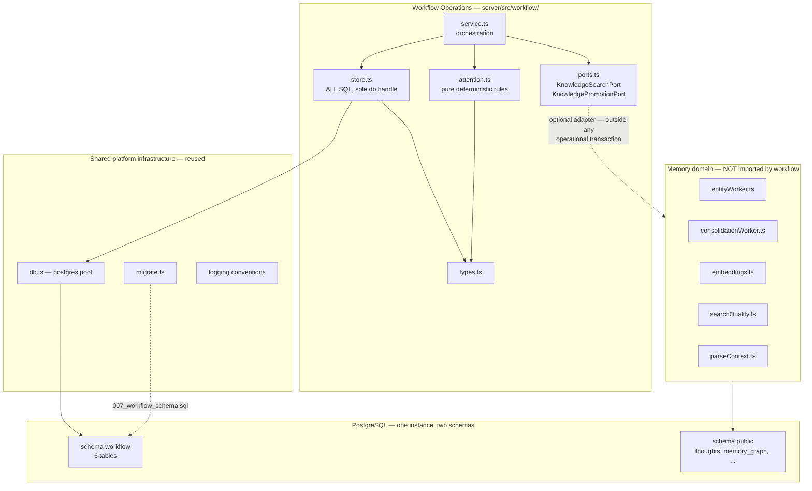

# ST-084 Spike Findings — Stage 1

**Story:** ST-084 — Architecture spike: validate ai-memory as the AWCP host (ADR-016 acceptance gate)
**Date:** 2026-07-30
**Branch:** `claude/st-084-awcp-host-spike`
**Status:** **Stage 1 complete. Criteria 5, 6 and 7 are UNPROVEN and out of Stage 1 scope.**
**Plan:** [`docs/plans/2026-07-29-001-awcp-ai-memory-host-spike.md`](../plans/2026-07-29-001-awcp-ai-memory-host-spike.md)

---

## Read This When

Deciding whether ADR-016's Candidate A (extend ai-memory as the AWCP host) survives
contact with the actual codebase; or before starting Stage 2, which inherits the
contracts defined in §7.

---

## Preliminary recommendation

> **PROMISING WITH CONCERNS.**

Stage 1's four criteria all pass on evidence, not narrative. Workflow Operations
demonstrably runs as a separate operational domain inside this codebase, with its
own transactional persistence, its own failure boundary, and no dependency on any
semantic-memory capability. The architectural claim ADR-016 rests on is **supported
so far**.

The "with concerns" is not hedging — three specific findings (§6) would each require
an explicit decision before acceptance, and one of them (**§6.1, the policy-scope
enforcement surface**) is large enough that it could still change the host verdict at
Stage 2. This report does **not** accept Candidate A, and ADR-016 stays
Proposed/Conditional.

This uses the deliberately weaker Stage 1 vocabulary — *promising / promising with
concerns / unlikely to fit* — not the final accept/reject. The final recommendation
is a Stage 2 deliverable.

---

## 1. What was built

A disposable vertical slice under `server/src/workflow/` (5 files, ~700 lines) plus
one migration and four test files.

| Slice item (plan §Minimal vertical slice) | Stage 1 status |
|---|---|
| 1. Work packet — identifier, title, objective, scope, repo binding, constraints, policy scope, status, verification criterion | **Built** |
| 2. Local run — agent type, host, working dir, repo, branch, start time, status | **Built** |
| 3. Remote Ubuntu run | **Stage 2** — protocol defined (§7.1), not implemented |
| 4. Checkpoint — completed work, current state, blockers, next action, commit, timestamp | **Built** |
| 5. Operational decision that blocks execution → deterministic `decision-required` | **Built** |
| 6. Completion gate — refuse without evidence, succeed with it | **Built** |
| 7. Optional memory projection through `KnowledgePromotionPort` | **Built** |
| 8. Deterministic attention (5 rules, no LLM) | **Built** |

**Schema reduced from ten tables to six**, per the PO's "smallest schema necessary"
direction. `repository_bindings` was inlined (it is 1:1 with the packet — a join
table for a single field is structure without a consumer). `attention_items` was
dropped **as a table** and attention made a derived pure function: a stored
projection can drift from the state it describes, a computed one cannot, and it
makes the "deterministic, no LLM" claim checkable by reading ~40 lines.
`run_events` and `execution_nodes` exist only to serve remote spool/replay and were
deferred rather than built unused.

---

## 2. Criterion 1 — Operational independence — **PASS**

*Requirement: WorkPacket, AgentRun, Checkpoint, OperationalDecision, AttentionItem,
Evidence and completion gating work with all semantic-memory capabilities disabled.*

The complete slice was executed in a process with every capability off and the
provider endpoint made unreachable:

```
FEATURE_ENTITY_WORKER=false
FEATURE_CONSOLIDATION_WORKER=false
FEATURE_EMBEDDING_BACKFILL=false
OPENROUTER_API_KEY=disabled
OPENROUTER_BASE_URL=http://127.0.0.1:9/blocked
```

**Result: 37 passed / 0 failed.** Every operational behaviour — packet creation, run
registration, checkpointing, blocking decisions, deterministic attention, the
completion gate's refusal *and* its acceptance — works with no embeddings, no
entity extraction, no consolidation, no graph traversal and no reachable model
provider.

The server itself also boots and stays serviceable in that mode:

| Probe | Result |
|---|---|
| `/health` | **HTTP 200 `healthy`** — a static literal, so the Docker healthcheck cannot fail from disabled capabilities; the container stays up |
| `/ready` | HTTP 200 `degraded` |
| postgres / pgvector / age | `ok` |
| `embedding_api` | `error` (expected — endpoint unroutable) |
| `embedding_backlog`, `entity_worker`, `consolidation_worker` | `n/a — disabled` |

**Two caveats worth recording rather than burying:**

1. **Memory-disabled mode works by accident, not by design.** `startupValidation.ts:1`
   hard-requires `OPENROUTER_API_KEY` and `Deno.exit(1)`s without it — but validates
   *truthiness only*, never against the provider. The literal string `disabled`
   satisfies it. There is **no first-class degraded/disabled mode** in this codebase.
   It works, but nothing defends the property, and a future tightening of that
   validation would silently break it.
2. **Prefer the `FEATURE_*` flags over the `*_DISABLED` variants.** Only `FEATURE_*`
   makes `/ready`'s worker probe report `n/a`; the `*_DISABLED` form stops the worker
   while leaving the probe still expecting runs (`healthCheck.ts:146-149`), which
   reports `error` against a database carrying older `worker_runs` rows.

---

## 3. Criterion 2 — Separate persistence and API boundary — **PASS**

*Requirement: independent transactional persistence; operational entities are not
thoughts/shards/graph records; memory reached only through explicit ports; a no-op
adapter supports the complete flow.*

| Sub-claim | Evidence |
|---|---|
| Independent persistence | Dedicated Postgres schema `workflow`, migration `007_workflow_schema.sql`. Applied cleanly at boot: `[migrate] applying 007_workflow_schema.sql... applied 1 new migration(s)` |
| Migration touches no memory table | Test re-applies 007 inside a rolled-back transaction and asserts the `public` table list is byte-identical before and after |
| Operational entities are not thoughts | Test creates a packet, then asserts zero `public.thoughts` rows contain its text |
| No structural dependency on memory | Test enumerates every foreign key in schema `workflow` and asserts all resolve within `workflow` |
| Memory reached only via ports | Test scans the module's own source for imports of the eight memory modules — fails the build on violation |
| Only `store.ts` holds the DB handle | Source scan asserts no other workflow file imports `../db.ts` |
| No memory-domain SQL | Source scan rejects 14 forbidden identifiers (`thoughts`, `memory_graph`, `cypher(`, `vector(`, `embedding`, …) |
| All SQL schema-qualified | Source scan asserts every `FROM`/`INTO`/`UPDATE`/`JOIN` identifier starts `workflow.` |
| **No-op adapter supports the complete flow** | A full slice — run, checkpoint, decision, resolve+promote, criterion, evidence, completion — passes against `NoopMemoryAdapter` |

**The boundary is enforced, not documented.** That distinction is the point: a
dependency rule stated in a comment is a rule that gets violated in six months by
someone reasonably adding an import. These tests fail CI instead.

**One finding that strengthens the case unexpectedly:** every workflow statement had
to be schema-qualified anyway, for a reason unrelated to tidiness. Four sites in the
memory domain issue a bare `SET search_path = ag_catalog, "$user", public` inside a
multi-statement `sql.unsafe()` on a *pooled* connection (`index.ts:940`, `:996`;
`entityWorker.ts:113`, `:123`). That `SET` is session-scoped and sticky, so any pooled
connection that has served a graph query keeps a polluted path for its lifetime. The
spike proved this is survivable — experiment 3 deliberately runs workflow operations
on a connection after a failed AGE query — but it is a live sharp edge in the shared
runtime that any co-tenant module inherits.

---

## 4. Criterion 3 — Failure isolation — **PASS**

*Requirement: knowledge-search failure, knowledge-promotion failure, graph
unavailability and central-service restart cannot corrupt or roll back operational
state; promotion remains an optional projection.*

Four of the plan's seven experiments are in Stage 1 scope; experiments 4–6
(disconnection, duplicate delivery, invalid auth) are remote-node and therefore
Stage 2.

| # | Experiment | Result |
|---|---|---|
| 1 | Knowledge **search** failure | **PASS** — degrades to an empty result with `degraded: true` and a visible error; operational work proceeds to completion |
| 2 | Knowledge **promotion** failure | **PASS** — decision remains `resolved` and authoritative; `promoted_memory_ref` stays `NULL` (no dangling reference); failure returned as data, not thrown |
| 2b | Promotion failure vs. completion | **PASS** — packet still completes |
| 2c | Projection **deleted** after success | **PASS** — decision survives intact; "deleting an optional promoted memory item cannot damage operational history" holds |
| 3 | **Graph** unavailable | **PASS** — a deliberately failed AGE query on the pooled connection leaves the full slice working |
| 7 | Central-service **restart** | **PASS** — all state rehydrates from the database alone; attention recomputes identically; the completion gate still refuses |
| — | Cross-domain transaction | **PASS** — a failing adapter cannot roll back a workflow transaction |

**The structural reason this passes**, rather than passing by luck: promotion runs
strictly *after* the operational write has committed, never inside its transaction
(`service.ts:resolveAndPromoteDecision`), and `promoted_memory_ref` is a nullable
pointer rather than a foreign key. Those two choices are what make memory failure
and memory *absence* equivalent from the operational side. Had promotion been
modelled as an FK or an in-transaction call, every one of these experiments would
fail — and that is precisely the coupling a naive implementation would introduce.

---

## 5. Criterion 4 — Reuse and coupling assessment

Classification of the ten components the plan names:

| Component | Classification | Evidence |
|---|---|---|
| **Postgres connection** (`src/db.ts`) | **Directly reusable** | 12-line `postgres.js` singleton; workflow uses the same pool and `sql.begin` transactions with no adaptation |
| **Migration system** (`src/migrate.ts`) | **Directly reusable** | Discovery regex is generic; `007` required **zero** changes to the runner. Caveat below. |
| **Authentication** (`src/auth.ts`) | **Reusable behind an adapter** | `requireApiKey` is a plain `(req) => Response \| null` invoked manually, not middleware, so a second credential type composes cleanly without touching `/mcp`. Not used in Stage 1. |
| **MCP transport** | **Reusable only after modification** | Not exercised in Stage 1. Registering tools outside `index.ts` requires two out-of-module edits — see §6.2 |
| **Worker/event infrastructure** | **Actively harmful coupling if reused** | `WorkerLogEvent.worker` is a closed union `"entity" \| "consolidation"` (`workerLogger.ts:4`) and `index.ts:638` hardcodes the same pair. Reusing it means widening a shared type *and* editing an unrelated tool. Workflow deliberately does not. |
| **Provenance fields** | **Reusable as a pattern, not as code** | The `created_at`/`updated_at`/soft-delete idiom transfers; no shared implementation exists to import |
| **Hybrid retrieval** (RRF/MMR) | **Unnecessary for AWCP** | Operational queries are keyed lookups and status filters. Ranking has no role in "which packets are blocked" |
| **Graph storage** (AGE) | **Unnecessary — and a live sharp edge** | Workflow issues no Cypher. But its `search_path` pollution is inherited by every co-tenant (§3) |
| **Consolidation** | **Unnecessary** | Promotion policy is memory-domain product logic; operational state is transactional, not recall-promoted |
| **Existing context scoping** (`parseContext`) | **Reusable only after modification** | Parses `tags` but enforces them nowhere (§6.1). Its `projects?.[0]` and `IS NULL OR` idioms are fail-open patterns a boundary column must not copy |
| **Logging/diagnostics** | **Reusable behind an adapter** | `withTiming`/structured-JSON house style transfers directly; the worker logger does not (above) |

**Actual dependencies the slice introduced:** exactly one runtime import outside the
module — `sql` from `../db.ts`, in `store.ts` alone. **Zero new npm dependencies**
(required: `deno.json` pins `lock.frozen: true`, so any new dependency reds the whole
suite).

**Net reuse verdict:** the reuse that materialises is *infrastructural* — connection
pooling, migrations, transactions, logging conventions, container/test topology. That
is real and non-trivial, and it is what "extend ai-memory" actually buys. The reuse
that ADR-016's Candidate A row implied might matter — hybrid search, graph, versioned
shards, tag grammar — is **unnecessary for AWCP** and correctly went unused. So the
host argument holds, but for narrower reasons than the ADR's framing suggests: the
value is a working Postgres/Deno/test substrate, not the memory engine.

---

## 6. Concerns — the three findings that qualify the recommendation

### 6.1 The policy-scope enforcement surface is far larger than ADR-016 assumes — **may change the verdict at Stage 2**

Direct inspection produced the single most consequential finding of this spike:

> **`scope.tags` is enforced in exactly zero retrieval paths.** It is read at one
> place (`index.ts:443`) and used only to INSERT. It appears in no `WHERE` clause
> anywhere in the codebase.

What Stage 2 actually faces on the memory side:

- **15 distinct read paths** would each need an independent predicate. There is no
  query builder, no repository layer, no row-level security — each is a hand-written
  tagged template that can be forgotten individually. Getting 14 of 15 right is the
  same as getting it wrong.
- **`fetch` is a one-call bypass** of every search-lane filter:
  `WHERE id = ${id} AND active = true` (`index.ts:211-215`), and the tool accepts no
  `context` parameter at all. Search returns ids under one scope; fetch retrieves them
  under any. Fixing the lanes without fixing `fetch` is theatre.
- **`graph_traverse` / `graph_search` cannot be filtered at all.** AGE nodes carry
  only `(label, name)` with no scope column and no in-graph join to `thoughts`. The
  remedy is extraction-time filtering or gating the tool — not a `WHERE` clause.
- **`entityWorker.ts:185` ships unscoped content to OpenRouter** — the primary egress
  path, and it predates any scope concept.
- **Global content-fingerprint dedup** (`schema.sql:45-48`) means the same text cannot
  exist at two scopes, and `capture_thought`'s `ON CONFLICT` *merges* tags
  (`index.ts:482-487`). A merge rule applied to a security column is a widening rule.
- **`project` is a ×1.2 ranking boost, not a filter**, unless `strict` is set — and
  bare `strict` with no `project:` token is a complete no-op (`index.ts:271`). Neither
  idiom may be copied for a boundary column.

**Why this bears on the host decision, not just on ST-082.** Candidate C (a clean
umbrella application) would carry *none* of this: a greenfield operational store has
no 15 legacy read paths, no unfilterable graph tool, and no fingerprint-dedup
interaction. Choosing ai-memory as host means the workflow product shares a database
with a corpus whose isolation controls do not yet exist, and inherits the obligation
to build them across a surface with no chokepoint. **Stage 1 cannot price that
obligation. Stage 2 must, before Candidate A is accepted.**

Stage 1 deliberately changed **no** memory-side retrieval semantics. A disposable
spike must not quietly alter production read paths.

### 6.2 A shared runtime has a shared blast radius

- **Migration failure is fatal to the whole server.** `migrate.ts:56` calls
  `Deno.exit(1)`, and `runMigrations()` is awaited at `index.ts:46` *before*
  `Deno.serve`. A malformed workflow migration bricks the memory MCP, not just
  workflow. Rollback is clean (DDL is transactional) but the process dies.
- **`migrations.test.ts` hardcoded the migration version list in four places**
  (lines 17, 18-25, 31, 97). Adding *any* migration reds the suite until updated.
  This spike had to update it — a small tax, but evidence that the shared substrate
  is not neutral to co-tenants.
- **Registering MCP tools costs two out-of-module edits**: the hand-maintained
  `toolNames` array at `index.ts:101-113`, and `mcp-protocol-compat.test.ts:172-179`,
  which regex-scans `server/index.ts` *alone* for `server.registerTool(` and asserts a
  two-way match against `tools/list`. Stage 1 avoided this by not registering tools;
  Stage 2 or production would pay it.

### 6.3 A Postgres schema is namespacing, not access control

`CREATE SCHEMA workflow` buys clean teardown and a real migration boundary. It does
**not** buy isolation: the single `ai_memory` role reads and writes both schemas
freely. Genuine enforcement needs a second role plus `REVOKE`. Nothing in Stage 1
depends on the stronger claim, but the findings must not be read as implying it.

---

## 7. Stage 2 contracts — defined here so Stage 2 does not start from assumptions

### 7.1 Remote execution-node protocol

- **Transport:** HTTPS, node → hub only, over Tailscale. The hub never dials the node;
  no inbound port on the node; **no general-purpose remote shell** (hard constraint).
- **Runtime:** z2 verified as Ubuntu 24.04.4 with `node`, `python3`, `curl`,
  `systemctl` — and **no deno**. The client must therefore be plain Node with zero npm
  dependencies (or POSIX shell + `curl`) and must not require a new runtime.
- **Auth:** a per-node bearer token in its own env var, distinct from
  `MEMORY_API_KEY`, validated by its own function alongside — not replacing —
  `requireApiKey`. It must **not** be added to `startupValidation.ts`'s `REQUIRED_ENV`,
  which hard-exits on absence; an optional module must not be able to prevent boot.
- **Idempotency:** every event carries `(node_id, client_seq)` under a unique
  constraint; replay is `ON CONFLICT DO NOTHING`. The hub's **acknowledgement** — never
  the send — is the node's cue to drop a spool entry.
- **Spool:** append-only JSONL in the node's state dir, one event per line, fsynced,
  replayed oldest-first. Bounded with oldest-dropped plus a recorded counter, so a long
  outage cannot silently fill the disk.
- **Control messages** (allow-listed, narrowly typed): request-status,
  request-checkpoint, request-repo-rescan, pause-reporting, resume-reporting.
- **Tables** (deferred from Stage 1): `workflow.execution_nodes`, `workflow.run_events`.

### 7.2 Policy-scope model

- Controlled closed vocabulary — `personal | corporate | mixed | public` — **not**
  descriptive tags. Already shipped as a `CHECK`-constrained column and proven
  DB-enforced in Stage 1.
- `NOT NULL` with **no `DEFAULT`**, deliberately: a permissive default silently mints
  permissive rows wherever an INSERT forgets the column. Forgetting must fail loudly.
- **Default-deny**: absence of scope denies, never allows. Applies to retrieval *and*
  model-provider routing.
- Scope belongs to **observations and sources**, not to identities: a Contact may span
  personal and corporate contexts while each observation retains its own scope.
- **Paths requiring enforcement in Stage 2** (enumerated, from §6.1): 15 memory read
  paths; `fetch` first, as it defeats all others; both graph tools, which need
  extraction-time filtering or gating rather than a predicate; the entity-worker and
  consolidation LLM egress paths; embedding backfill; and the `recall_events` /
  `recall_queries` correlation artefacts, which carry raw query text and have no scope
  column.
- **Honest narrowing** (invoking the plan's own escape clause deliberately, rather
  than discovering it late): Stage 2 will prove that *the workflow module's own records
  and retrieval paths enforce scope with default-deny, and every memory path that
  cannot enforce it is disabled for a scoped request and documented*. Closing all 15
  memory-side paths is ST-082's job and is larger than this spike.

---

## 8. What is UNPROVEN

Stated plainly so this report cannot be over-read:

| Criterion | Status |
|---|---|
| 5 — Policy-scope enforcement | **UNPROVEN.** Model defined and DB-enforced as a column; no retrieval enforcement built or tested. §6.1 may change the host verdict. |
| 6 — Remote Ubuntu execution node | **UNPROVEN.** Protocol defined (§7.1); no client written, no registration/heartbeat/checkpoint/spool/replay exercised; experiments 4–6 not run. z2 reachability confirmed, nothing more. |
| 7 — Final migration and extraction viability | **UNPROVEN.** Stage 2 deliverable. |

Also not established: production deployment, backup/DR, dashboard, VS Code extension,
Copilot lifecycle automation, event sourcing, and any Jira/Confluence/ADO write.
**No corporate external write of any kind was attempted or is authorised by this
report.**

---

## 9. Disposability — verified

The spike is disposable by construction, as the plan requires. Complete teardown:

```sql
DROP SCHEMA workflow CASCADE;
DELETE FROM schema_migrations WHERE version = 7;
```

```
rm -rf server/src/workflow/ server/db/007_workflow_schema.sql server/tests/workflow-*.test.ts
git checkout -- server/tests/migrations.test.ts     # revert 4 version assertions
```

**No other file was modified.** That one-sentence revert list *is* the separability
evidence for criterion 4 — a later extraction of Workflow Operations into its own
application remains possible, because nothing outside the module and one test file
knows it exists.

---

## 10. Verification summary

| Suite | Result |
|---|---|
| `workflow-attention.test.ts` (pure, no DB) | 16 passed / 0 failed |
| `workflow-store.test.ts` | 6 passed / 0 failed |
| `workflow-boundary.test.ts` | 8 passed / 0 failed |
| `workflow-failure-isolation.test.ts` | 7 passed / 0 failed |
| **All four, memory fully disabled + provider unroutable** | **37 passed / 0 failed** |
| `migrations.test.ts` (regression risk) | 6 passed / 0 failed |
| **Full server suite** | **253 passed / 9 failed** |

The 9 failures are the **documented pre-existing local baseline** — the board records
"216 passed / 9 expected-local-401 (CI is arbiter for LLM tests)" — and all 9 are
OpenRouter-dependent tests in `e2e.test.ts` and `entity-worker-observability.test.ts`,
files this change never touches. The arithmetic reconciles exactly: 216 + 37 = 253.

---

## 11. Decision report

```text
Recommendation:
- PROMISING WITH CONCERNS (Stage 1 preliminary; NOT an acceptance)

Evidence:
- boundary tests:      37/37 passed, incl. full run with memory disabled
                       and the model provider unroutable
- criteria proven:     1 operational independence   PASS
                       2 separate persistence/API   PASS
                       3 failure isolation          PASS
                       4 reuse and coupling         ASSESSED
- criteria unproven:   5 policy scope, 6 remote node, 7 final viability
- reused components:   Postgres connection, migrations, transactions,
                       logging conventions, container/test topology
                       (infrastructural reuse is real; memory-engine reuse
                       is unnecessary for AWCP and went unused)
- unwanted coupling:   worker logger's closed union; AGE search_path
                       pollution on pooled connections; migration failure
                       kills the whole server; migrations.test.ts hardcodes
                       the version list; MCP tools cost 2 out-of-module edits
- remote-node result:  NOT ATTEMPTED (Stage 2). z2 reachable; protocol defined.
- policy-scope result: NOT ENFORCED (Stage 2). Model defined and DB-constrained.
                       scope.tags enforced in ZERO retrieval paths today;
                       15 read paths, fetch bypass, 2 unfilterable graph tools.
- estimated migration: low for the module itself (one import, one schema,
                       clean teardown); UNKNOWN and potentially large for the
                       policy-scope obligation the shared corpus imposes
- unresolved risks:    §6.1 could still change the host verdict at Stage 2;
                       memory-disabled mode works only via weak env validation
                       and nothing defends it
```

**ADR-016 remains Proposed / Conditional.** This report does not accept Candidate A,
does not take the final host decision, and does not authorise schema or migration work
that assumes the host. Those are Stage 2 outcomes, for the PO to take on the evidence.

---

## 12. Dependency diagram

Solid arrows are real imports. The dashed arrow is the **only** sanctioned route to
the memory domain, and it is an optional adapter that never runs inside an
operational transaction. The memory modules in grey are *not imported by anything in
the workflow module* — a test enforces that by scanning the module's own source.



The shape is the finding: **one solid line leaves the module** (`store.ts → db.ts`),
and the memory domain is reachable only across a dashed, failure-tolerant boundary.
That is what makes criteria 2 and 3 pass, and what keeps a later extraction possible.

---

## 13. Proposed ADR-016 amendments — for review, NOT applied

Deliverable 10 of the plan. These are **proposals for the PO**; none has been applied,
and ADR-016 remains Proposed/Conditional.

1. **Keep the status at Proposed / Conditional.** Stage 1 supports the hypothesis but
   does not discharge the gate. Recommend adding a line recording that criteria 1–4
   are met and 5–7 outstanding, so the ADR carries its own progress.
2. **Narrow §1's reuse argument to what the evidence supports.** The Candidate A row
   lists "Postgres + pgvector + AGE storage, hybrid search (RRF/MMR), append-only
   versioned shards, tag grammar" as the reuse case. The spike found those
   **unnecessary for AWCP** (§5). The honest reuse case is *infrastructural* —
   connection pooling, migrations, transactions, logging conventions, container and
   test topology. Recommend rewriting the row to say that, because the current wording
   overstates the benefit and would mislead a future reader comparing against
   Candidate C.
3. **Add an explicit acceptance pre-condition for the policy-scope obligation.**
   §6.1 is a cost that Candidate A carries and Candidate C does not. Recommend ADR-016
   state that accepting Candidate A requires the enforcement surface to be priced
   first (Stage 2 / ST-082), rather than treating isolation as an orthogonal backlog
   item.
4. **Record the shared-blast-radius consequences in §3 (storage layout).** A bad
   co-tenant migration exits the whole server, and MCP tool registration costs
   out-of-module edits. Neither blocks the decision; both belong in the ADR's
   trade-off list rather than only in this findings doc.
5. **No change to §2 (topology) or §4 (source lineage).** Stage 1 produced no evidence
   bearing on either; the remote-node half of §2 is exactly what Stage 2 tests.

---

## 14. Surprises and discoveries

1. **`scope.tags` is enforced nowhere at all.** The expectation going in was "partially
   enforced"; the reality is zero retrieval paths. The tool descriptions are honest
   about it (`index.ts:242`: *"tags are not search filters in this tool"*) — the gap is
   documented, just not closed.
2. **Memory-disabled mode works by accident.** `startupValidation` demands
   `OPENROUTER_API_KEY` but validates truthiness only, so the literal string `disabled`
   satisfies it. The capability that Stage 1 depends on is unprotected by any test.
3. **AGE leaks `search_path` across a pooled connection** and every co-tenant module
   inherits it. Schema-qualifying everything was mandatory for correctness, not tidiness.
4. **`server/server.ts` is dead code** — a four-line placeholder that binds the same
   port as `index.ts` and is on no boot path.
5. **`index.ts` maintains its own tool list by hand** (`:101-113`) and a test regex-scans
   that single file to verify it, which quietly makes "register tools from another
   module" a two-file change.
6. **CLAUDE.md says six MCP tools; `index.ts` registers eleven.** Stale documentation,
   noted in passing.
