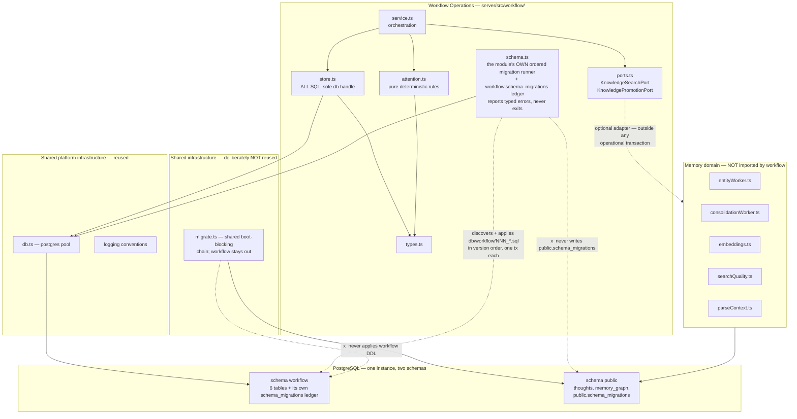

# ST-084 Spike Findings — Stage 1

**Story:** ST-084 — Architecture spike: validate ai-memory as the AWCP host (ADR-016 acceptance gate)
**Date:** 2026-07-30 · **last re-derived from the tree** 2026-07-31 (second PR #34 review round)
**Branch:** `claude/st-084-awcp-host-spike`
**Status:** **Stage 1 complete. Criteria 5, 6 and 7 are UNPROVEN and out of Stage 1 scope.**
**Plan:** [`docs/plans/2026-07-29-001-awcp-ai-memory-host-spike.md`](../plans/2026-07-29-001-awcp-ai-memory-host-spike.md)

---

## Read This When

Deciding whether ADR-016's Candidate A (extend ai-memory as the AWCP host) survives
contact with the actual codebase; or before starting Stage 2, which inherits the
contracts defined in §7.

---

## Preliminary recommendation

> **PROMISING WITH CONCERNS.**

Stage 1's four criteria all pass on evidence, not narrative. Workflow Operations
demonstrably runs as a separate operational domain inside this codebase, with its
own transactional persistence, its own failure boundary, and no dependency on any
semantic-memory capability. The architectural claim ADR-016 rests on is **supported
so far**.

The "with concerns" is not hedging — three specific findings (§6) would each require
an explicit decision before acceptance, and one of them (**§6.1, the policy-scope
enforcement surface**) is large enough that it could still change the host verdict at
Stage 2. This report does **not** accept Candidate A, and ADR-016 stays
Proposed/Conditional.

This uses the deliberately weaker Stage 1 vocabulary — *promising / promising with
concerns / unlikely to fit* — not the final accept/reject. The final recommendation
is a Stage 2 deliverable.

**What Stage 1 claims, separated so none is over-read** (full evidence in §10):

| Claim | Status |
|---|---|
| Evidence-based packet completion | **PROVEN** |
| Deterministic decision attention | **PROVEN** |
| Schema namespacing (not access control — §6.3) | **PROVEN** |
| Independent schema evolution | **PROVEN — mechanism.** Module-owned ordered migrations with a checksummed ledger; upgrade, idempotent rerun and drift detection all pass. The multi-migration case is exercised **synthetically**: the only real-directory test applies what is already there and skips it, because a third migration does not yet exist |
| **Actual execution blocking** | **UNPROVEN — Stage 2.** `blocking` is modelled state; its only implemented consequence is the attention item |

The schema is also **test-applied, not wired at boot** — `server/index.ts` never calls
`ensureWorkflowSchema`. See §8.

---

## 1. What was built

A disposable vertical slice under `server/src/workflow/` (6 files) plus workflow-owned
DDL in `server/db/workflow/` (two ordered migrations) and five test files. The DDL deliberately sits **outside**
the shared migration chain: that runner `Deno.exit(1)`s the whole server on failure, so
a workflow migration living there would have made a workflow defect a platform outage.

| Slice item (plan §Minimal vertical slice) | Stage 1 status |
|---|---|
| 1. Work packet — identifier, title, objective, scope, repo binding, constraints, policy scope, status, verification criterion | **Built** |
| 2. Local run — agent type, host, working dir, repo, branch, start time, status | **Built** |
| 3. Remote Ubuntu run | **Stage 2** — protocol defined (§7.1), not implemented |
| 4. Checkpoint — completed work, current state, blockers, next action, commit, timestamp | **Built** |
| 5. Operational decision that blocks execution → deterministic `decision-required` | **Partly built — read the note below.** The attention half is built and proven. The "blocks execution" half is **modelled state only** and is Stage 2. |
| 6. Completion gate — refuse without evidence, succeed with it | **Built** |
| 7. Optional memory projection through `KnowledgePromotionPort` | **Built** |
| 8. Deterministic attention (5 rules, no LLM) | **Built** |

**On slice item 5 — what `blocking` does and does not do.** An unresolved `blocking`
decision deterministically raises a `decision-required` attention item. That is its
*only* implemented consequence. It does not gate packet completion (the gate is
evidence-based per plan §6, and `completePacket` never reads `operational_decisions`),
and it does not halt a running agent, because Stage 1 has no execution node to halt.

This was previously overstated. The DDL comment read "A decision here can block a run
and gate completion" — false in both halves, and a PR #34 reviewer read that comment
and filed a P1 against the code for not doing what the comment promised. The PO
withdrew that direction on 2026-07-31: making `blocking` gate completion would be a
**product-contract amendment**, not enforcement of an existing requirement, because
plan §5 names the attention item as the sole consequence and plan §6 names missing
evidence as the sole fail condition. Actual execution blocking is recorded as a Stage 2
design requirement, and the eventual model should distinguish **advisory**,
**run-blocking** and **completion-gating** decisions rather than overloading one
boolean to mean all three.

`workflow-store.test.ts` now asserts explicitly that the packet completes with its
blocking decision still open, so changing that semantic requires a visible edit rather
than a quiet behaviour change.

**Schema reduced from ten tables to six**, per the PO's "smallest schema necessary"
direction. `repository_bindings` was inlined (it is 1:1 with the packet — a join
table for a single field is structure without a consumer). `attention_items` was
dropped **as a table** and attention made a derived pure function: a stored
projection can drift from the state it describes, a computed one cannot, and it
makes the "deterministic, no LLM" claim checkable by reading ~40 lines.
`run_events` and `execution_nodes` exist only to serve remote spool/replay and were
deferred rather than built unused.

---

## 2. Criterion 1 — Operational independence — **PASS**

*Requirement: WorkPacket, AgentRun, Checkpoint, OperationalDecision, AttentionItem,
Evidence and completion gating work with all semantic-memory capabilities disabled.*

The complete slice was executed in a process with every capability off and the
provider endpoint made unreachable:

```
FEATURE_ENTITY_WORKER=false
FEATURE_CONSOLIDATION_WORKER=false
FEATURE_EMBEDDING_BACKFILL=false
OPENROUTER_API_KEY=disabled
OPENROUTER_BASE_URL=http://127.0.0.1:9/blocked
```

**Result: 82 passed / 0 failed**, re-run against HEAD on 2026-07-31 (the earlier 37/37
figure was for the code as it stood then). Every operational behaviour — packet creation, run
registration, checkpointing, blocking decisions, deterministic attention, the
completion gate's refusal *and* its acceptance — works with no embeddings, no
entity extraction, no consolidation, no graph traversal and no reachable model
provider.

The server itself also boots and stays serviceable in that mode:

| Probe | Result |
|---|---|
| `/health` | **HTTP 200 `healthy`** — a static literal, so the Docker healthcheck cannot fail from disabled capabilities; the container stays up |
| `/ready` | HTTP 200 `degraded` |
| postgres / pgvector / age | `ok` |
| `embedding_api` | `error` (expected — endpoint unroutable) |
| `embedding_backlog`, `entity_worker`, `consolidation_worker` | `n/a — disabled` |

**Two caveats worth recording rather than burying:**

1. **Memory-disabled mode works by accident, not by design.** `startupValidation.ts:1`
   hard-requires `OPENROUTER_API_KEY` and `Deno.exit(1)`s without it — but validates
   *truthiness only*, never against the provider. The literal string `disabled`
   satisfies it. There is **no first-class degraded/disabled mode** in this codebase.
   It works, but nothing defends the property, and a future tightening of that
   validation would silently break it.
2. **Prefer the `FEATURE_*` flags over the `*_DISABLED` variants.** Only `FEATURE_*`
   makes `/ready`'s worker probe report `n/a`; the `*_DISABLED` form stops the worker
   while leaving the probe still expecting runs (`healthCheck.ts:146-149`), which
   reports `error` against a database carrying older `worker_runs` rows.

---

## 3. Criterion 2 — Separate persistence and API boundary — **PASS**

*Requirement: independent transactional persistence; operational entities are not
thoughts/shards/graph records; memory reached only through explicit ports; a no-op
adapter supports the complete flow.*

| Sub-claim | Evidence |
|---|---|
| Independent persistence | Dedicated Postgres schema `workflow`, DDL at `server/db/workflow/001_workflow_schema.sql`, applied by the workflow module's own `ensureWorkflowSchema()` — **not** by the shared boot chain (see §13a fix 7) |
| Migration touches no memory table | Test re-applies the DDL inside a rolled-back transaction and asserts the `public` table list is byte-identical before and after |
| Operational entities are not thoughts | Test creates a packet, then asserts zero `public.thoughts` rows contain its text |
| No structural dependency on memory | Test enumerates every foreign key in schema `workflow` and asserts all resolve within `workflow` |
| Memory reached only via ports | Test scans the module's own source and fails the build unless every import is on an **allowlist** (`./*` intra-module, `../db.ts`, `../logging.ts`, or a package specifier). A paired red/green control test proves the allowlist actually rejects `../entityWorker.ts`, `../index.ts` etc. — see the §3 correction |
| Only `store.ts`/`schema.ts` hold the DB handle | Source scan asserts no other workflow file imports `../db.ts` |
| No memory-domain SQL | Source scan rejects 14 forbidden identifiers (`thoughts`, `memory_graph`, `cypher(`, `vector(`, `embedding`, …) |
| All SQL schema-qualified | Source scan asserts every `FROM`/`INTO`/`UPDATE`/`JOIN` identifier starts `workflow.` |
| **No-op adapter supports the complete flow** | A full slice — run, checkpoint, decision, resolve+promote, criterion, evidence, completion — passes against `NoopMemoryAdapter` |

**The boundary is enforced, not documented.** That distinction is the point: a
dependency rule stated in a comment is a rule that gets violated in six months by
someone reasonably adding an import. These tests fail CI instead.

> **Correction (post-review) — the enforcement was weaker than this section claimed.**
> The original import check was a **blocklist** of eight memory modules. It omitted
> `../index.ts` — the composition root that registers every MCP tool — plus `auth.ts`,
> `healthCheck.ts`, `logging.ts`, `mcpDiagnostics.ts`, `migrate.ts` and
> `workerLogger.ts`. The workflow module could have imported straight from `index.ts`
> and this test would still have passed green. Structurally worse than the omission: a
> blocklist over a directory that grows permits every *future* memory module by default.
>
> Inverted to an allowlist, so an unlisted import now fails and adding a dependency is a
> deliberate edit to a reviewed list. The schema-qualification scan had the same class of
> hole — it was case-**sensitive**, so lowercase `from thoughts` was skipped silently;
> now case-insensitive with its own control test.
>
> The verdict does not change: manual inspection confirms the module never imported any
> of those files, so criterion 2 was genuinely met. What was defective was the
> **evidence**, and on a spike whose output *is* evidence that distinction is the whole
> point. Recorded rather than quietly fixed, because "our green tests certified a claim
> they could not actually check" is the most transferable finding in this report.

**One finding that strengthens the case unexpectedly:** every workflow statement had
to be schema-qualified anyway, for a reason unrelated to tidiness. Four sites in the
memory domain issue a bare `SET search_path = ag_catalog, "$user", public` inside a
multi-statement `sql.unsafe()` on a *pooled* connection (`index.ts:941`, `:997`;
`entityWorker.ts:115`, `:125`). That `SET` is session-scoped and sticky, so any pooled
connection that has served a graph query keeps a polluted path for its lifetime — a
live sharp edge in the shared runtime that any co-tenant module inherits.

> **Correction (post-review).** The first version of this section claimed the spike had
> proved this survivable because "experiment 3 deliberately runs workflow operations on
> a connection after a failed AGE query." That was **wrong, and the test was wrong with
> it**. A failed statement aborts its implicit transaction and rolls the `SET` back, so
> the failure path cannot pollute anything — the test exercised the one branch where the
> hazard is impossible while asserting the opposite. Verified directly against the
> PG15+AGE container:
>
> ```
> SET search_path = ag_catalog,...; SELECT 1/0;  ->  search_path = "$user", public   (rolled back)
> SET search_path = ag_catalog,...; SELECT 1;    ->  search_path = ag_catalog, ...    (persists)
> ```
>
> The claim is now genuinely proven, by a different test. `experiment 3b` reserves a
> connection, pollutes it via a *succeeding* statement, asserts the pollution persisted,
> then shows a qualified `workflow.work_packets` query resolves while an unqualified
> `work_packets` fails — so the qualification is demonstrably what defeats the hazard.
> `experiment 3a` pins the rollback behaviour that misled the original test, and `3c`
> keeps the honest isolation half. See §12.

---

## 4. Criterion 3 — Failure isolation — **PASS**

*Requirement: knowledge-search failure, knowledge-promotion failure, graph
unavailability and central-service restart cannot corrupt or roll back operational
state; promotion remains an optional projection.*

**Scope of this PASS, narrowed 2026-07-30.** Three of the requirement's four clauses
are proven outright: search failure, promotion failure, and graph unavailability. The
fourth — *central-service restart* — is proven only as far as **database rehydration**
(no operational state lives solely in memory). True restart behaviour, including cold
schema bootstrapping, composition-root wiring and pool reconnection, is **UNPROVEN**
and needs the writer and reader in separate processes. PR #34 review caught this as an
overclaim; the criterion still passes on the evidence gathered, but not on all four
clauses equally.

Four of the plan's seven experiments are in Stage 1 scope; experiments 4–6
(disconnection, duplicate delivery, invalid auth) are remote-node and therefore
Stage 2.

| # | Experiment | Result |
|---|---|---|
| 1 | Knowledge **search** failure | **PASS** — degrades to an empty result with `degraded: true` and a visible error; operational work proceeds to completion |
| 2 | Knowledge **promotion** failure | **PASS** — decision remains `resolved` and authoritative; `promoted_memory_ref` stays `NULL` (no dangling reference); failure returned as data, not thrown |
| 2b | Promotion failure vs. completion | **PASS** — packet still completes |
| 2c | Projection **deleted** after success | **PASS** — decision survives intact; "deleting an optional promoted memory item cannot damage operational history" holds |
| 3 | **Graph** unavailable | **PASS** — a deliberately failed AGE query on the pooled connection leaves the full slice working |
| 7 | Database **rehydration** (not restart) | **PASS, narrowed 2026-07-30** — all state rehydrates from the database alone; attention recomputes identically; the completion gate still refuses. Originally labelled "central-service restart"; PR #34 review correctly identified that as an overclaim. The same process, module instances, pool and pool config stay alive — only local variables are discarded — so schema bootstrapping, composition-root wiring and pool reconnection are untested. **Restart itself is UNPROVEN** and needs the writer and reader in separate processes. |
| — | Cross-domain transaction | **PASS** — a failing adapter cannot roll back a workflow transaction |

**The structural reason this passes**, rather than passing by luck: promotion runs
strictly *after* the operational write has committed, never inside its transaction
(`service.ts:resolveAndPromoteDecision`), and `promoted_memory_ref` is a nullable
pointer rather than a foreign key. Those two choices are what make memory failure
and memory *absence* equivalent from the operational side. Had promotion been
modelled as an FK or an in-transaction call, every one of these experiments would
fail — and that is precisely the coupling a naive implementation would introduce.

> **Correction (post-review) — the ordering was right, the error handling was not.**
> The original `resolveAndPromoteDecision` wrapped three operations in one `try`: the
> optional port call *and* two operational writes (`attachPromotionRef`, `getDecision`).
> So a projection that **succeeded** but whose reference failed to record reported
> `promoted: false` — and a caller retrying on that signal would create a **duplicate
> projection**, since `KnowledgePromotionPort` carries no dedup contract. That directly
> contradicted this section's claim that promotion failure is "visible and retryable."
>
> Fixed by narrowing the `try` to the port call alone and distinguishing the outcomes.
> **Superseded 2026-07-31:** the `refLost` boolean became a four-valued
> `PromotionStatus`, because two outcomes were still collapsed — a *timeout* was
> reported as a definite non-event when it is in fact unknown. See §13a.
> Two further defects in the same path: promotion **hardcoded `policyScope: "personal"`**
> for every packet regardless of its real scope — silently widening the security boundary
> §6.1 warns about, and invisible because every test used personal-scoped packets — and
> `resolveDecision` returned `undefined` typed as `OperationalDecision` for an unknown id,
> surfacing through that same catch as an opaque `TypeError` misattributed to promotion
> failure. `PromotionInput.policyScope` is now the closed `PolicyScope` union rather than
> `string`, making that class of widening a compile error.
>
> Criterion 3 still passes — no memory failure corrupts or rolls back operational state,
> which was and remains true. But three of these were found by independent review, not by
> the 37 passing tests, and one of them was a live security-boundary widening.

---

## 5. Criterion 4 — Reuse and coupling assessment

Classification of the ten components the plan names:

| Component | Classification | Evidence |
|---|---|---|
| **Postgres connection** (`src/db.ts`) | **Directly reusable** | 12-line `postgres.js` singleton; workflow uses the same pool and `sql.begin` transactions with no adaptation |
| **Migration system** (`src/migrate.ts`) | **NOT reused — deliberately bypassed** | *Corrected 2026-07-30 after PR #34 review.* This row previously read "Directly reusable", which described the **superseded** design that put the DDL in the shared chain. The final implementation moved it out: `ensureWorkflowSchema()` applies `db/workflow/001_workflow_schema.sql` itself, never touches `schema_migrations`, and has no version history, checksum, or upgrade path. Moving it out was the right call (§13a fix 7), but it is a **reduction in net reuse**, not an instance of it — the host argument must not count migrations. |
| **Authentication** (`src/auth.ts`) | **Reusable behind an adapter** | `requireApiKey` is a plain `(req) => Response \| null` invoked manually, not middleware, so a second credential type composes cleanly without touching `/mcp`. Not used in Stage 1. |
| **MCP transport** | **Reusable only after modification** | Not exercised in Stage 1. Registering tools outside `index.ts` requires two out-of-module edits — see §6.2 |
| **Worker/event infrastructure** | **Actively harmful coupling if reused** | `WorkerLogEvent.worker` is a closed union `"entity" \| "consolidation"` (`workerLogger.ts:4`) and `index.ts:638` hardcodes the same pair. Reusing it means widening a shared type *and* editing an unrelated tool. Workflow deliberately does not. |
| **Provenance fields** | **Reusable as a pattern, not as code** | The `created_at`/`updated_at`/soft-delete idiom transfers; no shared implementation exists to import |
| **Hybrid retrieval** (RRF/MMR) | **Unnecessary for AWCP** | Operational queries are keyed lookups and status filters. Ranking has no role in "which packets are blocked" |
| **Graph storage** (AGE) | **Unnecessary — and a live sharp edge** | Workflow issues no Cypher. But its `search_path` pollution is inherited by every co-tenant (§3) |
| **Consolidation** | **Unnecessary** | Promotion policy is memory-domain product logic; operational state is transactional, not recall-promoted |
| **Existing context scoping** (`parseContext`) | **Reusable only after modification** | Parses `tags` but enforces them nowhere (§6.1). Its `projects?.[0]` and `IS NULL OR` idioms are fail-open patterns a boundary column must not copy |
| **Logging/diagnostics** | **Reusable behind an adapter** | `withTiming`/structured-JSON house style transfers directly; the worker logger does not (above) |

**Actual dependencies the slice introduced:** exactly one runtime import outside the
module — `sql` from `../db.ts`, in `store.ts` alone. **Zero new npm dependencies**
(required: `deno.json` pins `lock.frozen: true`, so any new dependency reds the whole
suite).

**Net reuse verdict:** the reuse that materialises is *infrastructural* — connection
pooling, migrations, transactions, logging conventions, container/test topology. That
is real and non-trivial, and it is what "extend ai-memory" actually buys. The reuse
that ADR-016's Candidate A row implied might matter — hybrid search, graph, versioned
shards, tag grammar — is **unnecessary for AWCP** and correctly went unused. So the
host argument holds, but for narrower reasons than the ADR's framing suggests: the
value is a working Postgres/Deno/test substrate, not the memory engine.

---

## 6. Concerns — the three findings that qualify the recommendation

### 6.1 The policy-scope enforcement surface is far larger than ADR-016 assumes — **may change the verdict at Stage 2**

Direct inspection produced the single most consequential finding of this spike:

> **`scope.tags` is enforced in exactly zero retrieval paths.** It is read at one
> place (`index.ts:443`) and used only to INSERT. It appears in no `WHERE` clause
> anywhere in the codebase.

What Stage 2 actually faces on the memory side:

- **15 distinct read paths** would each need an independent predicate. There is no
  query builder, no repository layer, no row-level security — each is a hand-written
  tagged template that can be forgotten individually. Getting 14 of 15 right is the
  same as getting it wrong.
- **`fetch` is a one-call bypass** of every search-lane filter:
  `WHERE id = ${id} AND active = true` (`index.ts:211-215`), and the tool accepts no
  `context` parameter at all. Search returns ids under one scope; fetch retrieves them
  under any. Fixing the lanes without fixing `fetch` is theatre.
- **`graph_traverse` / `graph_search` cannot be filtered at all.** AGE nodes carry
  only `(label, name)` with no scope column and no in-graph join to `thoughts`. The
  remedy is extraction-time filtering or gating the tool — not a `WHERE` clause.
- **`entityWorker.ts:185` ships unscoped content to OpenRouter** — the primary egress
  path, and it predates any scope concept.
- **Global content-fingerprint dedup** (`schema.sql:45-48`) means the same text cannot
  exist at two scopes, and `capture_thought`'s `ON CONFLICT` *merges* tags
  (`index.ts:482-487`). A merge rule applied to a security column is a widening rule.
- **`project` is a ×1.2 ranking boost, not a filter**, unless `strict` is set — and
  bare `strict` with no `project:` token is a complete no-op (`index.ts:271`). Neither
  idiom may be copied for a boundary column.

**Why this bears on the host decision, not just on ST-082.** Candidate C (a clean
umbrella application) would carry *none* of this: a greenfield operational store has
no 15 legacy read paths, no unfilterable graph tool, and no fingerprint-dedup
interaction. Choosing ai-memory as host means the workflow product shares a database
with a corpus whose isolation controls do not yet exist, and inherits the obligation
to build them across a surface with no chokepoint. **Stage 1 cannot price that
obligation. Stage 2 must, before Candidate A is accepted.**

Stage 1 deliberately changed **no** memory-side retrieval semantics. A disposable
spike must not quietly alter production read paths.

### 6.2 A shared runtime has a shared blast radius

- **Migration failure is fatal to the whole server.** `migrate.ts:56` calls
  `Deno.exit(1)`, and `runMigrations()` is awaited at `index.ts:46` *before*
  `Deno.serve`. A malformed migration in the shared chain bricks the memory MCP.
  **This spike no longer pays that risk** — the workflow DDL was moved out of the
  shared chain (§13a fix 7), so a bad workflow migration cannot kill the server.
  The hazard remains real for anything that *does* live in the shared chain, which
  is why it stays recorded here as a property of the shared runtime.
- **`migrations.test.ts` hardcoded the migration version list in four places**
  (lines 17, 18-25, 31, 97), so adding *any* migration to the shared chain reds the
  suite until updated. The spike initially paid this tax and then stopped paying it:
  with the DDL relocated, `migrations.test.ts` was reverted to pristine and is now
  untouched by this spike. The co-tenancy tax is real but avoidable — by not joining
  the shared chain, which is itself the finding.
- **Leaving the shared chain left the module with no way to evolve its schema at all,
  and that went unnoticed until PR #34 review.** The replacement was a single
  `IF NOT EXISTS` DDL file whose name was hardcoded in `schema.ts`, which meant editing
  a `CREATE TABLE` body was a silent no-op against any existing database and adding
  `002_*.sql` was never applied. No test caught either, so "the workflow module owns
  its schema" was true only for the single act of creating it once. **Closed
  2026-07-31:** the module now has its own ordered runner — discovery of
  `server/db/workflow/NNN_*.sql`, a ledger at `workflow.schema_migrations` carrying
  version / filename / SHA-256 checksum / applied timestamp, one transaction per
  migration, and typed failures that never call `Deno.exit`. The ledger lives inside
  the workflow schema deliberately: writing to `public.schema_migrations` would
  reintroduce exactly the shared mutable state this separation exists to avoid, and
  would survive `DROP SCHEMA workflow CASCADE`. Note the shape of the original error —
  the module escaped a coupling and acquired a *capability gap* in its place, and the
  gap was invisible because nothing tested for the absence of a behaviour.
- **Registering MCP tools costs two out-of-module edits**: the hand-maintained
  `toolNames` array at `index.ts:101-113`, and `mcp-protocol-compat.test.ts:172-179`,
  which regex-scans `server/index.ts` *alone* for `server.registerTool(` and asserts a
  two-way match against `tools/list`. Stage 1 avoided this by not registering tools;
  Stage 2 or production would pay it.

### 6.3 A Postgres schema is namespacing, not access control

`CREATE SCHEMA workflow` buys clean teardown and a real migration boundary. It does
**not** buy isolation: the single `ai_memory` role reads and writes both schemas
freely. Genuine enforcement needs a second role plus `REVOKE`. Nothing in Stage 1
depends on the stronger claim, but the findings must not be read as implying it.

---

## 7. Stage 2 contracts — defined here so Stage 2 does not start from assumptions

### 7.1 Remote execution-node protocol

- **Transport:** HTTPS, node → hub only, over Tailscale. The hub never dials the node;
  no inbound port on the node; **no general-purpose remote shell** (hard constraint).
- **Runtime:** z2 verified as Ubuntu 24.04.4 with `node`, `python3`, `curl`,
  `systemctl` — and **no deno**. The client must therefore be plain Node with zero npm
  dependencies (or POSIX shell + `curl`) and must not require a new runtime.
- **Auth:** a per-node bearer token in its own env var, distinct from
  `MEMORY_API_KEY`, validated by its own function alongside — not replacing —
  `requireApiKey`. It must **not** be added to `startupValidation.ts`'s `REQUIRED_ENV`,
  which hard-exits on absence; an optional module must not be able to prevent boot.
- **Idempotency:** every event carries `(node_id, client_seq)` under a unique
  constraint; replay is `ON CONFLICT DO NOTHING`. The hub's **acknowledgement** — never
  the send — is the node's cue to drop a spool entry.
- **Spool:** append-only JSONL in the node's state dir, one event per line, fsynced,
  replayed oldest-first. Bounded with oldest-dropped plus a recorded counter, so a long
  outage cannot silently fill the disk.
- **Control messages** (allow-listed, narrowly typed): request-status,
  request-checkpoint, request-repo-rescan, pause-reporting, resume-reporting.
- **Tables** (deferred from Stage 1): `workflow.execution_nodes`, `workflow.run_events`.

### 7.2 Policy-scope model

- Controlled closed vocabulary — `personal | corporate | mixed | public` — **not**
  descriptive tags. Already shipped as a `CHECK`-constrained column and proven
  DB-enforced in Stage 1.
- `NOT NULL` with **no `DEFAULT`**, deliberately: a permissive default silently mints
  permissive rows wherever an INSERT forgets the column. Forgetting must fail loudly.
- **Default-deny**: absence of scope denies, never allows. Applies to retrieval *and*
  model-provider routing.
- Scope belongs to **observations and sources**, not to identities: a Contact may span
  personal and corporate contexts while each observation retains its own scope.
- **Paths requiring enforcement in Stage 2** (enumerated, from §6.1): 15 memory read
  paths; `fetch` first, as it defeats all others; both graph tools, which need
  extraction-time filtering or gating rather than a predicate; the entity-worker and
  consolidation LLM egress paths; embedding backfill; and the `recall_events` /
  `recall_queries` correlation artefacts, which carry raw query text and have no scope
  column.
- **Honest narrowing** (invoking the plan's own escape clause deliberately, rather
  than discovering it late): Stage 2 will prove that *the workflow module's own records
  and retrieval paths enforce scope with default-deny, and every memory path that
  cannot enforce it is disabled for a scoped request and documented*. Closing all 15
  memory-side paths is ST-082's job and is larger than this spike.

---

## 8. What is UNPROVEN

Stated plainly so this report cannot be over-read:

| Criterion | Status |
|---|---|
| **Actual execution blocking** | **UNPROVEN — Stage 2.** `blocking` is modelled operational state whose only implemented consequence is deterministic attention. Nothing in Stage 1 halts, pauses or refuses work on the strength of it, and there is no execution node against which it could. See §1's note on slice item 5. |
| 5 — Policy-scope enforcement | **UNPROVEN.** Model defined and DB-enforced as a column; no retrieval enforcement built or tested. §6.1 may change the host verdict. |
| 6 — Remote Ubuntu execution node | **UNPROVEN.** Protocol defined (§7.1); no client written, no registration/heartbeat/checkpoint/spool/replay exercised; experiments 4–6 not run. z2 reachability confirmed, nothing more. |
| 7 — Final migration and extraction viability | **UNPROVEN.** Stage 2 deliverable. |

**The workflow schema is TEST-APPLIED, not wired at boot.** `server/index.ts` contains
no reference to the workflow module and never calls `ensureWorkflowSchema` — the schema
exists in a database only because a test applied it. Every "proven" claim in this report
is therefore *proven against the module's own entry points*, not against a deployed
server. Wiring it into a composition root is deliberate Stage 2 work (the whole point of
`tryEnsureWorkflowSchema` returning an outcome instead of exiting is that the
composition root decides), but a reader must not infer deployment from these results.

Also not established: production deployment, backup/DR, dashboard, VS Code extension,
Copilot lifecycle automation, event sourcing, and any Jira/Confluence/ADO write.
**No corporate external write of any kind was attempted or is authorised by this
report.**

---

## 9. Disposability — verified

The spike is disposable by construction, as the plan requires. Complete teardown:

```sql
DROP SCHEMA workflow CASCADE;
```

```
rm -rf server/src/workflow/ server/db/workflow/ server/tests/workflow-*.test.ts
```

*Corrected 2026-07-30 after PR #34 review.* The previous version of this section was
written against the superseded design and left the real DDL behind: it deleted
`server/db/007_workflow_schema.sql` (the file now lives at
`server/db/workflow/001_workflow_schema.sql`), removed a `public.schema_migrations`
row that is never written, and reverted `migrations.test.ts`, which this spike no
longer touches.

*Still true after the 2026-07-31 migration work, and worth stating explicitly because
adding a ledger is exactly the kind of change that usually breaks a teardown claim.*
The module's ledger is `workflow.schema_migrations` — **inside** the schema being
dropped — so `DROP SCHEMA workflow CASCADE` still removes every trace in one statement.
Had the ledger been a row in the memory domain's `public.schema_migrations`, teardown
would now require unwinding shared bookkeeping, and criterion 4's separability
evidence would be measurably weaker. The `rm` line already covers
`002_decision_run_packet_integrity.sql` and `workflow-migrations.test.ts` via its
existing globs.

**No other file is modified — the teardown is now strictly `rm` plus one `DROP
SCHEMA`.** That is *stronger* separability evidence for criterion 4 than the original
claim, not weaker: there is no shared-chain bookkeeping to unwind, so a later
extraction of Workflow Operations into its own application remains possible because
nothing outside the module knows it exists.

---

## 10. Verification summary

Re-derived from the final tree at HEAD of `claude/st-084-awcp-host-spike` after the
2026-07-31 PO-directed round, not carried forward from earlier runs.

| Suite | Result |
|---|---|
| `workflow-attention.test.ts` (pure, no DB) | 18 passed / 0 failed |
| `workflow-store.test.ts` | 14 passed / 0 failed (+frozen contract, 3 resolveDecision, 2 composite-FK integrity) |
| `workflow-boundary.test.ts` | 16 passed / 0 failed (allowlist + scan + enumeration controls, no-process-termination, ledger in the workflow schema) |
| `workflow-failure-isolation.test.ts` | 23 passed / 0 failed (+four-outcome vocabulary, late-success orphan, undeclared-rejection default + declared control, 3 timeout bounds, 4 concurrency) |
| `workflow-migrations.test.ts` (new) | 11 passed / 0 failed — ordering, upgrade, idempotency, drift, drift-negative control, two-runner race + same-bytes control, typed failure, discovery guards |
| **All five, at HEAD** | **82 passed / 0 failed** (58 before these rounds) — 18 + 14 + 16 + 23 + 11 |
| **All five, memory fully disabled + provider unroutable** | **82 passed / 0 failed** — re-run at HEAD, not carried forward |
| `migrations.test.ts` (the memory domain's own) | untouched by this spike; the workflow DDL left the shared chain, so its version assertions stayed pristine |
| **Full server suite** (`docker compose --profile test`) | **298 passed / 9 failed** |

**The 9 failures are the documented pre-existing baseline, and the arithmetic proves no
test was lost behind an unchanged total:** the board records "216 passed / 9
expected-local-401 (CI is arbiter for LLM tests)", and 216 + 82 = **298**, exactly the
observed pass count. All 9 are OpenRouter-dependent tests in `e2e.test.ts` (8) and
`entity-worker-observability.test.ts` (1) — files this change never touches — and the
`mcp-test` container log carries 346 OpenRouter `401`s for the run, so the cause is the
absent provider credential and not this work.

**Operational consequence of the drift check, recorded because it will surprise
someone:** once a migration is applied, its checksum is frozen in the ledger of every
database that ran it. Editing an applied `NNN_*.sql` — including a comment fix, or an
EOL normalisation on checkout — then raises `MigrationDriftError` and, by the
fail-closed ordering, blocks *all* pending migrations until the ledger row is removed
or a new migration supersedes the change. That is the intended behaviour and the reason
the check exists; it is also why `002` should now be treated as immutable.

**Memory-disabled mode was re-run at HEAD**, closing the evidence limitation that the
previous 37/37 result predated two fix rounds. **82 passed / 0 failed.** Configuration,
with the env verified to take precedence over `--env-file` rather than assumed to:

```
FEATURE_ENTITY_WORKER=false
FEATURE_CONSOLIDATION_WORKER=false
FEATURE_EMBEDDING_BACKFILL=false
OPENROUTER_API_KEY=disabled
OPENROUTER_BASE_URL=http://127.0.0.1:9/blocked
```

**A defect this round found in the verification mechanism itself, worth recording
because it is the same class the spike keeps producing:** two boundary tests wrote
fixture files and so required `--allow-write`, which CI does not grant
(`.github/workflows/ci.yml:56`). They passed locally and failed in CI — a control that
runs on one machine controls nothing. Both were rebuilt to need no writes: the
enumeration control now proves the scanner reads the directory it is handed, and the
typed-failure test moved into the migrations suite where it drives the real runner
instead of a hand-rolled `sql.begin`.

---

## 11. Decision report

```text
Recommendation:
- PROMISING WITH CONCERNS (Stage 1 preliminary; NOT an acceptance)

Evidence:
- workflow tests:      82/82 passed, INCLUDING a re-run at HEAD with memory
                       disabled and the model provider unroutable
- full server suite:   298 passed / 9 failed (the 9 = documented local
                       OpenRouter-401 baseline; 216 + 82 = 298 reconciles)
- criteria proven:     1 operational independence   PASS
                       2 separate persistence/API   PASS
                       3 failure isolation          PASS
                       4 reuse and coupling         ASSESSED
- Stage 1 claims, stated separately so none is over-read:
                       evidence-based packet completion   PROVEN
                       deterministic decision attention   PROVEN
                       schema namespacing                 PROVEN
                       independent schema evolution       PROVEN
                         (ordered runner + ledger; 001->002 upgrade,
                          idempotent rerun and drift detection all pass)
                       actual execution blocking          UNPROVEN, Stage 2
                         (`blocking` is modelled state; its only implemented
                          consequence is the attention item)
- criteria unproven:   5 policy scope, 6 remote node, 7 final viability
- reused components:   Postgres connection, transactions, logging
                       conventions, container/test topology
                       (infrastructural reuse is real; memory-engine reuse
                       is unnecessary for AWCP and went unused)
                       NOT migrations — the module applies its own DDL and
                       stays out of the shared chain (corrected 2026-07-30)
- unwanted coupling:   worker logger's closed union; AGE search_path
                       pollution on pooled connections; MCP tools cost 2
                       out-of-module edits. The shared migration chain's
                       fatal-exit and hardcoded-version-list taxes were
                       AVOIDED by leaving the chain, not paid.
- remote-node result:  NOT ATTEMPTED (Stage 2). z2 reachable; protocol defined.
- policy-scope result: NOT ENFORCED (Stage 2). Model defined and DB-constrained.
                       scope.tags enforced in ZERO retrieval paths today;
                       15 read paths, fetch bypass, 2 unfilterable graph tools.
- estimated migration: low for the module itself (one import, one schema,
                       clean teardown); UNKNOWN and potentially large for the
                       policy-scope obligation the shared corpus imposes
- unresolved risks:    §6.1 could still change the host verdict at Stage 2;
                       memory-disabled mode works only via weak env validation
                       and nothing defends it
```

**ADR-016 remains Proposed / Conditional.** This report does not accept Candidate A,
does not take the final host decision, and does not authorise schema or migration work
that assumes the host. Those are Stage 2 outcomes, for the PO to take on the evidence.

---

## 12. Dependency diagram

Solid arrows are real imports. The dashed arrow is the **only** sanctioned route to
the memory domain, and it is an optional adapter that never runs inside an
operational transaction. The memory modules in grey are *not imported by anything in
the workflow module* — a test enforces that by scanning the module's own source.



The shape is the finding: **one solid line leaves the module** (`store.ts → db.ts`),
and the memory domain is reachable only across a dashed, failure-tolerant boundary.
That is what makes criteria 2 and 3 pass, and what keeps a later extraction possible.

---

## 12a. Post-Stage-1 drift — what changed under this report after the verdict was formed

**Added 2026-08-03, at the PO's Stage 1 review.** Everything above states what was true
when the verdict was formed (2026-07-30, re-derived 2026-07-31) and is deliberately left
as written — a findings doc that silently rewrites itself stops being evidence of what was
known when the decision was taken. ST-086 and ST-087 landed afterwards and moved three
of this report's factual claims. Re-derived from the tree on 2026-08-03:

| Claim, as written above | Status now | Direction |
|---|---|---|
| §8: "The workflow schema is **TEST-APPLIED, not wired at boot** — `server/index.ts` contains no reference to the workflow module… every 'proven' claim is proven against the module's own entry points, not against a deployed server" | **Discharged.** ST-086 wired it: `server/index.ts:73` calls `bootstrapWorkflow()` in the composition root, before `Deno.serve`, and the migration-at-startup path is proven by dropping the schema and booting a real process | **Favours Candidate A** — the Stage 1 evidence now describes a deployed server, and the caveat that qualified every "proven" claim no longer applies |
| §6.2: "**This spike no longer pays that risk** — the workflow DDL was moved out of the shared chain, so a bad workflow migration cannot kill the server" | **No longer true of a deployed server.** ST-086 chose fail-startup deliberately: under `FEATURE_WORKFLOW=true`, a workflow migration failure hits `Deno.exit(1)` at `server/index.ts:87`, before the port opens. The design property this paragraph praised does survive — the module still reports an outcome and never exits itself; the composition root decides — but the operational consequence it said had been escaped was reinstated by choice, with its rationale in the comment at `server/index.ts:56-72` | **Counts against Candidate A** — a shared process means a shared blast radius even with a separate schema and a separate migration runner. Now recorded in ADR-016 §3 |
| §11: "full server suite: 298 passed / 9 failed" | **336 passed / 9 failed** — same documented provider-401 baseline, plus ST-086's and ST-087's tests | Neutral — the baseline's shape is unchanged |

**§6.1 was re-verified and stands undiminished.** `scope.tags` appears in exactly one
place in the server today — `server/src/parseContext.ts:109`, where it is assigned — and
in no `WHERE` clause anywhere. Two merged stories later, still zero retrieval enforcement.
This is the finding that qualifies the recommendation, and nothing has reduced it.

**The general lesson, which is the reason this section exists:** a findings doc is a
Point-in-Time Result about a codebase, and later stories can change the facts a verdict
rests on without anyone re-reading the verdict. Two of the three concerns in §6 had moved
by the time the report was reviewed — in opposite directions — and neither move was
announced by the story that caused it. Re-derive a spike's load-bearing claims at review
time; do not review the document alone.

---

## 13. Proposed ADR-016 amendments — for review, NOT applied

Deliverable 10 of the plan. These were **proposals for the PO**.

> **Disposition, 2026-08-03 — reviewed and applied.** All five were accepted and are now
> reflected in ADR-016 revision 1.2. Amendments 1, 2 and 4 were applied as record
> corrections; amendment 5 was a deliberate no-op. **Amendment 3 was adopted in its
> stronger form — as an acceptance *gate*, not a trade-off**: ADR-016 now states that
> Candidate A may not be accepted while the policy-scope enforcement surface is unpriced,
> which binds Stage 2 (ST-088) to produce that estimate before recommending acceptance.
> **ADR-016's status is unchanged — still Proposed/Conditional.** Applying amendments is
> not discharging the gate. The text below is retained as the proposal of record.

1. **Keep the status at Proposed / Conditional.** Stage 1 supports the hypothesis but
   does not discharge the gate. Recommend adding a line recording that criteria 1–4
   are met and 5–7 outstanding, so the ADR carries its own progress.
2. **Narrow §1's reuse argument to what the evidence supports.** The Candidate A row
   lists "Postgres + pgvector + AGE storage, hybrid search (RRF/MMR), append-only
   versioned shards, tag grammar" as the reuse case. The spike found those
   **unnecessary for AWCP** (§5). The honest reuse case is *infrastructural* —
   connection pooling, migrations, transactions, logging conventions, container and
   test topology. Recommend rewriting the row to say that, because the current wording
   overstates the benefit and would mislead a future reader comparing against
   Candidate C.
3. **Add an explicit acceptance pre-condition for the policy-scope obligation.**
   §6.1 is a cost that Candidate A carries and Candidate C does not. Recommend ADR-016
   state that accepting Candidate A requires the enforcement surface to be priced
   first (Stage 2 / ST-082), rather than treating isolation as an orthogonal backlog
   item.
4. **Record the shared-blast-radius consequences in §3 (storage layout).** A bad
   co-tenant migration exits the whole server, and MCP tool registration costs
   out-of-module edits. Neither blocks the decision; both belong in the ADR's
   trade-off list rather than only in this findings doc.
5. **No change to §2 (topology) or §4 (source lineage).** Stage 1 produced no evidence
   bearing on either; the remote-node half of §2 is exactly what Stage 2 tests.

---

## 13a. Disposition of every review finding

Four buckets, per PO direction — so nothing is silently absorbed into prose.

### Resolved before Stage 1 submission

**Four P1 defects**, all found by independent review of code that already had 37
passing tests:

| # | Defect | Resolution |
|---|---|---|
| 1 | `resolveAndPromoteDecision` reported `promoted: false` when the projection had **succeeded** but its ref failed to record — a retry would duplicate the projection | `try` narrowed to the port call alone; outcomes made distinguishable. **Superseded 2026-07-31** by the four-valued `PromotionStatus`, which also splits *indeterminate* out of `failed` |
| 2 | Promotion **hardcoded `policyScope: "personal"`**, silently widening the security boundary for corporate/mixed/public packets | Reads the packet's real scope; `PromotionInput.policyScope` is now the closed `PolicyScope` union, making the class of bug a compile error |
| 3 | The import-boundary **blocklist** omitted `index.ts` and six more, and permitted every future memory module by default | Inverted to an allowlist with a red/green control test |
| 4 | The plan carried no YAML frontmatter, breaking the mandated `story: ST-NNN` link | Added; the PO-supplied body untouched |

**Three architectural findings** the PO required fixed before submission:

| # | Finding | Resolution |
|---|---|---|
| 5 | Both memory ports were **unbounded** — a hung adapter would block an operational command indefinitely | `withPortTimeout` bounds both; a `HangingMemoryAdapter` proves the bound fires, and a further test proves it does not misfire on adapters that settle |
| 6 | The `FOR UPDATE` guarantee was asserted **only in a comment** | Two concurrency tests were added here, then **superseded 2026-07-30** by PR #34 review: neither could actually discriminate the lock, because `completePacket`'s own `UPDATE` takes the same row and blocks regardless — verified by deleting the clause and watching them still pass. Resolved properly by giving `addCriterion` the same lock plus a frozen-contract refusal, which created a real contender and made a deterministic red/green control possible. See §13a residuals. |
| 7 | The workflow migration sat in the shared chain, whose runner `Deno.exit(1)`s the **whole server** before `Deno.serve` | DDL moved to `server/db/workflow/`, invisible to the shared runner. A workflow-owned `ensureWorkflowSchema()` applies it and throws a typed `WorkflowSchemaError`. Tests assert the module contains no `Deno.exit`/`process.exit` and that no workflow DDL sits in the shared chain |
| 8 | Zero-required-criteria packets completed but never reached `ready-for-review` — the gate and the attention queue disagreed | Rule chosen and applied consistently: **zero required criteria means verification-ready**. Gate, attention and tests now agree |

Plus three false claims in comments, now corrected or genuinely proven: `experiment 3`
tested the one branch where `search_path` pollution is impossible; the `completePacket`
docblock asserted an invariant the code does not provide; the schema-qualification scan
was case-sensitive.

**A bonus from fix 7:** with the DDL out of the shared chain, `migrations.test.ts` no
longer needs modifying at all. Stage 1 now touches **zero files outside
`server/src/workflow/`, `server/db/workflow/` and its own tests** — a materially
stronger separability result than the original submission.

### Resolved in the second PR #34 review round (2026-07-31, PO-directed)

Four further directions came from the same reviewer — the agent that originated the
AWCP concept. All four were independently verified before acting; one was withdrawn by
the PO after that verification contradicted its premise.

| # | Direction | Disposition |
|---|---|---|
| 1 | A port **timeout** is indeterminate, not a failure; define `decisionId` as the promotion idempotency key; prove a late success orphans a projection | **DONE.** `PromotionOutcome` is now a four-valued status (`promoted` / `ref-lost` / `failed` / `indeterminate`) branchable without string-matching the error. `LateSuccessMemoryAdapter` proves the orphan. The idempotency key is specified in the port contract **and explicitly marked unproven** — no adapter demonstrates it, so no retry here is called safe |
| 2 | Unresolved `blocking` decisions must gate completion | **WITHDRAWN by the PO.** Verification showed the premise was false: plan §5 names the attention item as the *only* consequence of a blocking decision and §6 names missing evidence as the *only* fail condition, so this would have been a product-contract amendment rather than enforcement of an existing requirement — and it would have broken the test that mirrors the plan's own vertical slice. **The reviewer was reading a comment I wrote:** `001_workflow_schema.sql` claimed a decision "can block a run and gate completion", which was false in both halves. Comment corrected; completion stays evidence-based; actual execution blocking recorded as Stage 2 |
| 3 | Composite FK so a decision's `run_id` and `packet_id` cannot disagree | **DONE, in migration `002`.** As literally worded the direction would have shipped a **broken** FK: plain `ON DELETE SET NULL` nulls every referencing column, and `packet_id` is `NOT NULL`, so deleting a run — reachable through `deletePacket`'s cascade — would have failed. Implemented with PostgreSQL 15's column-list `ON DELETE SET NULL (run_id)` and default MATCH SIMPLE, both verified against the pinned PG 15.18 image and covered by tests including the null-`run_id` and run-deletion cases |
| 4 | Remove `setPacketStatus` | **DONE.** Understated in the original finding: it manufactured `complete` packets *and* un-completed them, thawing the frozen verification contract. See residuals |

Two further defects neither the reviewer nor the first pass had flagged, found while
verifying the above and fixed in the same round: `resolveDecision` silently overwrote an
already-resolved decision (now once-and-final — idempotent on the same answer with
`resolved_at` preserved, typed `DecisionConflictError` on a different one), and the
module **could not evolve its schema at all** (see §6.2).

### Resolved in the third PR #34 review round (2026-07-31)

The same reviewer returned after the second round, **withdrew its own completion-gating
direction** on the evidence (confirming the narrowing above), and raised two adjacent
holes that the previous round's fixes had left open. Both were real.

| Finding | Disposition |
|---|---|
| **The non-timeout `catch` still classified every rejection as a definite non-event.** A remote adapter can commit the projection and *then* reject — response lost, connection reset, decode failure — so retry is no safer than after a timeout, and `promoteDecision(): Promise<string>` cannot express the difference | **DONE, by inverting the default.** `failed` is now opt-in: an adapter must throw `PromotionNotAttemptedError` to declare that nothing was committed. Every undeclared rejection classifies as `indeterminate`. The alternative the reviewer offered — documenting "may reject only before any side effect" — was rejected as an invariant neither the type system nor the network can enforce, i.e. the same prose-only claim §14 lesson 3 exists to prevent. `CommitThenRejectMemoryAdapter` proves the default with a plain `Error`; a green control proves `failed` is still reachable, so the vocabulary is four-valued in fact and not just in name |
| **P1 — the advisory-lock recheck could silently skip a different migration body.** Drift is checked *before* the lock. Two runners starting from an empty ledger with different bytes for the same version: both pre-scans see nothing, the winner applies, and a version-only recheck reports the loser's migration as a clean `skipped` while the database holds the winner's contents | **DONE.** The recheck now re-reads `filename, checksum` under the lock and raises `MigrationDriftError` on a checksum mismatch. Correctly identified as the exact race the advisory lock exists to make safe — and the pre-lock scan cannot cover it by construction, because the row did not exist when that scan ran. Proven by a two-runner test using the held-lock barrier, with a `pg_locks` non-vacuity guard (a green pass is meaningless unless runner B genuinely blocked) and a same-bytes green control. Verified red/green by deleting the comparison. A second defect found while fixing it: the surrounding `catch` would have wrapped the drift error in `MigrationApplyError`, collapsing the distinction the subclasses exist for |

### Known Stage 1 residuals (accepted, recorded)

Not fixed, do not affect the criteria 1–4 conclusion: client-versus-database clock skew
in staleness; untested not-found branches on `attentionForPacket`/`completePacket`;
test-only mutators (`backdateRunActivity`, `clearPromotionRef`) interleaved with
production functions in `store.ts`; test-helper duplication across the test files
(the reviewer explicitly advised **against** extracting at 2–3 call sites); the plan not
following the canonical Product Contract shape (it is a deliberately preserved PO spec);
and `listCheckpoints` having no ORDER BY tiebreaker for identical timestamps (no current
test depends on equal timestamps). `POLICY_SCOPES` remains exported without callers.

~~`setPacketStatus` remains exported without callers.~~ **CLOSED 2026-07-31, PO-directed
— and it was not merely dead code.** It wrote any status with no gate, so the public API
contained a route that manufactured a `complete` packet whose required criteria had no
evidence; and in reverse, `setPacketStatus(id, "open")` un-completed a packet and thawed
the verification contract `addCriterion` freezes. Either direction invalidated the claim
that this API preserves the completion invariant, no matter how well `completePacket`
and `addCriterion` behave. Deleted rather than gated. Stage 1 now implements exactly two
packet-status transitions, both earned — creation and verified completion — and
`in_progress` / `blocked` are consequently unreachable, which is a recorded Stage 1 gap
rather than an argument for reinstating a setter.

Also: `ref-lost` fires when `getDecision` throws *after* `attachPromotionRef` already
succeeded, so it occasionally advises reconciling a row that already holds its ref.
Harmless — reconciliation is a no-op there — but recorded rather than discovered later.

Two new residuals from this round, recorded rather than papered over:

- **`attachPromotionRef` overwrites unconditionally**, and idempotent `resolveDecision`
  makes that more reachable: resolve → promote → retry → promote again ends with the
  second projection's ref overwriting the first, orphaning projection #1. The fix is not
  in the store — it is `decisionId` as the promotion port's idempotency key, now
  specified in the contract and **unproven** (see below).
- **`resolveAndPromoteDecision` can return `indeterminate` and no reconciliation path
  consumes it.** The outcome vocabulary is correct; nothing yet acts on it. A caller
  holding "unknown" has no sanctioned recovery in Stage 1 beyond calling again, which is
  only safe once an adapter honours the idempotency key.

### Deferred to Stage 2

Criterion 5 (policy-scope enforcement), criterion 6 (remote execution node), criterion 7
(final extraction viability). Contracts for all three are specified in §7 so Stage 2 does
not begin from assumptions. `fetch` must be fixed first — see §6.1.

### Evidence limitations

- **The adversarial lens did not run.** The cross-model peer (`codex`, gpt-5.6-luna at
  xhigh) started but died on repeated 401s from the detached job's execution context.
  Because the peer owned the lens, the in-process fallback was correctly removed at the
  routing boundary. Coverage is **degraded**, not merely uncorroborated. The two risks it
  was specifically briefed on were caught by the testing and correctness lenses.
- **`withPortTimeout` bounds the caller's wait, not the underlying work.** It does not
  cancel an in-flight operation; a real adapter holding a socket should also accept an
  `AbortSignal`. **Amended 2026-07-31:** the code previously drew the wrong conclusion
  from this limitation — it classified a timeout as `promoted: false, safe to retry`,
  asserting the projection had not happened on the one path where that is precisely
  what nobody knows. A timeout is now an explicit `indeterminate` outcome, and
  `LateSuccessMemoryAdapter` proves the case it was hiding: the projection lands after
  the bound fires, `promoted_memory_ref` stays NULL, and the result is an orphaned
  projection requiring reconciliation. An `AbortSignal` would help but is **not** a
  substitute — cancellation is itself racy, so the caller still needs to be able to say
  "unknown".
- **No adapter has been shown to honour the promotion idempotency key.** `decisionId`
  is now specified as `KnowledgePromotionPort`'s idempotency key — two calls with the
  same key must yield at most one projection and the same reference — but every adapter
  in this spike is an in-process fake. Until a real adapter demonstrates it, **no retry
  in this system may be described as safe**, and the report does not claim it is.
- **A rejection does not mean nothing happened, and the signature cannot promise it
  does.** Corrected 2026-07-31 in the third review round: after the timeout fix, the
  catch one branch over still classified *every* other rejection as a definite
  non-event. A remote adapter can commit the projection and then reject because the
  response was lost or the connection reset. `failed` is now opt-in — an adapter must
  throw `PromotionNotAttemptedError` to claim it — and every undeclared rejection
  defaults to `indeterminate`. Documenting "reject only before any side effect" instead
  would have been an invariant neither the type system nor the network can enforce,
  i.e. exactly the prose-only claim §14 lesson 3 warns against.
- **A Postgres schema is namespacing, not access control** (§6.3).
- ~~**The memory-disabled run predates the last two fix rounds.**~~ **CLOSED
  2026-07-31.** Re-run against HEAD with the same configuration: **78 passed / 0
  failed** with all capabilities off and the provider endpoint unroutable. The env was
  verified to take precedence over `--env-file` rather than assumed to.
- ~~**No concurrency test covers a concurrent criterion INSERT** — a phantom no row lock
  can close.~~ **CLOSED 2026-07-30** after PR #34 review, which established that this was
  reachable *in-module* via `addCriterion` (a bare INSERT with no lock), not only by an
  external writer — so the completion-gate invariant was not proven. `addCriterion` now
  takes the same packet row lock and refuses once the packet is complete
  (`CriteriaFrozenError`). Both orderings are now safe: criterion first and the gate
  refuses; gate first and the criterion refuses.

  Two consequences worth recording. First, **the lock became testable**: with a real
  contender on that row, `completePacket`'s `FOR UPDATE` is now covered by a
  deterministic red/green control — hold the row lock, insert a required criterion while
  completion waits, and completion must observe it. Delete `FOR UPDATE` and that test
  fails, which was verified by doing exactly that. Before this change no test could
  discriminate the clause at all, because the subsequent `UPDATE` took the same lock.
  Second, **locking alone would not have been enough**: a criterion arriving *after*
  completion commits is not a race, and only the frozen-contract refusal closes it.

- **A concurrent evidence DELETE remains open.** Different writer, different table; the
  packet lock does not cover it. In-module the only deletion route is `deletePacket`'s
  cascade, which blocks on the same lock; an external writer is unconstrained. Closing it
  generally needs SERIALIZABLE.

- ~~**`setPacketStatus` is an ungated back door.**~~ **CLOSED 2026-07-31 — deleted.** It
  wrote any status including `complete` with no lock and no criteria check, bypassing the
  gate rather than racing it; and in reverse it un-completed packets, thawing the frozen
  verification contract. Recorded here originally as "not fixed"; the PR #34 reviewer was
  right that leaving it invalidated the completion-invariant claim outright.

---

## 14. What the code review changed — and the one lesson worth keeping

The Stage 1 implementation was reviewed by seven independent lenses plus an attempted
cross-model adversarial pass. It found **four P1 defects in code that already had 37
passing tests**, and the pattern across them is more valuable than any individual fix.

| # | Defect | Why the tests missed it |
|---|---|---|
| 1 | `resolveAndPromoteDecision` reported `promoted: false` when the projection had succeeded but its ref failed to record — inviting a duplicate projection on retry | No test failed `attachPromotionRef` independently of the port |
| 2 | Promotion **hardcoded `policyScope: "personal"`**, silently widening the security boundary for corporate/mixed/public packets | Every test created personal-scoped packets, so the hardcode was indistinguishable from correct behaviour |
| 3 | The import-boundary **blocklist** omitted `index.ts` and six other memory modules; a blocklist also permits every future one by default | The test asserted over a list, and the list was the bug — nothing checks a check |
| 4 | The plan carried no YAML frontmatter, breaking the mandated `story: ST-NNN` cross-link | No automated frontmatter check exists for `docs/plans/*.md` |

Plus three claims that were false in comments while the tests passed: `experiment 3`
exercised the one branch where `search_path` pollution is impossible; the
`completePacket` docblock asserted a `FOR UPDATE` invariant the code does not provide
(the lock covers the packet row, not the criteria/evidence rows it reads, which
re-snapshot under READ COMMITTED); and the schema-qualification scan was
case-sensitive.

**The lesson.** Every one of these had green tests. The tests were not merely
incomplete — several *certified claims they could not actually check*. That is a
specific failure mode, not general sloppiness, and it is sharpest exactly here: when a
spike's deliverable **is** evidence, the evidence mechanism needs adversarial review as
much as the production code does. Three concrete habits follow:

1. **Prefer allowlists to blocklists for any boundary check.** A blocklist over a
   growing surface silently weakens with every file added.
2. **Give every verification mechanism a red/green control** — a test proving the check
   *fires*, not just that it stayed quiet. Both boundary scans now have one.
3. **A comment asserting an invariant is a claim that needs a test or a correction.**
   Two of the three false claims above lived only in prose.

**The second review round made habit 3 concrete in a way the first round did not, and
it is worth stating because it raises the cost of a stale comment.** The DDL comment on
`operational_decisions` claimed a decision "can block a run and gate completion". Both
halves were false. A reviewer read that comment, believed the code was meant to do it,
and filed a P1 directing that `completePacket` be changed to match — a direction the PO
then had to withdraw once the plan was checked. So a false comment did not merely fail
to describe the code: **it nearly rewrote it.** The failure mode is not "documentation
drifts", it is "documentation is an input to other people's decisions, including
reviewers' and future agents'."

Two further habits earned in that round:

4. **A control that runs on one machine controls nothing.** Two boundary tests needed
   `--allow-write`, which CI does not grant. They passed locally and failed in CI —
   green where it was cheap, absent where it mattered. Check that a verification
   mechanism runs *in the environment that gates merge*, not just the one you are
   sitting at.
5. **Distrust a test that cannot re-establish its own precondition.** "Prove an existing
   001 upgrades through 002" destroys its own setup the first time it succeeds. Written
   against shared state it would have passed exactly once and then silently tested
   nothing — the same silent-pass family as the blocklist, arriving by a different
   route.

This is also the argument for having run the review at all rather than shipping on the
author's own verification: the author wrote both the code and the tests that certified
it, and reviewed the diff before the review — and still missed all four.

**Adversarial coverage gap, recorded honestly:** the cross-model peer (`codex`, gpt-5.6-luna
at xhigh) started but died on repeated 401s from the detached job's execution context.
Because the peer owned the lens, the in-process fallback was correctly removed at the
routing boundary — so **the adversarial lens did not run**. Coverage is therefore
*degraded*, not merely uncorroborated. Mitigating but not equivalent: the two risks the
peer was specifically briefed on (the silent-pass boundary scans, and experiment 3's
branch) were both caught by the testing and correctness lenses.

---

## 15. Surprises and discoveries

0. **Four P1 defects survived 37 passing tests** — see §14. The most transferable
   finding in this report is not architectural: it is that a spike's own verification
   mechanism needs adversarial review, because green tests certified three claims that
   were false.
1. **`scope.tags` is enforced nowhere at all.** The expectation going in was "partially
   enforced"; the reality is zero retrieval paths. The tool descriptions are honest
   about it (`index.ts:242`: *"tags are not search filters in this tool"*) — the gap is
   documented, just not closed.
2. **Memory-disabled mode works by accident.** `startupValidation` demands
   `OPENROUTER_API_KEY` but validates truthiness only, so the literal string `disabled`
   satisfies it. The capability that Stage 1 depends on is unprotected by any test.
3. **AGE leaks `search_path` across a pooled connection** and every co-tenant module
   inherits it. Schema-qualifying everything was mandatory for correctness, not tidiness.
4. **`server/server.ts` is dead code** — a four-line placeholder that binds the same
   port as `index.ts` and is on no boot path.
5. **`index.ts` maintains its own tool list by hand** (`:101-113`) and a test regex-scans
   that single file to verify it, which quietly makes "register tools from another
   module" a two-file change.
6. **CLAUDE.md says six MCP tools; `index.ts` registers eleven.** Stale documentation,
   noted in passing.

---

## 13. Stage 2 Unit 1: Policy-Scope Enforcement Pricing (Criterion 5 — ADR-016 Gate Item)

**Purpose:** Defend an estimate for enforcing `scope.tags` across all memory-side retrieval paths. This is the binding gate item from ADR-016 §1 that determines whether Candidate A (ai-memory as AWCP host) can be accepted.

**Methodology:** Each of the 15 enumerated paths from §6.1 is classified by enforcement feasibility and effort. Classifications are:
- **Straightforward** — add `AND scope = $scope` to existing WHERE clause; no structural change required
- **Requires new parameter** — tool takes no context parameter; adding enforcement requires new parameter addition and caller-side plumbing
- **Structurally blocked** — path cannot enforce a WHERE predicate; tool must be gated (deny calls if scope filter active)
- **Egress path** — not a retrieval operation; enforcement means "do not send to provider if scope boundary is violated"

**Effort scale:**
- **S** = 1–2 hours (single line change, one test assertion, no cross-module edits)
- **M** = half-day (parameter plumbing, multiple callsites, medium test coverage, 2–3 files touched)
- **L** = 1+ day (schema changes, egress policy implementation, multi-module integration, or major product decision required)

---

### 13.1 Pricing Table: 15 Memory-Side Retrieval Paths

| # | Path | Type | Classification | Effort | Notes |
|---|------|------|---|---|---|
| 1 | `search_thoughts` BM25 lane | Retrieval | Straightforward | S | Add `AND scope = $scope` at `index.ts:207-215`. Single WHERE clause, context param already present. |
| 2 | `search_thoughts` vector lane | Retrieval | Straightforward | S | Add `AND scope = $scope` at `index.ts:360-361`. Context param already present. |
| 3 | `search_thoughts` RRF fusion pass | Retrieval | Straightforward | S | Add `AND scope = $scope` to `SELECT id FROM thoughts` query in `searchQuality.ts`. Context available from caller. |
| 4 | `search_thoughts` MMR re-rank | Retrieval | Straightforward | S | Add `AND scope = $scope` to re-rank query in `searchQuality.ts`. Context available from function parameter. |
| 5 | `fetch` (one-call bypass) | Retrieval | **Requires new parameter** | **M** | Tool accepts no context param at all (`index.ts:262`). Must add `context?: string` to input schema, parse/validate it, thread to WHERE clause. Breaks caller contract — reverse incompatible without versioning strategy or optional-param fallback. |
| 6 | `list_thoughts` | Retrieval | Straightforward | S | Add `AND scope = $scope` to WHERE at `index.ts:632`. Context param already present. |
| 7 | `thought_stats` count (total) | Retrieval | Straightforward | S | Add `AND scope = $scope` to `WHERE active = true` at `index.ts:665`. Context param already present. |
| 8 | `thought_stats` by-type | Retrieval | Straightforward | S | Add `AND scope = $scope` to WHERE at `index.ts:666`. Context param already present. |
| 9 | `thought_stats` by-project | Retrieval | Straightforward | S | Add `AND scope = $scope` to WHERE at `index.ts:667`. Context param already present. |
| 10 | `capture_thought` read-back | Retrieval | **Requires new parameter** | **M** | Tool accepts context but does not enforce on read-back after INSERT. Inserted row is already scoped via parameterized INSERT; but returned rows must be filtered by scope. Requires implicit scope filtering or new param + validation. |
| 11 | `graph_traverse` (AGE/openCypher) | Retrieval | **Structurally blocked** | **L** | AGE nodes carry only `(label, name)`. No scope column exists in the graph; cannot join to `thoughts` table within openCypher MATCH. Two options: (a) extract-time tagging (tag every node with scope from source thought) = schema change + worker update, or (b) gate the tool (deny calls if scope filter active). Recommend gating for Stage 2 (reversible), defer tagging to Stage 3. |
| 12 | `graph_search` (parameterized graph) | Retrieval | **Structurally blocked** | **L** | Same as `graph_traverse` — AGE node structure unchanged, no scope column available. Recommend gating alongside #11. |
| 13 | Entity-worker egress (OpenRouter) | Egress | **Egress path** | **L** | Worker ships unscoped content to OpenRouter at `entityWorker.ts:186`. Enforcement means "do not invoke LLM if entity extraction would violate scope boundary". Requires: (a) read scope from source thought, (b) gate the LLM call, (c) tag extracted entity with scope, and (d) product-level decision on what scope means for extracted entities (can extracted entities cross scope boundaries?). |
| 14 | Consolidation LLM egress (OpenRouter) | Egress | **Egress path** | **L** | Worker ships shard consolidations to OpenRouter at `consolidationWorker.ts` / `consolidationLLM.ts`. Similar gating required: do not consolidate across scope boundaries. **Product decision required:** what is the scope of consolidated output (can personal wiki be synthesized from corporate shards)? |
| 15 | Embedding backfill (OpenRouter) | Egress | **Egress path** | **L** | Backfill at `embeddingBackfill.ts` ships rows with no scope filtering. Enforcement means "do not embed if scope is active and row violates boundary". Simpler than #13–14 (no cross-boundary synthesis), but still requires scope-gating before calling OpenRouter. |

---

### 13.2 Effort Summary

**By classification:**
- **Straightforward** (paths 1–4, 6–9): 8 paths × S = **8 hours (1 day)**
- **Requires new parameter** (paths 5, 10): 2 paths × M = **16 hours (2 days)**
- **Structurally blocked** (paths 11–12): 2 paths × L = **16+ hours (2+ days)**
- **Egress paths** (paths 13–15): 3 paths × L = **24+ hours (3+ days)**

**Total defended estimate: 64+ hours (8+ working days)** to enforce scope across all paths.

**Breakdown by effort tier:**
- Low effort (S): 8 paths, 1 day total
- Medium effort (M): 2 paths, 2 days total
- High effort (L): 7 paths (structurally blocked + egress), 5+ days total

**Critical path:** Paths 1–4, 6–9 must be implemented and tested first (1 day), as a sanity check on the model. If this subsurface proves harder than estimated, the L-effort paths will be harder too.

---

### 13.3 Key Findings

1. **The "straightforward" paths are genuinely straightforward** — 8 of 15 (53%) are single-line WHERE additions already, achievable in ~1 day. This closes most of the search surface quickly and serves as a proof-of-concept for the enforcement model.

2. **`fetch` is a critical chokepoint** — path #5 (one-call bypass) requires schema change and breaks the caller contract. This is M-effort but high risk (every existing client of the tool must upgrade). Versioning strategy is mandatory before implementation.

3. **Graph tools cannot be filtered at query level** — paths 11–12 are L-effort because AGE node structure has no scope column and openCypher cannot reach back to the `thoughts` table. Gating (deny calls if scope filter active) is the Stage 2 recommendation; tagging nodes at extract-time is deferred to Stage 3 to avoid a schema commitment now.

4. **Egress paths require product-level policy decisions** — paths 13–15 (entity-worker, consolidation, embedding) are each L-effort because they require answering: "What does scope mean for synthesized content?" These decisions must be made before implementation starts.

5. **No single chokepoint exists** — the 15 paths are distributed across 8+ source files with no query builder, no row-level security layer, and no shared data-access pattern. A single mistake in any path silently opens the boundary. Test coverage is therefore **critical** (see Risks, below).

---

### 13.4 Risks and Mitigations

| Risk | Severity | Mitigation |
|---|---|---|
| `fetch` breaks caller contract | High | Implement versioning strategy before modifying `fetch` schema. Option A: new optional `context` param, ignore if absent (forward-compatible). Option B: new versioned tool `fetch_v2` alongside `fetch` (backward-compatible but doubles maintenance). Decide before ST-082 implementation. |
| Graph tagging schema commitment | High | Defer to Stage 3; gate the tools in Stage 2. Gating is reversible (remove the gate later). Tagging is a schema commitment (cannot undo without a migration). |
| Egress policy ambiguity | High | PO decision required before Stage 2 execution unit 2 (egress enforcement). Questions: (a) Can extracted entities cross scope boundaries? (b) Can consolidated output span scopes? (c) Can embeddings be generated for cross-scope shards? Document answers in ADR-016 before implementation. |
| Silent coverage gap (critical) | Critical | Every path must have two test assertions: red control (enforcement removed → breach passes, should fail) and green control (enforcement present → allow passes). 15 paths × 2 assertions = 30 test cases minimum. A single path with zero test coverage is a latent breach. Use integration tests that exercise the full MCP call stack, not just isolated SQL queries. |
| Scope column leakage via existing patterns | High | `parseContext`'s fail-open idioms (`projects?.[0]`, `IS NULL OR`) must not be copied to boundary enforcement. Add a shared validation function that requires explicit deny-on-null, never allow-on-null, for scope columns. |

---

### 13.5 Comparison to Candidate C (Clean Umbrella Application)

Candidate C (separate operational application, no memory co-tenancy):

- **No legacy retrieval paths:** Operational queries are keyed lookups (e.g., "fetch run #1234") and status filters (e.g., "list my running packets"), not semantic search. Scope enforcement would be 2–3 WHERE clauses, not 15 paths.
- **No unfilterable graph tool:** Workflow state is transactional; no knowledge graph needed. No AGE surface = no structurally-blocked paths.
- **Scope enforcement via single application layer:** Application-level parameter binding (via prepared statements or an ORM layer) enforces scope once, for all queries. No 15 hand-written queries to mistake.
- **No fingerprint-dedup interaction:** No tag-merging logic to reason about. Content is not deduplicated across scopes.
- **No egress ambiguity:** Workflow produces no extracted entities and no consolidated output. Embeddings are not required. Egress paths are zero.

~~**Net savings for Candidate C: 4–5 days** in implementation complexity and ongoing maintenance. Offset by 3–4 days of greenfield setup (schema design, application skeleton, test infrastructure). **Candidate C breaks even on effort, but wins on simplicity and maintainability.**~~

> **WITHDRAWN 2026-08-26 — do not cite this figure, here or anywhere downstream.** Every one of the
> five bullets above is `scope.tags` **enforcement** work, and §18.2 establishes that this work is
> ai-memory's own personal/corporate isolation obligation — owned by ST-082 and required in *either*
> topology. So "4–5 days saved by Candidate C" and §13.2's "64+ hours owed regardless" are the same
> quantity counted from opposite ends; netting one against the other double-counts it. The pricing
> table at §13.1–§13.2 stands as U1's record of what enforcement costs **ai-memory**. The
> cross-topology *comparison* built on top of it does not, and no part of the §18 recommendation
> rests on it. The five bullets themselves remain a valid *qualitative* contrast — keyed lookups
> versus semantic retrieval, one enforcement layer versus fifteen — and that is the only form in
> which §18 uses them. See §18.2 and the standing PO direction recorded in §18's opening note.

---

### 13.6 Recommendation for ADR-016 Acceptance

**Candidate A (ai-memory as AWCP host) is viable IF:**

1. **Paths 1–4, 6–9 (straightforward, 1 day) are implemented and tested as a sanity check** — before committing to the full 8+ day estimate. If this subsurface is harder than estimated, stop and escalate to PO.

2. **Path 5 (`fetch` parameter addition) is scoped clearly:** Decide on versioning strategy (optional-param fallback vs. `fetch_v2` vs. major version bump) and document in ST-082 acceptance criteria.

3. **Paths 11–12 (graph tools) are gated, not schema-changed** — tools return error if scope filter is active. This is reversible; schema tagging is deferred to Stage 3 or later.

4. **Paths 13–15 (egress) are scoped separately; PO decision required** on entity/consolidation/embedding scope rules before ST-082 implementation. These decisions belong in ADR-016 updates, not in implementation tickets.

5. **ADR-016 §1 is updated with this pricing table and per-path classification** — so the boundary-enforcement cost is visible to operators, reviewers, and future maintenance planners. The gate is not "can we do this?" but "do we know what it costs?"

~~**Candidate C (clean umbrella) remains less expensive in implementation effort** (by 4–5 days), but does not eliminate the greenfield setup cost (3–4 days).~~ **Effort clause withdrawn 2026-08-26 — see the note in §13.5.** What survives is the half of this recommendation that never depended on the figure, and it has since been made binding for the whole evaluation (§18's opening note): the decision between them is made on product and operational grounds — shared versus separate persistence, operational coupling, future extensibility — and not on implementation effort at all.

---

### 13.7 Verification Checklist

- [x] Pricing table covers all 15 enumerated paths (§6.1)
- [x] Each path is classified in one of four categories (Straightforward / Requires param / Structurally blocked / Egress)
- [x] Effort estimates are defended by file:line references or architectural reasoning
- [x] Total effort is summed and stated (64+ hours / 8+ days)
- [x] Risk mitigations are documented and actionable
- [x] Comparison to Candidate C is honest (Candidate C is not "free", but "different effort profile")
- [x] Recommendation is conditional (IF the conditions are met, Candidate A is viable)
- [x] This section is intended as appendix to findings doc (§13) and as input to ADR-016 update

---

## 16. Stage 2 Unit 3: Node Client, Reliable Delivery & Regression Safety (ADR-016 criterion 6)

**Numbering.** This section is `## 16.`, not `## 13.`, deliberately. This document already carries
**two** sections numbered 13 — "Proposed ADR-016 amendments" at line 730 (Stage 1) and "Stage 2 Unit 1:
Policy-Scope Enforcement Pricing" at line 1039, which Phase 1 appended *after* `## 14` and `## 15`. A
third `## 13.` would make the number useless as a reference. `ROADMAP.md` and `03-CONTEXT.md` both name
"§13" for this phase's findings; **this heading supersedes those references.** Following the same
supersession-note pattern D-04 used for the `.mjs` filename, neither Tier-1-adjacent document was edited
to say so.

Evidence captured 2026-08-18 against the real remote node **z2** over the tailnet.

### 16.1 What was built

`server/scripts/awcp-node-client.mjs` — the repo's first Node.js artifact, a zero-dependency Node 18 ESM
module using only `node:fs`, `node:path`, `node:os`, `node:url`, `node:crypto`. Subcommands: `register`,
`emit`, `checkpoint`, `flush`, `run`, `status`. State lives under `~/.awcp/` (`node_id`, `spool.jsonl`,
counter state); the bearer is read from the environment and never written there (D-16).

The exit-code contract, which is what makes a shell transcript self-describing: **0** success, **75**
deferred (retryable exhaustion, spool intact), **77** terminal auth failure. `process.exitCode` is used
rather than `process.exit()` so pending stream writes flush before exit — an exit code arriving with a
truncated transcript would defeat the purpose of capturing one.

Tests: `server/tests/awcp-node-client.test.ts` (29) and `server/tests/workflow-node-client-hub-e2e.test.ts` (3).

### 16.2 Enrolment, opened and closed

D-11's sequence as actually executed against the containerized `mcp` service (confirmed as the process
serving `:3000` via `docker compose ps mcp` plus `ss -lntp`; no native `./dev.sh` process was running).

Both credentials are redacted to fixed placeholders below. The registration is the single request worth
quoting because it is the only one carrying `X-Node-Enrolment-Secret` — which is exactly why an
unredacted quote would publish the operator's secret into git history permanently.

```
# window opened: secret appended to .env, container recreated, verified INSIDE the process
$ docker compose exec -T mcp printenv AWCP_NODE_ENROLMENT_SECRET | wc -c
65                                   # 64 hex chars + newline — length only, value never displayed

# the single enrolling invocation, run once from z2
$ ssh personal-server '. ~/.awcp-node.env; . ~/.awcp-enrol.env; rm -f ~/.awcp-enrol.env; \
    AWCP_HUB_URL=http://100.106.232.78:3000 node ~/awcp-node-client.mjs register'
{"node_id":"1fbae82b-b12d-46dc-bbbf-d64784402ca4"}
#   Authorization: Bearer <REDACTED-NODE-BEARER>
#   X-Node-Enrolment-Secret: <REDACTED-ENROLMENT-SECRET>

# window closed: line removed from .env, container recreated, verified INSIDE the process
$ docker compose exec -T mcp printenv AWCP_NODE_ENROLMENT_SECRET | wc -c
1                                    # empty

# closure proof — fresh UNKNOWN 64-hex bearer + the old secret, built via `curl --config` (mode 0600)
# so neither header value ever reached argv
$ curl -s -o /dev/null -w '%{http_code}' --config /tmp/awcp-closure.curlcfg
401
```

On z2 after enrolment: `~/.awcp` is mode `0700`, `~/.awcp/node_id` is mode `0600`, `~/.awcp-enrol.env`
no longer exists, and concatenating every file under `~/.awcp/` and matching it against a mode-0600
credential list with `grep -F -f` produced **no match** (D-12) — checked mechanically, never by printing.

**A closure that nearly did not take, worth recording because the failure was silent.** After removing
the line from `.env`, `docker compose up -d mcp` reported `Running` rather than `Recreated` and left the
old process — still holding the secret — serving `:3000`. The in-process check caught it at `65`. The
root cause was subtler than a missed recreate: `.env` had **no trailing newline**, so appending
`AWCP_NODE_ENROLMENT_SECRET=…` concatenated it onto the end of the preceding `ANTHROPIC_API_KEY=` line
instead of creating a new one. `sed '/^AWCP_NODE_ENROLMENT_SECRET=/d'` therefore matched nothing and
reported success, and a `grep -c '^AWCP_NODE_ENROLMENT_SECRET'` read `0` — both consistent with "already
removed" while the window stood open. Only the byte-level inspection found it at offset 128 of another
line. **This is Pitfall 4 in a form the plan did not anticipate**: the plan's insistence on verifying
inside the process, rather than inferring from `.env` or from an HTTP response, is the only reason this
was caught rather than shipped as a false closure claim.

### 16.3 Experiments, with transcripts

All experiments ran from `ssh personal-server` against `AWCP_HUB_URL=http://100.106.232.78:3000`.
**The dev hub was never stopped, restarted, or recreated during this task** (D-18); the container
serving it was created at `11:33:25Z`, before the first experiment event at `11:34:55Z`. Experiment 4
simulates disconnection client-side only, by repointing the client at an unroutable endpoint.

**Baseline delivery + heartbeat/checkpoint** (criterion 6's other half — a 20-second `run` with a
5000 ms heartbeat, then `SIGINT`):

```
$ AWCP_HEARTBEAT_INTERVAL_MS=5000 timeout -s INT 20 node ~/awcp-node-client.mjs run
# (run is silent on stdout by design; the evidence is the delivered rows)
$ node ~/awcp-node-client.mjs status
dropped_events=0
spooled_events=0
```
Delivered: `client_seq` 1 checkpoint (start), 2–4 heartbeat, 5 checkpoint (stop). A clean start/stop
checkpoint pair with heartbeats between, and an empty spool.

**Experiment 4 — disconnection and replay (EVENT-02, EVENT-03):**

```
$ export AWCP_HUB_URL=http://127.0.0.1:1        # unroutable; hub untouched
$ for i in 1 2 3 4 5; do node ~/awcp-node-client.mjs emit exp4_event "{\"n\":$i}"; done
{"client_seq":6} {"client_seq":7} {"client_seq":8} {"client_seq":9} {"client_seq":10}
$ node ~/awcp-node-client.mjs status
dropped_events=0
spooled_events=5
$ node ~/awcp-node-client.mjs flush; echo "flush_exit=$?"
{"outcome":"deferred","acked":[],"delivered":[],"remaining":5}
flush_exit=75
$ node ~/awcp-node-client.mjs status                  # spool INTACT after failed flush
dropped_events=0
spooled_events=5

$ export AWCP_HUB_URL=http://100.106.232.78:3000      # connectivity restored
$ node ~/awcp-node-client.mjs flush; echo "flush_exit=$?"
{"outcome":"acked","acked":[6,7,8,9,10],"delivered":[6,7,8,9,10],"remaining":0}
flush_exit=0
$ node ~/awcp-node-client.mjs status
dropped_events=0
spooled_events=0
```
Discharges EVENT-02/EVENT-03 and ROADMAP Success Criteria 2 and 3: events survived the outage
oldest-first, and **no spool entry was removed until the hub acknowledged it** — the failed flush left
all five in place.

**Experiment 5 — duplicate delivery (EVENT-01):** the pre-flush spool copy was restored over
`~/.awcp/spool.jsonl` and flushed again.

```
$ cp ~/.awcp-spool-preflush.copy ~/.awcp/spool.jsonl
$ node ~/awcp-node-client.mjs flush; echo "flush_exit=$?"
{"outcome":"acked","acked":[6,7,8,9,10],"delivered":[6,7,8,9,10],"remaining":0}
flush_exit=0
```
Hub row count for this `node_id`: **10 before the replay, 10 after** — identical. The same
`client_seq` values were acknowledged both times. `UNIQUE(node_id, client_seq)` with
`ON CONFLICT DO NOTHING` plus read-back acknowledgement absorbed the replay and still fully acked it.
Discharges EVENT-01 and ROADMAP Success Criterion 1.

**Experiment 6 — invalid authentication (D-17):** one event emitted first so "spool intact" is a claim
with content, then a flush with a fresh, well-formed but **unenrolled** 64-hex bearer.

```
$ node ~/awcp-node-client.mjs emit exp6_event '{"probe":true}'
{"client_seq":11}
$ . ~/.awcp-badauth.env                          # unenrolled bearer, delivered via stdin, never echoed
$ node ~/awcp-node-client.mjs flush; echo "flush_exit=$?"
{"outcome":"terminal_auth","acked":[],"delivered":[],"remaining":1}
flush_exit=77
# stderr:
awcp-node-client: terminal reason=auth_failed spooled_events=1
$ node ~/awcp-node-client.mjs status              # spool still holds the event
dropped_events=0
spooled_events=1
```
Exactly one request was made — the client treats auth failure as terminal and does not retry. It does
**not** distinguish a wrong bearer from an unenrolled one, matching the hub's deliberately opaque 401.

**Spool overflow on the real node (EVENT-04):** `AWCP_SPOOL_MAX_ENTRIES=5`, unroutable endpoint, eight
events emitted.

```
$ node ~/awcp-node-client.mjs status
dropped_events=3
spooled_events=5
# stderr, one structured line per drop:
awcp-node-client: dropped client_seq=12 reason=spool_overflow dropped_events_total=1
awcp-node-client: dropped client_seq=13 reason=spool_overflow dropped_events_total=2
awcp-node-client: dropped client_seq=14 reason=spool_overflow dropped_events_total=3
$ node ~/awcp-node-client.mjs flush               # endpoint restored; the five survivors land
{"outcome":"acked","acked":[15,16,17,18,19],"delivered":[15,16,17,18,19],"remaining":0}
```
The **oldest** three (12, 13, 14) were dropped and a visible counter incremented, rather than silently
filling disk. Discharges EVENT-04 and ROADMAP Success Criterion 4. The eviction is independently visible
in the readback below as a gap at 12–14.

**D-14 — counter monotonicity across a real process exit:** after a full drain, one more event from a
fresh process.

```
$ node ~/awcp-node-client.mjs emit d14_event '{"final":true}'
{"client_seq":20}
```
`client_seq` 20 exceeds every previously delivered value. This is the real-node form of the in-process
restart test: the counter survived an actual process exit, not a rebuilt config object.

### 16.4 Scoped SQL readback

The durable artifact. Every query is scoped with `WHERE node_id = …` (D-02) — an unscoped count over
`workflow.run_events` is nondeterministic the moment a live node streams into the same database.
`bearer_token_hash` is deliberately **not** selected.

```sql
SELECT node_id, hostname, platform, status, registered_at, last_seen_at
  FROM workflow.execution_nodes WHERE node_id = '1fbae82b-b12d-46dc-bbbf-d64784402ca4';
```
```
               node_id                | hostname | platform | status |         registered_at         |         last_seen_at
--------------------------------------+----------+----------+--------+-------------------------------+-------------------------------
 1fbae82b-b12d-46dc-bbbf-d64784402ca4 | z2       | linux    | active | 2026-08-18 11:28:14.190239+00 | 2026-08-18 11:28:14.190239+00
(1 row)
```

```sql
SELECT client_seq, event_type, received_at
  FROM workflow.run_events WHERE node_id = '1fbae82b-b12d-46dc-bbbf-d64784402ca4' ORDER BY client_seq;
```
```
 client_seq |   event_type   |          received_at
------------+----------------+-------------------------------
          1 | checkpoint     | 2026-08-18 11:34:55.553917+00
          2 | heartbeat      | 2026-08-18 11:35:00.627552+00
          3 | heartbeat      | 2026-08-18 11:35:05.677991+00
          4 | heartbeat      | 2026-08-18 11:35:10.714456+00
          5 | checkpoint     | 2026-08-18 11:35:15.758386+00
          6 | exp4_event     | 2026-08-18 11:36:28.409664+00
          7 | exp4_event     | 2026-08-18 11:36:28.409664+00
          8 | exp4_event     | 2026-08-18 11:36:28.409664+00
          9 | exp4_event     | 2026-08-18 11:36:28.409664+00
         10 | exp4_event     | 2026-08-18 11:36:28.409664+00
         11 | exp6_event     | 2026-08-18 11:37:10.174114+00
         15 | overflow_event | 2026-08-18 11:37:11.473648+00
         16 | overflow_event | 2026-08-18 11:37:11.473648+00
         17 | overflow_event | 2026-08-18 11:37:11.473648+00
         18 | overflow_event | 2026-08-18 11:37:11.473648+00
         19 | overflow_event | 2026-08-18 11:37:11.473648+00
         20 | d14_event      | 2026-08-18 11:37:24.925542+00
(17 rows)
```

17 rows = 20 emitted − 3 dropped by overflow. The **gap at 12–14 is the eviction evidence**, and the
presence of both `heartbeat` and `checkpoint` rows is what discharges criterion 6's full definition
rather than its spool-and-replay half.

**Two observations for Phase 4, neither of which this run resolves.** First, the plan's readback query
named a column `first_seen_at` that does not exist; the actual column is `registered_at` (schema:
`node_id`, `bearer_token_hash`, `registered_at`, `last_seen_at`, `status`, `hostname`, `platform`).
Second, and more substantive: **`last_seen_at` is identical to `registered_at`** despite 17 subsequent
delivered events, so the hub does not appear to advance `last_seen_at` on event ingestion. Whether that
is intended or a gap is not decided here.

### 16.5 Criterion-6 disposition

ADR-016 §1 criterion 6 reads: *"Remote-client control — the hub-and-client topology (§2) works against
this host: authenticated remote event ingestion with spooled replay."* Element by element:

| Element | Disposition | Evidence |
|---|---|---|
| Authentication | **Discharged** | Enrolment through the real Phase 2 path (§16.2); Experiment 6 proves terminal `77` on an unenrolled bearer with the spool intact |
| Heartbeat | **Discharged** | `client_seq` 2–4 `heartbeat` rows in the readback (§16.4) |
| Checkpoint | **Discharged** | `client_seq` 1 and 5 `checkpoint` rows — start and stop pair (§16.4) |
| Spool | **Discharged** | Experiment 4 (5 events retained through the outage) and the overflow run (bounded, oldest-first, visible counter) |
| Replay | **Discharged** | Experiment 4 replay landed 6–10; Experiment 5 proved a second replay adds no rows |
| Experiments 4–6 | **Discharged** | §16.3, all three on the real node against the real hub |
| Repo-rescan | **Not implemented — an adjacent U3 capability, not a criterion-6 element** | Criterion 6's text names authenticated ingestion with spooled replay; repo-rescan is not among the things it names. It is listed under U3 in the canonical plan, and `03-CONTEXT.md:251` leaves its Phase 3 membership explicitly open. It was not built. Recorded here so Phase 4 inherits the question rather than a silence |

**RATIFIED 2026-08-26 by the PO — see §19**, which discharges `03-CONTEXT.md:250-252`'s instruction
that Phase 4 record criterion 6 against the canonical-plan definition, and carries repo-rescan forward
as an owned scope item rather than an unattributed question.

**Overall: criterion 6 is discharged for every element it names** — authentication, heartbeat,
checkpoint, spool, replay, and experiments 4-6, each with evidence above. Repo-rescan does not qualify
that discharge: criterion 6's text does not name it, so its absence is a **U3 scope gap, not a
criterion-6 shortfall**. Two honest limits travel with the result even so — the co-tenancy evidence in
§16.7 is smoke-level (two calls, no load or concurrency), and the standing limits below are accepted
rather than solved.

**Standing limits that travel with this result** (from the plan's threat model, recorded here as Phase 4
input rather than treated as closed):

- **No per-node revocation exists** (`T-03-06-04`; `store.ts:677-679`). Deleting a node's row lets the
  same secret re-enrol it, and `status` has no `revoked` value. Accepted for one operator-provisioned
  node with the window closed; it becomes a real gap the moment a second node is added.
- **Plain `http://` is acceptable here only because the tailnet path is WireGuard-encrypted end to end**
  (`T-03-06-07`, D-01). The bearer and, once, the enrolment secret crossed this link. **Any repointing
  of the client off the tailnet requires TLS** — a constraint a future reader inherits.
- The enrolment window is a capability, not an allowlist: while open, any 64-hex bearer presenting the
  secret can enrol. The secret does not expire.

### 16.6 Regression safety (criterion 5 carry-forward)

From 03-05, quoted as numbers:

- **SAFE-01:** the filtered name-for-name diff between `03-REGRESSION-BASELINE.txt` and
  `03-REGRESSION-FINAL.txt` is **empty (exit 0)** — 400 pre-Phase-3 tests identical in identity and
  outcome, **391 ok / 9 FAILED**, the 9 matching the baseline's 9 exactly. `git diff --name-only`
  over `server/tests/` names only the two new files, neither of which appears in the baseline's
  classname list, so no pre-existing test was modified to reach green.
- **SAFE-02:** seeded corpus counts over `public.thoughts` (ids matching `00000000-0000-4000-8000-%`)
  were **total=33 / active=33** immediately before and immediately after the full-suite run — identical,
  and 33/33 again after the repeatability runs.

### 16.7 Co-tenancy observation

Criterion 6 is a claim about whether the topology works *against this host*, yet the regression evidence
came from the test stack while the only real node writes to the dev stack. This step closes that gap at
smoke level: two authenticated memory-tool calls over `/mcp`, against the same dev stack z2 had just
streamed 17 events into, taken **after** the readback was safely captured.

```
search_thoughts   → HTTP 200, 0.221 s   {"query":"remote execution node enrolment","results":[]}
capture_thought   → HTTP 200, 0.029 s   Captured as shard / project:ai-memory
                                        (id: 982f5f54-25d3-4a19-ad4f-b9117321c895)
```

**No behavioural or latency difference was observed.** Both tools answered normally while a real node's
rows sat in `workflow.run_events` on the same Postgres. The empty `search_thoughts` result is a corpus
property, not a failure — the call itself succeeded.

**The captured row is deliberate provenance, retained by decision.** Its content names ST-088, plan
03-06 and the co-tenancy probe, so a future reader finds an explained artifact rather than stray test
data. It was not cleaned up: the suite cannot be run against the dev database at all here (it would
`DROP SCHEMA workflow CASCADE` and de-enrol z2), and a targeted delete would run over the same
connection that must not touch `workflow`. One identified row is the accepted cost of the observation.

**What this does and does not support.** It is a smoke-level co-tenancy signal — two calls, no
concurrency, no load. Phase 4 must not read this null result as evidence that the topology *scales* on
this host.

### 16.8 Host-fit friction observed while building (criterion 7 raw material)

Captured first-hand rather than written from recall in Phase 4. **This states no criterion-7 conclusion
— whether inheriting this codebase costs less than it saves remains Phase 4's to draw.**

- **No `package.json` anywhere in the repo** (D-04/D-05), so the first Node artifact had to be `.mjs` to
  be treated as ESM. The obvious remedy — adding a `package.json` with `"type": "module"` — would change
  what npm tooling infers about an otherwise Deno-only tree, which is why it was not done.
- **Deno's `node:` compatibility layer carried the client, with one sharp edge.** `node:os`'s
  `hostname()` requires `--allow-sys=hostname` under Deno's compat layer, a grant the phase deliberately
  does not make; the call is wrapped in try/catch and falls back to omitting the field, and
  `process.platform` is used directly instead of `os.platform()` because it needs no syscall.
- **The test permission surface widened.** The two new test files earned `--allow-run=deno` (spawning a
  real hub process) and `--allow-write=/tmp` (their persisted paths are injectable to a
  `Deno.makeTempDir()`, which is what keeps the grant scoped to `/tmp` rather than `$HOME`).
  `CLAUDE.md`'s grant inventory had to be brought current — an inherited-codebase maintenance cost that
  recurs with every future file that spawns a process.
- **Operational sharp edges found in this run** and recorded above: `docker compose up -d` reporting
  `Running` and silently keeping stale environment (§16.2), and an env file without a trailing newline
  turning an append into a line-concatenation that defeated both `sed '/^…/d'` and `grep -c '^…'`.

### 16.9 Open questions carried to Phase 4

Reproduced from `03-06-PLAN.md`. Surfaced, not answered.

**1. Nothing in this phase observes memory tools and a live node on the same stack (product-lens, P1).**
*Resolution — approved by the PO on 2026-08-18 and folded into the plan:* the co-tenancy observation was
taken and is recorded in §16.7. What remains open for Phase 4 is not *whether to look* but what a
two-call observation can support: it is a smoke-level signal, not a load or contention study, and Phase 4
should not read a null result as proof the topology scales on this host.

**2. Host-fit friction discovered here is never routed to criterion 7 (product-lens, P2).**
*Resolution — approved by the PO on 2026-08-18 and folded into the plan:* the friction subsection was
added and is recorded in §16.8. It captures the friction as first-hand observation only; **criterion 7's
conclusion remains Phase 4's to draw**, and recording the inputs here must not be mistaken for having
answered it.

**3. Does `FEATURE_WORKFLOW` stay enabled on the base `mcp` service after Phase 3?** (carried from
03-01.) Leaving it on makes `/api/workflow/*` and an unauthenticated `/workflow` dashboard shell part of
every `docker compose up -d` on a port published on all interfaces; turning it off silently re-breaks
future real-node work with a 404. A maintainer decision either way. **Note that this run depended on it
being on**, and on the port being published on all interfaces, because z2 reaches the hub over the
tailnet — binding to loopback would have made this evidence impossible to collect.

**4. Is repo-rescan in Phase 3 scope?** (carried from 03-03.) The canonical plan lists it under U3 and
`03-CONTEXT.md:251` leaves its membership explicitly open. It was not implemented. §16.5 records it as an
adjacent U3 capability rather than a criterion-6 element; whether it should have been built is still
unanswered.

### 16.10 Standing hazard created by this run

z2 is enrolled and the enrolment window is closed. **Any test run against the dev `DATABASE_URL` —
including the native `./dev.sh` inner loop — issues `DROP SCHEMA IF EXISTS workflow CASCADE`, which
deletes z2's `execution_nodes` row and de-enrols the node behind the opaque 401.** The evidence above
cannot be regenerated without reopening a window D-11 deliberately closed. This is why the write-up
exists at all (D-03): the rows are not the artifact, this section is. Use the test stack
(`mcp-test`/`db-test`) for all suite runs.

ADR-016 remains **Proposed/Conditional**. Nothing in this section changes its status; Phase 4 owns the
final recommendation.

### 16.11 The §16.10 hazard is closed, and single-writer is now enforced rather than assumed (ST-092)

§16.10 above records a standing hazard this section created: z2 is enrolled, the enrolment
window is closed, and any suite run against the dev `DATABASE_URL` issues `DROP SCHEMA IF EXISTS
workflow CASCADE`, deleting z2's `execution_nodes` row and de-enrolling it behind an opaque 401.
The mitigation offered there was a documented instruction — *use the test stack*.

**ST-092 replaced that instruction with enforcement.** `server/tests/workflow-mvp-e2e.test.ts` and
`server/tests/migrations.test.ts` now call `requireTestDatabase()` before their first destructive
statement, and it refuses on any database that does not carry a database-level marker applied only
by the compose `seed` service. It keys on a property of the connected database rather than of the
environment, because an environment check passes in exactly the case that matters — and the
database *name* does not discriminate at all, since `db` and `db-test` are both `POSTGRES_DB:
ai_memory`. The refusal was demonstrated against a real unmarked database with a row in
`workflow.execution_nodes`: the row survives the guarded run and is gone after the same run with
the guard removed.

§16.10's warning stands as history; the hazard it describes can no longer be reached by the
command it warns about.

**What this changes for ADR-016's benefit, and only this.** Criterion 6's evidence in §16.1–§16.10
was gathered under an *assumed* single-writer model: the client was designed for one active
process per node, nothing enforced it, and the Phase 3 test that appeared to prove repeated
`client_seq` allocation looped sequentially inside one process — so it could not have failed for
the reason it existed. ST-092 makes the constraint real: an exclusive lockfile, proven by two
genuinely contending processes, with the contention refusal and the stale-lock reclaim both
observed failing when lock acquisition was stubbed out. Phase 4 may therefore cite this section's
evidence without the "concurrent local producers" caveat the cross-AI review attached to it.

**One durability gap this section's evidence did not cover, and neither review lane found.**
`allocateSeq`'s docblock explains why the counter must never be derived from the spool — a reset
makes the hub's `ON CONFLICT (node_id, client_seq) DO NOTHING` silently discard real events (D-14).
It closed that route and left another open: the counter was written with an `openSync(path, "w")`
that truncates before writing, so the crash window was a zero-length file, and the recovery path
read an unparseable counter as `0` and returned `1`. Same reset, different door. It surfaced while
verifying an unrelated claim about how many call sites rename, and is now closed — the counter goes
through the same rewrite-and-rename primitive as the spool and state file, and an unparseable
counter is refused rather than read as zero.

This subsection records only what ST-092 proved. ADR-016 remains **Proposed/Conditional**; Phase 4
still owns the final recommendation, and none of the above discharges the §6.1 pricing gate.

## 17. Stage 2 Unit 5: Actual Execution Blocking Assessment (§8 follow-up)

**Verdict: UNPROVEN — `blocking` state does not gate execution anywhere in the codebase. It is read
in exactly two places, both purely observational, and its absence from every operational write path
is exhaustive, not merely unchecked.**

§8 originally recorded this as UNPROVEN on the grounds that no execution node yet existed against
which actual halting could be measured. That premise is now stale — z2 has been enrolled and
exercised for real (§16) — but the verdict does not change, because the reason has moved: it was
never a measurement gap. `blocking` has no consumer capable of halting anything, node-side or
hub-side, so there is nothing for a real node to prove or disprove.

**What `blocking` actually is.** A boolean field on `OperationalDecision`
(`server/src/workflow/types.ts:239`), set when a decision is created
(`server/src/workflow/store.ts:302-316`, exposed via `POST /packets/:packetId/decisions` in
`server/src/workflow/api.ts:94-98,647-660`; the CLI sets it as `!--advisory` at
`server/scripts/awcp.ts:510`).

**Every read of `.blocking` in the repository, found by grepping the field name across
`server/src/workflow/`, `server/scripts/`, and `server/index.ts` — two production sites, both
observational:**

| Site | Effect |
|---|---|
| `server/src/workflow/attention.ts:49-58` (Rule 1 of `evaluateAttention`) | An open decision with `blocking: true` is projected into a `decision-required` `AttentionItem`. Attention is explicitly a **derived, read-only projection** (see the file's own docblock) — nothing consumes it to stop anything. |
| `server/src/workflow/dashboard.ts:273` | Renders a `<span class="tag">blocking</span>` badge next to the decision in the operator dashboard. Display only. |

**What was checked and does *not* read `.blocking`, confirming the absence is exhaustive rather than
an oversight not yet found:**

- **Packet completion** — `store.completePacket` (`server/src/workflow/store.ts:562-593`) is the
  actual completion gate; it checks only `verification_criteria`/`evidence_items` for unmet required
  criteria (`CompletionBlockedError`) and never queries `operational_decisions` at all. A packet with
  an open, `blocking: true` decision completes exactly as freely as one with none.
- **Decision resolution** — `store.resolveDecision` (`server/src/workflow/store.ts:349-378`) and
  `service.resolveAndPromoteDecision` (`server/src/workflow/service.ts:91-`) resolve a decision and
  optionally promote it into memory; neither branches on `.blocking`.
- **The remote-node client** (`server/scripts/awcp-node-client.mjs`) — zero references to
  `blocking` (verified by grep against the full file). Its only concerns are event
  spool/replay/heartbeat/checkpoint (§16); it has no path that reads decision state at all, so the
  real node §16 enrolled cannot halt on this field even in principle.
- **The agent-facing CLI** (`server/scripts/awcp.ts`) — the only other reference beyond the create
  call is the CLI's own decision-creation flag; no command refuses or halts based on an existing
  decision's `blocking` value.

**Why "modelled state, attention-only" (the plan's original framing) undersold it slightly.** The
plan and the story-board criterion text both describe `blocking`'s "only implemented consequence"
as "the attention item... and a dashboard tag" — which this investigation confirms precisely, with
file:line citations, against the *current* code (post-ST-097/ST-098 refactor, i.e. re-verified after
`store.ts` was split into `workItemStore.ts` and the WorkItem lane was added — neither touched this
mechanism). The two attention rules for "blocked" state (`decision-required` from `.blocking`, and
the separate `blocked` reason from a checkpoint's free-text `blockers` field, `attention.ts:60-71`)
are easy to conflate; both are equally non-enforcing, and neither gates a claim, a run, a completion,
or a CLI command.

**No overclaiming, per the plan's own instruction:** this is not "blocking is broken" — it was never
built to halt anything; it is a signal to a human or agent reading the dashboard/attention feed, and
it does that correctly. The finding is that ADR-016 §1's "actual execution blocking" criterion, if it
means *the system prevents further work while a blocking decision is open*, is not met by any code in
this repository, proven now rather than surmised, and no future execution node — real or otherwise —
changes that without a code change to add a consumer.

## 18. Stage 2 Unit 6: Final Extraction Viability & ADR-016 Recommendation (criterion 7)

**Standing PO direction, 2026-08-26 — this governs how the whole section argues.** Effort and elapsed
time are **discounted entirely** as evaluation inputs: the deciding axes are design quality and
functional fit. A figure may appear here only as a record of what some unit measured (§13 priced
ai-memory's own enforcement obligation, and that record stands) — never as support for choosing one
topology over another. Every cross-topology cost comparison this section previously carried has been
withdrawn on that basis, not merely because one of them turned out to be unsound. Where a withdrawal
removed the only quantitative support for a claim, the claim is now stated qualitatively or not at all.

**Verdict, stated once up front and defended below: Candidate A is technically achievable but not
justified. The reuse that would have justified sharing a codebase went unused; the reuse that did
happen is generic infrastructure — connection pooling, a migration idiom, logging, container topology
— that any competent Deno+Postgres service scaffolds for itself, which is what criterion 7 actually
asks — and the answer is that the engine was never inherited. On top of a reuse case that did not
materialise, co-tenancy adds coupling that is real and deliberately *unpriced* here: a wider surface
AWCP must trust (fifteen hand-written enforcement points rather than one adapter boundary), a shared
failure domain, and a shared database role. Each is a design-fit objection, not a cost estimate. The
recommendation is not "Candidate A can't work" — Stage 1 and Phase 2–3 prove it can. It is "we now
have evidence it shouldn't."**

**What this verdict does NOT rest on:** the 64+ hour `scope.tags` figure. That work is ai-memory's own
obligation under ST-082 either way (§18.2, §18.6), so it is not a tax separation avoids and is not
counted as one. **Nor does the verdict select a replacement** — it rejects Candidate A; the
peer-service topology it points to is a direction, unscored, and explicitly not Candidate C (§18.4).

**This section is a recommendation for PO review, not an applied decision.** Per the PO's explicit
instruction when this section was drafted (2026-08-26), ADR-016's `status` and Decision text are
**not changed by this commit**. §18.10 is the proposed replacement text, held for sign-off — the same
pattern §13 already established in this document for unapplied ADR amendments.

### 18.1 Re-evaluating criteria 1–7 against this interpretation

| Criterion | Status | What it actually established |
|---|---|---|
| 1. Operational-domain separation | **Met** (Stage 1) | Evidence *for* separation, not merely for co-tenancy: WorkPackets/runs/checkpoints/decisions are cleanly their own domain even *inside* ai-memory's process. If the domain separates this cleanly at the code level while co-located, it separates at the process level too. |
| 2. Memory-disabled operation | **Met** (Stage 1) | Same reading: a `NoopMemoryAdapter` (`ports.ts`) passes every core workflow test. AWCP's correctness never depended on the memory subsystem being present, in either topology. |
| 3. Separate persistence/API boundaries | **Met** (Stage 1) | Operational tables and the platform MCP surface never leaked into each other. Positive evidence the boundary is real, not just declared. |
| 4. Failure isolation | **Met** (Stage 1), with a caveat §12a/§3 already recorded | A fault in embedding/entity/consolidation workers cannot corrupt operational state — but ST-086's fail-startup wiring means a *workflow* migration fault now takes the whole memory MCP down. Failure isolation is asymmetric: memory faults can't hurt AWCP, but a shared process still lets AWCP hurt memory. |
| 5. Policy-scope enforcement | **NOT met — priced, not enforced** (§13/U1) | ADR-016 §1's actual wording is *"the Q9 isolation controls (policy-scope field, default-deny retrieval/provider routing) are implementable at this boundary"*, and the board states it as **default-deny; every enabled retrieval/graph/context/export/provider path enforces or fails closed**. U1 established that every one of the 15 paths has a feasible mitigation and priced the total at 64+ hours (8+ days) — but *feasible and priced* is not *enforced*. `scope.tags` is still enforced in **zero** retrieval paths (§6.1, unchanged); ST-082 owns the build. An earlier draft of this row restated the criterion as "implementable" and marked it met on the pricing alone — corrected 2026-08-26 after review; **the criterion stays unproven, and the board's own checkbox for it correctly remains unticked.** |
| 6. Remote-client control | **Met** (§16), definition ratified (§19) | Real node, real hub, all six named elements discharged. The conflict between ADR-016 §1's wording and the board's wider clause is settled in §19, in favour of the ADR's: repo-state is not an element of this criterion. Says nothing about *where* the hub should live — a standalone AWCP hub is exactly as capable of authenticating z2 as ai-memory's is. |
| 7. Reuse justifies the domain-fit cost | **Not met** | See §18.2. This is the criterion whose answer decides the host question, and the evidence answers "no" — criteria 1–4 and 6 describe a boundary that is *clean*, not a boundary that *should be shared*, and criterion 5 is an outstanding bill rather than a discharged one. |

### 18.2 The reuse-vs-cost reconciliation

**What was supposed to justify Candidate A, and what actually did:**

- The ADR's original code-maturity argument for Candidate A named the memory engine itself — pgvector
  storage, RRF/MMR hybrid search, append-only versioned shards, tag grammar — as the reuse case
  (ADR-016 §1 table, "Code maturity" row). **None of it was used.** §5's per-component classification
  found the domain-specific capabilities either *unnecessary* (hybrid retrieval, graph storage,
  consolidation — "operational queries are keyed lookups and status filters... ranking has no role")
  or *actively harmful to reuse* (the worker/event infrastructure's closed union type).
- What *did* reuse — Postgres connection pooling, the transaction pattern, logging conventions,
  container/test topology (§5's verdict: "the reuse that materialises is infrastructural") — is
  generic. None of it is specific to being a memory-retrieval system — a well-built Deno+Postgres
  service scaffolds the same things for itself, from templates and conventions that are not
  ai-memory's to lend. This is the whole of criterion 7's answer, and it is a statement about *kind*,
  not about *quantity*: what AWCP inherited by sharing this codebase was nothing it could not have
  had on its own terms.
- **The day-count comparison this bullet used to make has been withdrawn (2026-08-26).** It read
  §13.5's "~4–5 days saved" against its "~3–4 days greenfield" and concluded the reuse case was a
  wash. Two things were wrong with leaning on it. It was **unsound**: §13.5's savings are built
  entirely from `scope.tags` enforcement bullets, which the next bullet establishes are owed in either
  topology, so the figure netted a quantity against itself. And it was **the wrong kind of argument**
  — per §18's opening note, effort is not an axis this decision is decided on. Criterion 7 asks
  whether inheriting ai-memory's *engine* justifies the domain-fit cost of living inside it. The
  answer does not need a number: the engine was not inherited at all (§5), and what was inherited is
  not the engine.
- **What is genuinely topology-specific — corrected 2026-08-26 after review, because an earlier draft
  of this bullet inflated it.** That draft counted the whole 64+ hour (8+ day) `scope.tags`
  enforcement surface (§13) as a cost separation avoids. **It does not, and §18.6 of this same section
  already said so:** those 15 paths are ai-memory's own personal/corporate isolation obligation, owned
  by ST-082, and that work is required whether or not AWCP ever shared the codebase. Counting all
  eight days against Candidate A double-counts work the delivered system pays for either way. What
  separation actually changes:
  - **How many enforcement points AWCP must trust** — 15 hand-written retrieval paths with no
    chokepoint, versus one scoped adapter boundary. The hardening work is the same work; AWCP's
    exposure to getting any one of the fifteen wrong is not. §13's own risk table calls a single
    missed path "a latent breach," and §6.1 puts it plainly: getting 14 of 15 right is the same as
    getting it wrong.
  - **A shared failure blast radius** (§6.2/§12a, ST-086's fail-startup wiring) — a failed *workflow*
    migration currently stops the memory MCP from opening its port. Wholly topology-specific.
  - **A shared Postgres role with no real access-control isolation** (§6.3: "a Postgres schema is
    namespacing, not access control"). Wholly topology-specific.
  - **The worker-type-union coupling** §5 flagged as actively harmful to extend. Wholly
    topology-specific.

  No defended hour figure exists for that incremental set, this section does not invent one, and
  under §18's opening note it would not be the deciding evidence even if one did — see §18.9. What
  carries the recommendation is the shape of the finding, not its size: the reuse criterion 7 named
  did not occur, and the coupling that co-tenancy adds in its place is structural — a wider trusted
  surface, a shared failure domain, a shared database role, a union type flagged as harmful to
  extend. Each of those is a design-fit objection that stands whatever it costs to remedy.
- Net: the case for sharing a codebase was reuse. The reuse that would have mattered didn't happen,
  and the reuse that did happen is generic and cheap to replicate — so the justification for
  co-tenancy is absent on its own terms, before any cost differential is argued. What co-tenancy adds
  on top is not a bill AWCP would otherwise escape, but a wider surface it has to trust and a failure
  domain it has to share.

**One thing this reconciliation does *not* say:** that the ai-memory integration attempt failed or was
wasted effort. It answered exactly the question a spike exists to answer — Stage 1–3 discovered that
memory is an *optional capability* AWCP can consume, not the *container* it needs to live in. That is
a more useful, and more durable, result than either "yes, host it here" or a vague "reuse would help."

### 18.3 The domain boundary is already clean at the code level — extraction is a deployment change, not a rewrite

Two files already exist in exactly the shape a standalone-service split would need, built during
Stage 1 for a different stated reason (failure isolation) that turns out to double as the extraction
seam:

- **`server/src/workflow/ports.ts`** — "the ONLY sanctioned route from Workflow Operations to the
  memory domain," enforced by `workflow-boundary.test.ts`, not just documented. `KnowledgeSearchPort`
  (read-side, advisory) and `KnowledgePromotionPort` (write-side) are already optional-by-construction,
  already bounded by `PORT_TIMEOUT_MS`, and a `NoopMemoryAdapter` already proves the whole operational
  flow completes with memory absent. **This is the structural shape the recommended `ContextPort`
  needs — the boundary and its enforcement already exist, in-process.** What changes if AWCP becomes
  standalone is that an adapter implementing these interfaces makes a network call instead of an
  in-process one; the boundary does not need to be invented.

  **One gap in that contract, and it is load-bearing for the recommendation — recorded 2026-08-26
  after review.** The two ports are asymmetric on policy scope. The write side already carries it:
  `PromotionInput.policyScope` is typed to the closed `PolicyScope` union (`ports.ts:162`), deliberately
  narrowed after an earlier implementation hardcoded `"personal"` for every packet. **The read side
  does not** — `KnowledgeSearchPort.search(query: string, limit: number)` (`ports.ts:109`) takes no
  scope parameter at all, and neither does `service.ts`'s `gatherAdvisoryContext`. So an adapter
  implementing this interface as-is cannot distinguish a personal, corporate, mixed, or public packet's
  advisory retrieval, and separation alone would not fix that: it would move a scope-blind read across
  a network boundary rather than closing it. **`ContextPort` must thread `PolicyScope` through the
  read side (or enforce it at an equivalent mandatory boundary on the memory service) before any
  cross-scope traffic flows through it** — this is Phase A's real content (§18.8), not a detail
  deferred to Phase D, and it is the same enforcement obligation criterion 5 leaves outstanding.
- **`server/src/workflow/bootstrap.ts`** / **`schema.ts`** — the composition-root seam ("this file is
  the ONLY thing the composition root needs to know about... one predicate, one bootstrap call") and
  the workflow module's own self-contained migration runner, deliberately kept out of the shared
  chain. **State this precisely, because an earlier draft overstated it:** the *module* reports rather
  than exits — it returns a discriminated result and never calls `Deno.exit` itself. The *deployed
  host still terminates*: under `FEATURE_WORKFLOW=true` the composition root reads that result and
  calls `Deno.exit(1)` before the port opens (`server/index.ts:77-91`), which is exactly the shared
  blast radius §18.1's criterion-4 row and §6.2/§12a record. What transfers to a standalone service is
  the module-level reporting contract — a boot sequence that decides its own process lifetime rather
  than inheriting someone else's — not a claim that faults are already non-fatal today.

This matters for the recommendation's credibility: the clean boundary criteria 1–4 proved isn't
theoretical or retrofitted for this section — it's exercised, tested code that already treats the
memory domain as an external, optional dependency reached through exactly two named ports.

### 18.4 Recommended topology — and why it is NOT Candidate C

**Naming correction, 2026-08-26 after review.** Earlier drafts of this section called the
recommendation "Candidate C." That was wrong, and the error mattered: **Candidate C is defined by
donor retirement**, and this recommendation deliberately does not retire ai-memory.

> `awcp-spec-evaluation.md:185` — C is "the *replacement product*, importing selected packages/data
> from both donors **and retiring them on a dated plan**… defensible only with an explicit retirement
> path for both donors — without one it degenerates into a third managed system."
>
> ADR-016 §1's own scoring row agrees: C "is the retirement path for the other two — defensible only
> with a dated supersession plan for both donors."

What follows keeps ai-memory as a **live product and a supported optional provider** — no
retirement, no supersession plan, and none intended. By the evaluation's own definition that is not
Candidate C. Calling it C would have put the PO's signature on an option whose defining condition
this recommendation does not meet.

**So name it for what it is: a standalone AWCP peer service — a topology the original six-criteria
scoring never evaluated as a host candidate.** The evaluation's Candidate D rejection explicitly
left the door open for it (*"The rejection is of three workflow products; separately deployed
components/services under one product remain an open topology option"*), but "left open" is not
"scored." Two honest consequences, both of which belong in front of the PO rather than buried:

1. **The reject half and the select half of this recommendation carry different weight.** Rejecting
   Candidate A is backed by the full spike — criteria 1–7, three phases of evidence, §18.1–§18.2.
   Selecting a peer-service topology is a *direction*, argued from the same evidence but **not put
   through the six-criteria scoring A, B, and C each received.**
2. **That scoring is the obvious next step**, and it is deliberately not attempted here — inventing a
   score for a topology in the same pass that proposes it would repeat the overclaim this section was
   just corrected for. §18.9 records it as missing evidence.

AWCP as a standalone service/codebase, peer to ai-memory rather than contained by it, consuming memory
through an adapter derived from the existing port contract instead of an in-process call:

```
                    AWCP
              workflow / control plane
                       │
         ┌─────────────┼─────────────┐
         │              │             │
         ▼              ▼             ▼
   execution        ai-memory     verification
   providers      (ContextPort)    / evals
  (Agent Radio,                  (future work,
   Claude, Codex,                 not this ADR)
   OpenCode, ...)
```

- **`ContextPort`** = `KnowledgeSearchPort` + `KnowledgePromotionPort` as specified in `ports.ts`
  (§18.3), promoted from an in-process TypeScript interface to a real adapter boundary (HTTP/MCP call
  to ai-memory, or another provider later) — **and with `PolicyScope` threaded through the read side,
  which today's `search(query, limit)` lacks (§18.3).** That threading is a precondition of the port,
  not a later refinement: without it the adapter cannot tell a corporate packet's advisory retrieval
  from a personal one. AWCP's correctness must not depend on this port resolving — exactly the
  property `NoopMemoryAdapter` already proves.
- **ai-memory** remains a **supported, optional** context provider, not a mandatory dependency and not
  an AWCP host.
- **Execution providers** (Claude, Codex, OpenCode, and — per the strategy baseline's own import queue,
  `docs/investigations/awcp-strategy-baseline-2026-08.md` — the already-imported `cpeddle/agent-radio`
  evidence bearing on the milestone immediately after this one, "Horizon B") sit below AWCP as
  interchangeable runtimes, not above or beside it. **That relationship is asserted here only as
  context for why the boundary matters, not designed here** — Horizon B is explicitly out of scope for
  this ADR and this recommendation does not specify or commit to anything about it.

### 18.5 Domain ownership inventory (current tree, not yet moved)

Every file under `server/src/workflow/` is AWCP-owned; nothing there is ai-memory-domain:

| File | Ownership |
|---|---|
| `api.ts`, `attention.ts`, `dashboard.ts`, `observedSession.ts`, `policy.ts`, `readModel.ts`, `remoteNodeHub.ts`, `schema.ts`, `service.ts`, `store.ts`, `types.ts`, `workItemStore.ts`, `bootstrap.ts` | **AWCP domain** — packets, runs, checkpoints, decisions, attention, WorkItem, observed sessions, remote-node hub, all operator/agent-facing surfaces (`server/scripts/awcp.ts`, `server/scripts/awcp-node-client.mjs`) |
| `ports.ts` | **The seam** — already the extraction boundary (§18.3); stays with AWCP, its adapter implementation moves to point at a real ai-memory client instead of an in-process one |

Generic infrastructure AWCP currently borrows in-process, reusable as a **pattern**, not as shared
code, without weakening either side (§5's own classification):

| Pattern | Source today | Reuse mode after separation |
|---|---|---|
| Postgres pooling / `sql.begin` transactions | `server/src/db.ts` | Copy the ~12-line pattern; no shared package needed at this scale |
| Migration runner idiom (self-contained, reports not terminates) | `schema.ts`'s own design | Already AWCP's own; nothing to extract |
| Bearer-auth adapter (`requireApiKey`-shaped) | `server/src/auth.ts` | Reusable behind an adapter (§5); copy the shape |
| Structured logging (`withTiming`) | ai-memory house style | Copy the convention |

Everything else in `server/` (the six MCP tools in `index.ts`, `searchQuality.ts`, `entityWorker.ts`,
`consolidationLLM.ts`, `embeddingBackfill.ts`, `parseContext.ts`, the memory-domain `db/schema.sql`
etc.) is **ai-memory domain** and is untouched by any of this.

### 18.6 `scope.tags` after separation

The 15-path, 64+ hour enforcement surface priced in §13 is a cost of **AWCP and memory retrieval
sharing a trust domain**. Once AWCP is a separate service with its own database and its own
authentication, none of those 15 paths are AWCP's problem — they remain exactly what they'd be if
AWCP had never been proposed as co-tenant: ai-memory's own personal/corporate isolation obligation,
owned and priced on ai-memory's own roadmap (ST-082), independent of AWCP's existence. If AWCP later
calls into ai-memory through `ContextPort`, whatever scope filtering applies to *that one call* is
ai-memory's authorization concern at its own API boundary — a single enforcement point, not 15.

**That reduction is real but it is not free, and this section must not be read as making the
obligation vanish** (recorded 2026-08-26 after review). Collapsing 15 enforcement points to one only
helps if the one is actually enforced, and today it is not: the read-side port carries no
`PolicyScope` at all (§18.3), so a `ContextPort` built from the current interface would be a
scope-blind hole in exactly the boundary this section says separation simplifies. Separation changes
*where* the enforcement obligation sits and *how many* places must implement it — it does not
discharge it. Criterion 5 stays unproven either way (§18.1), and threading scope through the read
side is Phase A work (§18.8).

### 18.7 What this changes elsewhere

- **ST-082** (build the `scope.tags` enforcement `ST-088` priced) does not disappear — ai-memory still
  needs it for its own product boundary — but its framing changes from "a co-tenancy tax AWCP forces"
  to "an ai-memory product-security item on its own merits, unconnected to AWCP." Its urgency and
  scope should be reassessed on that basis, not as an ADR-016 side effect.
- **ADR-016 §2 (topology), §3 (storage layout), §4 (source-lineage)** describe AWCP-internal design
  decisions that, if AWCP becomes its own codebase, belong in an AWCP-owned ADR rather than living on
  in ai-memory's. Not actioned here — noted as an implication for whoever plans the extraction.
- **The B–D milestone** (`awcp-strategy-baseline-2026-08.md`, decision 1 and 3: "ADR-016 Phase 4 is the
  immediate decision gate... nothing is planned on the wrong side of the host decision") was explicitly
  blocked on this decision. This section's recommendation, once the PO signs off on §18.10, is what
  unblocks it.

### 18.8 Bounded extraction roadmap — sketch only, **not started**

**Nothing below is executed by this commit.** No file moves, no module is renamed, no behavior
changes. This is a shape for whoever plans the extraction, offered so the ADR decision doesn't ship
without a credible non-big-bang path:

- **Phase A — Freeze the boundary, and close its scope gap.** Confirm `ports.ts`'s two interfaces are
  the complete surface AWCP needs from memory (workflow-boundary.test.ts already proves no other file
  imports it); document them as the contract a real adapter must implement. **Thread `PolicyScope`
  through the read side** — `KnowledgeSearchPort.search` and `gatherAdvisoryContext` take none today
  (§18.3), and freezing a scope-blind read contract would bake the gap into the adapter. Default-deny
  on an absent or unrecognized scope, matching the write side's closed-union treatment rather than
  `parseContext`'s fail-open idioms (§6.1).
- **Phase B — Stand up AWCP's own persistence/runtime.** New database (or database + role, at minimum
  — see below), new process, `schema.ts`'s existing self-contained migration runner ported as-is.
- **Phase C — Move AWCP-owned modules.** The `server/src/workflow/` tree and `server/scripts/awcp*`
  move as a unit; nothing in §18.5's AWCP-domain list needs re-architecting first, only relocating.
- **Phase D — Replace the in-process port implementation with a real adapter.** `NoopMemoryAdapter`'s
  contract already defines the target shape; a real adapter calls ai-memory's MCP surface instead of
  an in-process function.
- **Phase E — Verify isolation and retire the co-tenancy mechanisms.** Confirm a memory-service outage
  doesn't affect AWCP (repeat the Stage 1 failure-isolation proof against a real network boundary
  instead of an in-process fake); remove `FEATURE_WORKFLOW`, the shared-schema fail-startup wiring, and
  the workflow-boundary lint test once nothing depends on them.

**Database/role guidance for whenever Phase B happens:** co-location on one physical Postgres server
is an operational convenience question, separate from this decision. What matters per §6.3's own
finding ("a Postgres schema is namespacing, not access control") is that AWCP and ai-memory hold
**separate roles/databases**, so a shared instance (if chosen for cost) does not silently become a
shared trust boundary the way the current single `ai_memory` role does.

### 18.9 Missing evidence, named honestly

- **No load or concurrency evidence exists for AWCP running standalone** — nothing in Stage 1–3 tested
  AWCP's own runtime under load, isolated or co-tenant. The co-tenancy check in §16.7 is smoke-level in
  the *other* direction (does memory notice AWCP, not does AWCP need memory's resources).
  Not required to settle *this* decision (the decision is about coupling, not capacity), but a real gap
  for whoever plans Phase B's infrastructure sizing.
- **No estimate exists for the extraction effort itself** (Phases A–E above). §13's 8+ day figure prices
  staying, not leaving. A defended extraction estimate is follow-on work, not part of this recommendation.
- **The recommended peer-service topology has not been scored against the six criteria** that A, B,
  and C each went through (domain fit, security model, code maturity, migration effort, operational
  simplicity, retirement path) — see §18.4. This is the single largest gap in the *select* half of the
  recommendation, and it is named rather than filled deliberately: scoring a topology in the same pass
  that proposes it is how the overclaims this section already had to correct got in.
- **No topology-specific cost figure exists — and none is now sought.** §18.2 states which costs are
  genuinely topology-specific (trusted-surface width, shared blast radius, shared role, worker-union
  coupling) after removing the `scope.tags` work that ST-082 owns either way, but it does not price
  that remaining set and no defended number should be attributed to it. This was recorded as a gap
  in the recommendation's support; under the standing PO direction at §18's opening note it is no
  longer one, because effort is not an input to this decision. It remains a genuine **planning**
  gap for whoever schedules the work.
- **The cross-topology day-count comparison has been withdrawn, not merely left unfilled.** §13.5's
  "4–5 days saved / 3–4 days greenfield" netted the same `scope.tags` quantity against itself; the
  note there marks it unusable. Anything downstream that cites a Candidate A/C effort delta is citing
  a withdrawn figure.
- **The relationship to Horizon B / agent-radio is asserted from the strategy baseline document, not
  independently re-verified in this session** — cited at §18.4 for context on why the boundary matters
  to what comes next, not as evidence for the host decision itself, which rests entirely on §18.1–§18.7.

### 18.10 Proposed ADR-016 decision text — FOR PO REVIEW, NOT APPLIED

The following is drafted for §1 of ADR-016, replacing the current "Preferred: Candidate A —
conditionally" framing, **pending explicit PO sign-off**. ADR-016's live `status` field and body
remain **Proposed / Conditional** until that sign-off lands as a separate, explicit commit.

> **Decision, in two parts of unequal weight.**
>
> **(a) Reject Candidate A** — AWCP co-tenancy within ai-memory. This half is settled on the spike's
> full evidence.
>
> **(b) Direct a standalone AWCP peer service** — its own codebase and runtime, consuming ai-memory as
> an optional context provider through an adapter derived from the existing `ports.ts` boundary
> (`KnowledgeSearchPort` / `KnowledgePromotionPort`), with `PolicyScope` threaded through its read
> side. **This is a direction, not a scored selection.**
>
> **This is explicitly NOT Candidate C.** Candidate C is defined by donor retirement — "importing
> selected packages/data from both donors and retiring them on a dated plan… defensible only with an
> explicit retirement path for both donors" (`awcp-spec-evaluation.md:185`; ADR-016 §1's own
> retirement-path row says the same). ai-memory is **not** retired here; it stays a live product and a
> supported optional provider. The peer-service topology was never scored against the six criteria
> that A, B, and C each went through, and this decision does not pretend otherwise: **scoring it is
> the next step, and part (b) should be read as directing that work rather than concluding it.**
>
> Stage 1 (criteria 1–4) and Phase 2–3 (criterion 6) proved AWCP's operational domain is cleanly
> separable and functions correctly with the memory subsystem absent, degraded, or unreachable —
> evidence *for* standalone operation, not merely for safe co-tenancy. **Criterion 5 is not
> discharged by this decision and must not be read as discharged by it:** Stage 2 priced the
> policy-scope enforcement surface at 64+ hours / 8+ days, but `scope.tags` remains enforced in zero
> retrieval paths and the read-side port carries no `PolicyScope` at all. **That work is not a cost
> separation avoids** — it is ai-memory's own personal/corporate isolation obligation, owned by
> ST-082, required whether or not AWCP ever shared the codebase. Separation narrows the surface AWCP
> must trust from fifteen hand-written enforcement points to one adapter boundary; it does not
> discharge the obligation or reduce the work. **Threading scope through the read side, default-deny,
> is a precondition of the adapter contract this decision names**, not follow-on work. Criterion 7 asked
> whether ai-memory's engine reuse justified Candidate A's domain-fit cost; it does not. The
> domain-specific memory engine (search, graph, hybrid retrieval, consolidation) went entirely unused;
> the reuse that did materialize is generic infrastructure — connection pooling, a migration idiom,
> logging, container topology — which any competent Deno+Postgres service scaffolds for itself and
> which is not ai-memory's to lend. Co-tenancy's ongoing costs — a shared failure blast radius,
> a shared Postgres role with no real access-control isolation, and coupling flagged as actively
> harmful to extend (§5) — are not offset by anything AWCP actually gained from sharing a codebase.
>
> **This is not a verdict that the ai-memory integration attempt failed.** It is the result the spike
> was built to produce: memory is an optional capability AWCP can consume through an explicit port, not
> the architectural container it must live inside. ai-memory remains a supported context provider.
> Infrastructural patterns (connection pooling, the migration idiom, logging conventions) may still be
> copied into a standalone AWCP codebase as patterns; nothing here characterizes that code as wasted.
>
> Extraction is not scoped by this decision. §18.8 of the Stage 2 findings sketches a bounded,
> non-big-bang path (freeze the boundary → stand up standalone persistence → move AWCP-owned modules →
> replace the in-process port with a real adapter → verify isolation) for whoever plans it next.

**Gate progress, for §1's own bookkeeping once/if this is applied:** criteria 1–4 and 6 discharged as
described above and in §16–§17. **Criterion 5 is NOT discharged** — U1 priced the enforcement surface
(64+ hours) but `scope.tags` is still enforced in zero retrieval paths, so it remains an outstanding
obligation ST-082 owns, not a met criterion. Criterion 7 answered **no** — reuse does not justify the
domain-fit cost. Criterion 5's outstanding status is **neutral** between the two topologies, not an
argument for either: the work is required either way (§18.2, §18.6). What separation changes is the
width of the surface AWCP must trust, not the size of the bill.

### 18.11 Verdict

**ADR-016 EVIDENCE SUPPORTS REJECTING CANDIDATE A. It does not, on its own, select a replacement.**

The two halves are not equally supported, and after two review rounds forced that distinction into
the open it is stated plainly rather than blurred:

- **Reject Candidate A — settled.** Criteria 1–4 and 6 met; criterion 5 outstanding and neutral
  between topologies; criterion 7 answered **no**. The reuse that justified co-tenancy did not
  materialize (§18.2). No cost differential is needed to reach that conclusion, and per §18's opening
  note none is offered: the domain-specific engine went unused, what was reused is generic and not
  ai-memory's to lend, and what co-tenancy adds in its place is structural coupling — a wider trusted
  surface, a shared failure domain, a shared role. That is a design-fit answer, and it is the only
  kind of answer criterion 7 was ever going to get from this evidence.
- **Select a standalone peer service — directional.** Argued from the same evidence, but never put
  through the six-criteria scoring A, B, and C each received, and explicitly *not* Candidate C, whose
  defining donor-retirement condition this recommendation does not meet (§18.4).

Of §18.9's gaps, one now bears directly on the *select* half rather than only on planning quality:
**the peer-service topology is unscored.** AWCP's load profile, the extraction estimate, the
topology-specific cost figure, and the Horizon B relationship remain planning-quality gaps.

**§18.10 is ready for PO sign-off as a two-part decision** — settle the rejection, direct the
replacement and its scoring. It is **not** ready to be read as a scored selection of a named
candidate, and it now says so in its own text.

---

## 19. Criterion-6 definition ratified, and repo-rescan carried forward with an owner

`03-CONTEXT.md:250-252` left one instruction for this phase: *"Whether repo-rescan is in Phase 3 scope
at all remains open — the canonical plan lists it under U3, so Phase 4 must record criterion 6 against
that definition."* Phase 4 inherited it, §18.1 assumed §16.5's answer without discharging it, and PR #59
review caught the omission. This section discharges it.

### 19.1 The conflict, and the ratification

Two definitions of criterion 6 were in circulation:

| Source | Wording | Includes repo-state? |
|---|---|---|
| `ADR-016-awcp-consolidation-host-topology.md:54` (the criterion itself) | *"authenticated remote event ingestion with spooled replay"* | **No** |
| `.github/planning/story-board.md`, ST-088 entry — **wording as it stood before this ratification** | *"authenticated registration, heartbeat, checkpoint, repo-state; offline spool + idempotent replay"* | **Yes** |
| Canonical plan U3 (`2026-08-04-002-…-plan.md:109`) | *"Implements spool, heartbeat, checkpoint, and repo-rescan"* | Yes, as U3 scope |

**Ratified 2026-08-26 by the PO: ADR-016 §1's wording governs the criterion.** §16.5's disposition —
that repo-rescan is an adjacent U3 capability rather than a criterion-6 element — is the accepted
reading, and the board clause has been corrected to match rather than the criterion widened to match
the board. The reasoning is textual and does not depend on effort: a gate criterion is discharged
against the things it names, and ADR-016 §1 names authenticated ingestion with spooled replay. Where a
board paraphrase of a Tier-1 artifact and the artifact disagree, the artifact wins — the ordinary
source-of-truth precedence in `CLAUDE.md`, applied to a case where the drift was inside a single
checklist line.

**Criterion 6 is therefore discharged, unqualified.** Repo-rescan does not qualify it.

### 19.2 Repo-rescan is a real U3 gap — carried forward, not closed

Ratifying the criterion settles the *gate*. It does not make the capability unnecessary, and it must
not be read as retiring it. Recorded here with an owner so it stops arriving in each phase unattributed
(`03-VERIFICATION.md:218`).

**What it is.** `request-repo-rescan`, one of five allow-listed control messages in the AWCP spec
(`2026-07-29-001-awcp-ai-memory-host-spike.md:174-180`; restated at `2026-08-04-002-…-plan.md:95`
alongside `request-status`, `request-checkpoint`, `pause-reporting`, `resume-reporting`). The hub asks a
node to re-read its working tree *now* and report repository, branch and commit, rather than waiting on
that node's own cadence.

**The local case is already solved and is not part of this gap.** `server/scripts/awcp.ts` runs where
the repository is and derives repo/branch/commit from `git` directly — shebang `--allow-run=git`,
narrowed to that one binary, with a fixed allow-listed command set (`:1`, `:81-84`, `:457-486`). Those
values land in permanent hub columns: `workflow.agent_runs.repository` / `.branch`
(`001_workflow_schema.sql:44-47`), `workflow.checkpoints.repo_commit` (`:94`). Only the **remote-node**
path has a gap.

**The gap splits in two, and only one half needs new protocol.** The framing that made repo-rescan look
expensive is that the spec specifies it as a *pull* — hub asks, node answers — which requires an
inbound channel the node client does not have (`awcp-node-client.mjs:1512`: *"no control channel, no new
hub route"*). Separating the halves removes most of that:

1. **Push half — the node's checkpoints omit a field the spec's own checkpoint contract already
   requires.** Spike plan §4 lists "repository commit" among a checkpoint's fields. The node client's
   payloads are deliberately synthetic — *"nothing derived from the machine's working directory or
   repository contents"* (`awcp-node-client.mjs:1515-1516`) — so for the remote path the hub's picture
   of a node's commit is not stale, it is **absent**. Filling it is a payload change on the existing
   emitter over the existing push path: no new route, no new direction, no control channel. The hub
   columns to receive it already exist.
2. **Pull half — `request-repo-rescan` proper**, the on-demand "tell me now." *Only* this half needs the
   inbound channel, and it may not be wanted at all if a short push cadence suffices. It is separable
   and should be decided on its own merits.

**PO design direction, 2026-08-26 (a direction for whoever plans this, not a decision taken here):**
prefer the push recast. It delivers the same information over a path that already exists, and it does
not open a hub→node direction to get it.

**Rejected alternative — SSH from hub to node for a direct `git status`.** Considered and rejected on
design grounds, recorded so it is not re-proposed:

- The spike plan states plainly, immediately before enumerating the five narrow control messages:
  *"The product spike shall not implement a general-purpose remote shell"*
  (`2026-07-29-001-awcp-ai-memory-host-spike.md:172`). SSH-for-git-status is that shell by a side door.
- It **inverts the trust direction.** Today a node holds a bearer letting it *talk to* the hub;
  compromising the hub reveals nothing about any node's filesystem. SSH would have the hub hold a
  credential granting shell *on* every node it manages — a strictly worse failure domain than the
  narrow control message it was meant to avoid, and a direct regression against criterion 4's own
  concern.

A node-side side-service that reports repo state is better than SSH — it keeps the push direction — but
worse than (1): a second process to deploy, authenticate and keep alive, to carry data the existing
checkpoint path can already carry.

**The D-03 objection is weaker than previously recorded.** §16.5 and `03-CONTEXT.md` treat node-side
`git` as reopening D-03's parked question of what content leaves a node under permanent retention. That
holds for *arbitrary* working-directory content, but not for these three fields: `awcp.ts` already lands
repo/branch/commit in permanent hub columns (cited above), so repository, branch and commit are an
**already-retained data class**, not a new one. The remaining delta for the node client is mechanism —
importing `node:child_process`, and the `--allow-run` grant this forces onto the in-process test file
(D-09) — with `awcp.ts`'s narrow single-binary allow-list as the precedent for doing it safely. D-03
still owns any proposal to send content beyond those three fields.

**Owner:** unassigned at the U3/AWCP-roadmap level, and deliberately **not** folded into ST-088, which
this closes. It survives the host decision: both halves are node-client work that a standalone AWCP
peer service inherits unchanged, since neither depends on where the hub lives.
