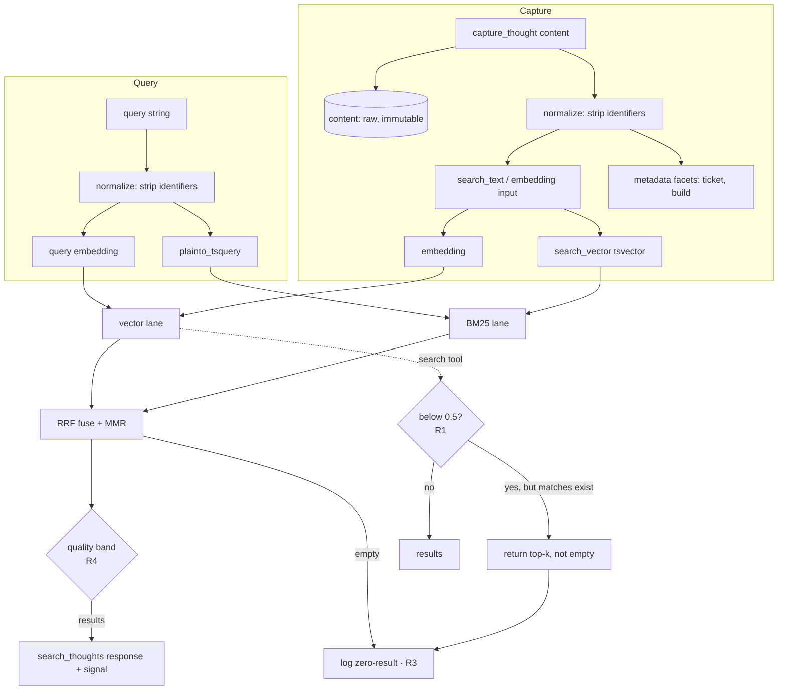

# feat: Retrieval Robustness (ST-054)

## Summary

A consuming agent searched ai-memory for `build 65008 PRI-5751 pipeline failure` and the
`search` tool returned an empty result. Investigation found three independent retrieval-path
defects, all verified against current source and the local Docker instance. This plan hardens
the hybrid search path so that **specificity narrows results without erasing them**, identifiers
stop poisoning recall, and zero-result events become observable. It is the tooling-side fix; the
plan deliberately excludes consumer-side capture/query discipline (the weaker lever) and graph-
expanded "connected" retrieval (owned by the reshaped ST-034).

The plan is gated by an eval harness built in ST-046 — without a seeded corpus, "0 results" is
ambiguous between broken ranking and an empty corpus, which is exactly the ambiguity that made
the original incident hard to diagnose.

---

## Problem Frame

Three proven defects (see origin QP-054 for the in-session verification trail):

- **D1 — `search` fails closed.** Vector-only with a hard `>= 0.5` similarity floor
  (`server/index.ts:51`). Identifier-heavy queries fall below the floor → `{"results":[]}`,
  indistinguishable from an empty store. Validated: local `search` returned `[]`; `search_thoughts`
  (no floor) returned 10.
- **D2 — identifiers poison both lanes.** Identifiers shift the embedding vector and, because
  `plainto_tsquery` ANDs every lexeme (`server/index.ts:131`, `server/db/search.sql:18-19`),
  collapse the BM25 lane to zero rows whenever the query contains a token (the unique ticket/build
  id) that no stored memory holds.
- **D3 — zero-result queries are invisible.** `search` never logs recall; `search_thoughts` logs
  only non-empty result sets (`server/index.ts:166`, `server/src/searchQuality.ts:62`). The
  false-empty rate cannot be measured today.
- **D3b — thin-corpus noise.** `search_thoughts` returns low-signal results formatted identically
  to authoritative ones, with no machine-parseable quality band.

**Non-goal framing:** the corpus was *also* genuinely empty of build-failure memories (0 matches on
direct DB check). This plan fixes retrieval; it cannot surface uncaptured memories. The eval harness
must seed a known corpus to keep the recall signal unambiguous.

---

## Requirements

Traceable to QP-054 in-scope items (D1–D3b) and PO decisions:

- **R1 (D1)** `search` must not return an empty set when relevant memories exist below the legacy
  floor. Response shape `{results:[{id,title,url}]}` is preserved and pinned by a characterization test.
- **R2 (D2)** Identifiers are normalized out of *retrieval text* (embedding input + tsquery input)
  via a non-destructive derivation; raw `content` is immutable; identifiers are retained as
  exact-match `metadata` facets.
- **R3 (D3)** Zero-result queries are logged for both `search` and `search_thoughts`.
- **R4 (D3b)** `search_thoughts` results carry a machine-parseable per-result quality signal.
- **R5 (gate)** The change passes the ST-046 eval harness: recall@k on incident-style queries
  (with and without identifiers) meets threshold, and a no-false-empty regression is green.
- **R6** Cross-model critical review passes before the story moves to Review (repo standard AC).

---

## Key Technical Decisions

### KTD-1 — Fix the `search` floor in place; do not add a parameter or variant
The MCP contract for `search` is its response *shape*, which the ChatGPT deep-research connector
binds to — not the internal 0.5 quality knob. Returning `[]` when matches exist is a bug, not a
guarantee. A flag/param is the *riskier* option because ChatGPT invokes `search` with a fixed
single-arg signature; a behavioral parameter cannot be required of that caller. So: change behavior,
pin the shape with a characterization test. (PO-confirmed.)

**Recommended policy: floor-with-fallback** (deepening F1). Keep the floor as a *preference*, not a
gate: return above-floor results when any exist; when none clear the floor, fall back to the top-k
nearest by similarity rather than an empty set. This preserves the current high-precision behavior on
strong-match queries while making "empty when relevant memories exist" structurally impossible — only
a genuinely empty store yields `[]`. The remaining open question is narrow: the exact fallback
constant / whether to keep any floor at all for the above-floor preference (settle in `/plan`,
informed by the ST-046 recall numbers).

### KTD-2 — Non-destructive identifier normalization (raw + derived + facets)
`content` is never mutated. A normalization helper produces the text used for embedding and BM25;
extracted identifiers are written to the existing `metadata` JSONB column as exact-match facets.
This is the structural version of "don't lead with the ticket" — enforced by the tool, not by agent
discipline. Whether the normalized text is *persisted* (a `search_text` column feeding the generated
`search_vector`) or computed *inline* is an open question for /plan (see Open Questions) — persisting
buys BM25 quality at the cost of a one-time backfill.

### KTD-3 — Reconcile identifier rules with ST-049
ST-049 (query routing) wants exact error codes, UUIDs, and short tokens to stay BM25-precise. The D2
normalizer must not strip those. The boundary (strip Jira-style `[A-Z]{2,}-\d+` and bare build
numbers `\d{4,}`; keep error codes/UUIDs/versions) is a KTD to settle jointly so the two stories
don't fight.

### KTD-4 — Quality signal is structured, not prose
R4's signal must be parseable by a consuming agent. **Recommended shape (deepening F2):** emit, per
result, a normalized `0–1` relevance score **plus** a discrete band — `high` / `medium` / `low` —
derived from absolute similarity thresholds (not RRF rank, which is relative and says nothing about
absolute closeness). The band is what lets an agent distinguish "authoritative hit" from "best guess
on a thin corpus" — the exact failure the validation surfaced (10 unrelated results all formatted
identically). Carried as a structured field in the response, not buried in the `rrf: 0.xxxx` text
line. The remaining open question is narrow: the band threshold values, which the ST-046 seeded
corpus calibrates.

### KTD-5 — Eval harness lives in ST-046, consumed here
ST-046 already owns the golden-set regression and the seeded corpus. Building a second harness in
ST-054 would duplicate it. ST-054 is *blocked by* ST-046; the gate is a dependency, not a deliverable.

---

## High-Level Technical Design

Retrieval-path data flow after this change (identifier normalization shown on both write and read
paths; the two failure-mode fixes annotated):

Directional guidance for review, not an implementation specification.

---

## Implementation Units

### U1. Characterize current `search` and `search_thoughts` behavior
**Goal:** Pin existing behavior before changing it, so the false-empty fix is provably a behavior
change and the response shape is locked.
**Requirements:** R1 (shape pin), R5 (baseline).
**Dependencies:** none.
**Files:** `server/tests/search-tool-contract.test.ts` (new).
**Approach:** Characterization tests asserting `search` returns `{results:[{id,title,url}]}` shape,
and capturing the *current* empty-on-floor behavior as a documented baseline the U2 change will flip.
Use the canonical SSE-parsing client in `server/tests/_helpers/mcpClient.ts`.
**Execution note:** Characterization-first — write these against current `index.ts` before any edit.
**Patterns to follow:** existing `server/tests/*.test.ts` + `_helpers/mcpClient.ts`.
**Test scenarios:**
- Happy path: `search` with a query that has a strong (>0.5) match returns ≥1 result with exactly
  `id`, `title`, `url` keys.
- Baseline (to be flipped by U2): `search` with an all-below-floor query currently returns `results: []`.
- Shape: every element has a 80-char-max `title` and a URL built from `CITATION_BASE_URL`.
**Verification:** tests pass against unmodified `server/index.ts`.

### U2. Graceful degradation for the `search` floor (D1 / R1)
**Goal:** `search` returns nearest-neighbor results instead of an empty set when everything is below
the legacy 0.5 floor, without changing the response shape.
**Requirements:** R1.
**Dependencies:** U1.
**Files:** `server/index.ts` (the `search` handler, lines ~43-65), `server/tests/search-tool-contract.test.ts`.
**Approach:** Replace the hard `>= 0.5` SQL predicate with the floor-with-fallback policy settled in
KTD-1: prefer above-floor results; when none clear the floor, return the top-k by similarity anyway.
Keep the `LIMIT 10` and ordering. Do not alter the shape. The only open bit is the fallback constant
(see KTD-1), not the policy.
**Patterns to follow:** the no-floor vector lane already used by `search_thoughts`
(`server/index.ts:153-158`) is the reference for "rank, don't gate."
**Test scenarios:**
- All-below-floor query now returns the top-k nearest (flips the U1 baseline).
- Above-floor query is unchanged (same top results, same order).
- Empty store still returns `results: []` (true empty is still possible).
- Shape characterization from U1 still green.
**Verification:** U1 suite passes with the baseline assertion updated to the new behavior.

### U3. Non-destructive identifier normalization helper (D2 / R2, R3-adjacent)
**Goal:** A single pure helper that, given text, returns `{ retrievalText, facets }` — stripping
identifier tokens from the retrieval text and extracting them as structured facets — leaving raw
input untouched.
**Requirements:** R2; reconciles with KTD-3.
**Dependencies:** none (pure module).
**Files:** `server/src/identifierNormalization.ts` (new), `server/tests/identifier-normalization.test.ts` (new).
**Approach:** Pattern set settled in /plan per KTD-3: strip Jira-style `[A-Z]{2,}-\d+` and bare build
numbers `\d{4,}`; **preserve** error codes, UUIDs, semantic versions (ST-049 precision). Return the
stripped/whitespace-collapsed text plus a `{ tickets: [...], builds: [...] }` facet object. No I/O,
fully unit-testable.
**Execution note:** Test-first — this is pure logic with sharp boundary cases.
**Test scenarios:**
- `build 65008 PRI-5751 pipeline failure` → retrievalText `build pipeline failure`,
  facets `{ builds: ["65008"], tickets: ["PRI-5751"] }`.
- Preserves a UUID and a semver token unchanged in retrievalText.
- Preserves an error code like `E0123` (or whatever KTD-3 settles) in retrievalText.
- Empty / identifier-only input → empty retrievalText, facets populated.
- Idempotent: normalizing already-normalized text is a no-op.
**Verification:** unit suite green; no regex catastrophic-backtracking on long inputs.

### U4. Apply normalization on the capture path (D2 / R2)
**Goal:** New captures embed and index on normalized text and persist identifier facets, while
storing raw `content` verbatim.
**Requirements:** R2.
**Dependencies:** U3.
**Files:** `server/index.ts` (`capture_thought`, ~lines 230-280), possibly `server/db/` (a
`search_text` column + facet write) — **schema-vs-inline is an Open Question**.
**Approach:** Run U3's helper on `content`; use `retrievalText` as the embedding input and (if
persisted) as the `search_text` feeding the BM25 index; merge `facets` into the existing `metadata`
JSONB (`server/index.ts:94` shows metadata is already surfaced). Raw `content` column unchanged.

**If `search_text` is persisted (deepening F3) — name the real cost:** the `search_vector` column in
`server/db/schema.sql` is a **generated tsvector currently derived from `content`**. Persisting
normalized text means *redefining that generated column to derive from `search_text` instead* — which
forces a full tsvector regeneration and a **GIN index rebuild across every existing row**, not just a
column add. Provide idempotent DDL consistent with the ST-039 `002_*.sql` precedent, and a one-time
backfill that (a) populates `search_text` for pre-existing rows and (b) lets the generated column
recompute. On the dev + test DBs this is cheap (small corpus); the plan records it because on a grown
production corpus it is a non-trivial migration, and the alternative (inline normalization at
embed/tsquery time, no persisted column) trades BM25 index quality for zero migration — that
schema-vs-inline fork is the U4 decision for `/plan` (see Risks).
**Patterns to follow:** ST-039 `server/db/002_needs_embedding.sql` idempotent-DDL + backfill pattern;
existing fire-and-forget embedding update.
**Test scenarios:**
- Capture a thought containing a ticket id → `metadata` contains the facet; embedding input excluded it.
- Raw `content` round-trips byte-for-byte via `fetch`.
- (If persisted) re-applying DDL is a no-op; backfill populates `search_text` for pre-existing rows.
**Verification:** integration test via `mcp-test`; `fetch` returns raw content + facet metadata.

### U5. Apply normalization on the query path (D2 / R2)
**Goal:** `search` and `search_thoughts` normalize the incoming query before embedding and
`plainto_tsquery`, so identifier tokens no longer collapse the BM25 lane or skew the vector.
**Requirements:** R2.
**Dependencies:** U3.
**Files:** `server/index.ts` (`search` and `search_thoughts` handlers).
**Approach:** Pass the query through U3's helper; use `retrievalText` for both lanes. Facets from the
query *may* later drive exact-match filtering (deferred — see Scope Boundaries). Keep RRF/MMR untouched.
**Test scenarios:**
- `search_thoughts` for `build 65008 PRI-5751 pipeline failure` against a seeded corpus containing a
  generic build-failure memory now returns it (BM25 lane no longer zeroed).
- A query with only identifiers degrades to the vector lane gracefully (no crash, no empty-by-AND).
- Plain queries with no identifiers are unchanged.
**Verification:** integration test in `mcp-test` against seeded corpus; the incident query surfaces
the seeded build-failure thought.

### U6. Zero-result observability (D3 / R3)
**Goal:** Every zero-result query is logged for both tools, making the false-empty rate measurable.
**Requirements:** R3.
**Dependencies:** none (independent of U2/U5 but most valuable alongside them).
**Files:** `server/index.ts` (both handlers), `server/src/searchQuality.ts` (extend `logRecall` or
add a zero-result log path), possibly `server/db/schema.sql` (`recall_events` already exists; a
nullable-result-count row or a dedicated column/flag — decide in /plan).
**Approach:** On the empty path that currently early-returns (`server/index.ts:166`), emit a recall
log row marking zero results (and the normalized query). `search` gets recall logging it currently
lacks entirely. Keep it fire-and-forget so it never affects the response (mirror existing
`logRecall` error handling at `searchQuality.ts:70`).
**Test scenarios:**
- A query guaranteed to miss writes a zero-result `recall_events` row (or equivalent) with the query text.
- Logging failure does not fail the search response (induce a log error, assert response still 200).
- A normal non-empty search still logs as today (no regression).
**Verification:** integration test asserts a row exists after a known-miss query.

### U7. Quality signal on `search_thoughts` results (D3b / R4)
**Goal:** Consumers can distinguish authoritative hits from thin-corpus best-guesses.
**Requirements:** R4.
**Dependencies:** none (formatting/contract change; pairs naturally with U2).
**Files:** `server/index.ts` (`search_thoughts` response builder, ~lines 200-209).
**Approach:** Emit a structured per-result quality field (normalized score + band, exact shape per
KTD-4) rather than only the inline `rrf: 0.xxxx` text. Must be machine-parseable. No ranking change —
the score already exists; this surfaces it.
**Test scenarios:**
- Strong-match result carries a `high` band / score above threshold.
- Thin-corpus result set carries `low` band signals (reproduce the validation scenario: 10 unrelated
  results all flagged low).
- Field is structurally present and parseable for every result.
**Verification:** integration test parses the signal from each result; thin-corpus query yields low band.

### U8. Eval-harness gate consumption (R5)
**Goal:** Prove the recall improvement and no-false-empty property via the ST-046 harness.
**Requirements:** R5, R6.
**Dependencies:** U2, U5, U7, **and ST-046** (harness + incident-query relevance set).
**Files:** `server/tests/search-golden-set.test.ts` (owned by ST-046; ST-054 adds incident cases).
**Approach:** Add incident-style queries (with and without identifiers) and assert recall@k meets the
threshold ST-046 defines, plus a no-false-empty regression (seeded related memory ⇒ `search` never
returns `[]`). This is the dependency seam — ST-054 cannot close until ST-046 lands.
**Test scenarios:**
- `Covers R5.` Incident query with identifiers retrieves the seeded build-failure memory within top-k.
- `Covers R5.` Same query stripped of identifiers retrieves it at an equal-or-better rank.
- `Covers R1/R5.` No-false-empty: with a seeded related memory present, `search` returns ≥1 result.
**Verification:** golden-set suite green in `mcp-test`.

---

## Scope Boundaries

In scope: D1, D2, D3, D3b retrieval-path fixes (R1–R4), the eval-gate consumption (R5), cross-model
review (R6).

### Deferred to Follow-Up Work
- **Query-facet exact-match filtering** — using normalized query facets (e.g. "only memories tagged
  build 65008") as a hard filter. U5 extracts them; wiring them to a filter is a later enhancement.
- **Capture-side prompting guidance** — making agents "lead with the problem" is the consumer-side
  lever; explicitly not pursued (ST-054 makes it structural instead).
- **Re-normalization backfill of historical thoughts** — only if U4 persists `search_text`; if so it
  reuses the ST-039 sweep pattern and may be split out.

### Outside this plan's scope
- **Graph-expanded "connected" retrieval** — reshaped **ST-034** owns it; depends on its cardinality
  bounding strategy. Do not retrofit graph fusion here.
- **The eval harness itself** — expanded **ST-046**.

---

## System-Wide Impact

Three distinct blast radii this change reaches, each worth a reviewer's attention (deepening F4):

- **`search` consumers (contract).** `search` is the ChatGPT-compatibility tool. U2 changes *which
  rows come back* (never the response shape — U1 pins that). Any external deep-research connector
  bound to `search` sees more results on previously-empty queries; none see a schema change.
- **Capture path (every new thought).** U4 inserts a normalization step into `capture_thought`, the
  single write path all memories flow through. A bug here affects *every* thought captured after
  deploy, so its tests (U3 unit + U4 integration) are load-bearing. Raw `content` immutability is the
  guardrail that keeps the blast radius to retrieval, not stored data.
- **Existing rows (schema/backfill).** Only if `search_text` is persisted (U4 / F3): the generated
  `search_vector` redefinition + reindex touches every existing row. Dev/test corpus is small;
  production is not. This is the highest-risk surface and the reason the schema-vs-inline fork is an
  explicit `/plan` decision rather than an executor judgment call.

---

## Risks & Dependencies

- **Hard dependency on ST-046.** ST-054 cannot prove R5 until the harness + seeded incident corpus
  exist. Sequencing: ST-046 → ST-054.
- **ST-049 collision (KTD-3).** If the D2 normalizer strips tokens ST-049 wants kept BM25-precise,
  the two stories regress each other. Settle the shared token-class boundary in /plan; add a test
  asserting error codes/UUIDs survive normalization.
- **Schema-vs-inline (U4).** Persisting `search_text` improves BM25 (generated `search_vector`) but
  forces a backfill and a DDL file; inline-only is simpler but leaves BM25 indexing on raw text.
  Resolve in /plan; if persisted, follow ST-039's idempotent-DDL precedent.
- **Generated-column reindex cost (F3).** Redefining `search_vector` to derive from `search_text`
  regenerates the tsvector and rebuilds the GIN index for every row — cheap on dev/test, non-trivial
  on a grown production corpus. Mitigation: prefer applying during a low-traffic window; the
  inline-only alternative avoids it entirely. Decided with the schema-vs-inline fork above.
- **Normalizer version drift (F5 — subtle, high-impact).** If doc-side normalization is *persisted*
  (`search_text`) and query-side is computed *inline*, the two must use the **same normalizer logic
  forever**. Changing the identifier regex set later silently desynchronizes persisted documents from
  normalized queries — recall degrades with no error and no log. Mitigations to choose in /plan:
  (a) keep normalization **query-side only** (never persist `search_text`) so there is a single code
  path and nothing to drift — the simplest safe option; or (b) if persisting, record a
  `normalizer_version` and re-run the backfill when it changes. The golden-set harness (ST-046) is
  the detector of last resort, but prevention beats detection here.
- **`search` is a ChatGPT-compat surface.** U2 must not change the response shape — U1's
  characterization test is the guardrail.
- **Contract drift telemetry.** U6 is partly self-justifying: without zero-result logging we cannot
  measure whether U2/U5 actually reduced false-empties in production.

---

## Sources & Research

- In-session source verification (2026-06-04): `server/index.ts`, `server/db/search.sql`,
  `server/src/searchQuality.ts` read directly; behavior of the two lanes, the 0.5 floor, the
  AND-semantics of `plainto_tsquery`, and the zero-result logging gap confirmed from code.
- Local-instance validation (separate agent session, 2026-06-04): `search` → `{"results":[]}`;
  `search_thoughts` → 10 low-signal results; direct DB check → 0 matches for the incident tokens.
- Adversarial design review (2026-06-04): drove the hypotheses-not-certainty framing, the
  non-destructive-normalization requirement, the conditional-not-always-on graph stance (→ ST-034),
  and the eval-harness gate (→ ST-046).
- No external/framework research run: the design is grounded in the existing codebase and the
  validated incident; RRF/MMR/pgvector mechanics are already established in `server/src/searchQuality.ts`
  and ST-005. (Recorded for honesty — this plan is codebase-grounded, not externally sourced.)

---

## Repo Planning-Workflow Alignment

This ce-plan artifact is **supporting material** for the repo's native `/plan` workflow
(`.github/prompts/plan.prompt.md`), not a replacement for it. How the pieces fit:

- **Authoritative seed = the query packet.** `/plan` Phase 2 reads `QP-054-retrieval-robustness.md`
  as its *sole input* and authors the ExecPlan against the `_TEMPLATE.md` structure. This document is
  required reading the QP points to for the implementation-unit breakdown (U1–U8), test scenarios, and
  KTD rationale that Phase 2 lifts into ExecPlan §4 / §2d — but the QP remains the contract.
- **Lifecycle (corrected 2026-06-04).** Per `plan.prompt.md`, a story is **Refined only once its
  ExecPlan is `✅ Ready for /continue`**; `/continue` auto-executes Refined stories. ST-054 therefore
  sits in **Backlog** until `/plan` Phase 2 produces and marks its ExecPlan Ready — placing it in
  Refined with only a seed QP would let `/continue` pick up a story with no ExecPlan. (This reverses
  the `/plan-new` intake's "Refined" placement, which conflicts with the operational lifecycle.)
- **Sequencing across the three stories:**
  1. **ST-046** (eval harness) — Backlog, blocked_by none. `/plan` it first; its Ready ExecPlan is the
     gate ST-054 depends on.
  2. **ST-054** (this plan) — Backlog, blocked_by ST-046. `/plan` after ST-046 lands.
  3. **ST-034** (reshaped: cardinality + connected-retrieval orchestration) — Backlog, blocked_by
     ST-037 (needs accumulated dogfooding data). Owns the "connected memories" answer ST-054 defers.
- **Cross-model review.** The ExecPlan's final task must carry the cross-model critical-review step
  (`plan.prompt.md` §"Cross-model review requirement"); R6 / the board AC already reserve it.
- **Verification posture.** ExecPlan task commands run **inside containers** (`docker compose
  --profile test exec mcp-test deno test …`), never host Deno — match each task's verification to its
  deliverable scope (no unrelated suites as a safety net).

---

## Origin

Planned from `.github/planning/query-packets/QP-054-retrieval-robustness.md` (see origin for the full
PO decision table and the verification trail). This ce-plan artifact feeds the repo's `/plan` session,
which will produce the executable ExecPlan at `.github/planning/execplans/exec-plan-ST-054.md`.
