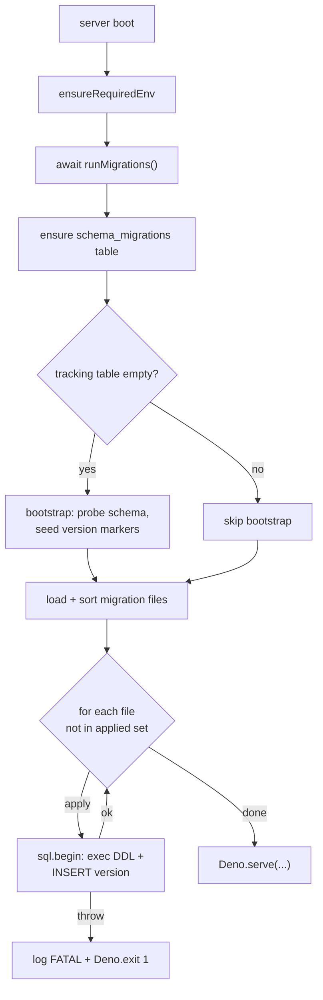

# feat: Migration Framework (ST-042)

## Summary

Add a lightweight, file-based migration framework to the cloud MCP server: a `schema_migrations` tracking table, a `server/src/migrate.ts` runner invoked at startup before the HTTP server binds, and a consolidated `server/db/migrations/` directory holding numbered SQL files. The runner bootstraps cleanly against the existing dev database (tables present, no tracking table) by detecting already-applied schema and seeding version markers, then applies any unapplied migrations inside transactions.

---

## Problem Frame

Schema changes today are applied two ways: Docker `/docker-entrypoint-initdb.d/` scripts (which only run once, on an empty data directory) or manual `psql -f` against the persistent dev DB. There is no record of which DDL a given database has received, no protection against double- or out-of-order application, and every new column requires a documented manual step in the ExecPlan. This works for one developer but is fragile and blocks ST-045 (worker idempotency) and ST-048 (metrics table), both of which need a reliable way to add schema.

---

## Requirements

- R1. Schema changes are applied via numbered migration files tracked in a `schema_migrations` table (QP-038 AC-9).
- R2. Against a **fresh** database, the runner records version entries for the baseline schema and every migration file, leaving the DB in the same shape Docker init produces today.
- R3. Against an **existing** database (tables present, no `schema_migrations`), the runner detects already-applied schema, seeds the tracking table with the correct version markers, and does **not** re-run or error on already-present DDL.
- R4. A new migration file dropped into `server/db/migrations/` is applied on next startup and its version recorded.
- R5. A failing migration aborts startup with a clear error (`Deno.exit(1)`), and the partial DDL is rolled back (transactional per migration).
- R6. No regression: the full `mcp-test` suite passes, and both dev and test DBs end in a schema-equivalent state to today.
- R7. Cross-model critical review passes before the story moves to Review (repo standard AC).

**Origin acceptance examples:** AE traces to QP-038 AC-9 (numbered migrations + tracking table).

---

## Scope Boundaries

- **Single-instance only.** No advisory-lock concurrency guard for multi-instance racing — noted as a future enhancement, not built (the deployment is single-instance today).
- **No rewrite of `schema.sql`/`graph.sql`.** The baseline schema stays as Docker-init scripts; `001_initial.sql` is a marker, not a re-statement of the full schema.
- **No retroactive migration of historical data.** This is infrastructure for *applying* DDL, not a data backfill.
- **The `MIGRATIONS_DISABLED` env flag is NOT added.** Unlike the worker disable flags, migrations must run in the test container (the runner is exactly what the tests exercise). See KTD-4.

### Deferred to Follow-Up Work

- **Advisory-lock concurrency guard** (`SELECT pg_advisory_lock(...)` around the runner): needed only when the server runs multi-instance. Record as a follow-up when cloud horizontal scaling is on the table.
- **Teaching the runner to own `graph.sql` / `search.sql`**: graph DDL stays Docker-init-only for now; folding it into a numbered migration is a later cleanup.

---

## Context & Research

### Relevant Code and Patterns

- **`server/src/db.ts`** — exports `sql` (postgres.js v3.4.4). Transactions via `sql.begin(async (tx) => {…})` are confirmed in use at `server/src/consolidationWorker.ts:119`. The runner must use this same pattern for atomic apply + record.
- **`server/index.ts:33`** — `ensureRequiredEnv()` is the first startup call; `Deno.serve(...)` is at line ~876. Deno 2 supports top-level `await`, so `await runMigrations()` slots in directly after line 33 with no IIFE wrapper.
- **`server/db/002_needs_embedding.sql`** (ST-039) — idempotent `ADD COLUMN IF NOT EXISTS` delta; currently COPY'd into the Dockerfile as `04-needs-embedding.sql`.
- **`server/db/003_search_text_and_recall_queries.sql`** (ST-054) — idempotent delta; **not** in the Dockerfile because `schema.sql` already carries the ST-054 columns for fresh DBs. It exists to upgrade pre-ST-054 databases.
- **Test DB access** — tests import `sql` directly from `../src/db.ts` and use direct INSERT/SELECT/DELETE with `sanitizeResources: false, sanitizeOps: false` (see `server/tests/embedding-backfill.test.ts`, `server/tests/capture-size-limit.test.ts`).
- **Path resolution** — `new URL("../db/migrations/", import.meta.url)` is the Deno-idiomatic way to locate files relative to the module (used in `server/tests/search-golden-set.test.ts:91`). Works under both the dev bind-mount and an image build.

### Institutional Learnings

- **Idempotent-DDL convention** (from `server/db/002_needs_embedding.sql` header): every delta uses `IF NOT EXISTS` guards so re-application is harmless. The runner relies on this as belt-and-suspenders even with version tracking.
- **Generated `search_vector` cannot be `ALTER`-ed in place** — `003` does a DROP + re-ADD of the generated column and rebuilds the GIN index. This is already inside `003`; the runner must execute that file's statements as-is inside one transaction. On a grown corpus this is a heavy operation, but on the dev DB (where `003`'s columns already exist via `schema.sql`) bootstrap detection marks it applied so it never re-runs.
- **No `docs/solutions/` directory exists yet** — these learnings live in ADRs and inline SQL comments. Not blocking.

### External References

- None. The design is grounded in the existing codebase and the QP-038/ST-042 stub. postgres.js transaction semantics are already established in-repo.

---

## Key Technical Decisions

- **KTD-1 — `001_initial.sql` is a no-op marker, not the full schema.** The baseline schema (`thoughts`, `consolidation_*`, `recall_*`, graph) is created by Docker init on fresh DBs. `001` exists only to anchor version numbering. Bootstrap detection marks it applied when `public.thoughts` exists. Rationale: re-stating 200 lines of `schema.sql` as a migration invites drift between the two; the marker keeps a single source of truth.

- **KTD-2 — Consolidate migration files under `server/db/migrations/` and repoint the Dockerfile.** Move `002_needs_embedding.sql` and `003_search_text_and_recall_queries.sql` into `server/db/migrations/`. Update the Dockerfile COPY for the `002` init script to the new path. Rationale: one canonical location the runner reads; avoids the duplication-and-drift trap of keeping two copies. `003` stays out of the Dockerfile (fresh DBs get its columns from `schema.sql`), but lives in `migrations/` so the runner can mark/apply it. *(PO-confirmed default; the alternative of leaving files in place and duplicating into `migrations/` was offered and not chosen.)*

- **KTD-3 — Bootstrap detection probes one schema artifact per version.** `001` ← `to_regclass('public.thoughts')`; `002` ← `needs_embedding` column on `thoughts`; `003` ← `search_text` column on `thoughts`. Each marker inserted `ON CONFLICT (version) DO NOTHING`. Rationale: the existing dev DB already has all three (schema.sql + manual ST-039/ST-054 applies), so a naive "run everything" would attempt re-applies; per-version detection makes the first run a pure no-op that just records state.

- **KTD-4 — No `MIGRATIONS_DISABLED` flag.** The worker disable flags exist because background workers race test writes. Migrations are different: the `mcp-test` server process *should* run the runner at boot — that is precisely what Task 4.3's tests assert. The fresh tmpfs `db-test` gets schema.sql + 002 via Docker init, then the runner bootstraps `schema_migrations` on first server start. Rationale: disabling migrations in test would mean never testing the runner end-to-end.

- **KTD-5 — Each migration applies inside `sql.begin()`.** DDL in Postgres is transactional, so a failing migration rolls back cleanly before `Deno.exit(1)`. The version INSERT happens inside the same transaction as the DDL, so tracking can never diverge from reality.

---

## Open Questions

### Resolved During Planning

- **Where do migration files live?** → `server/db/migrations/`, with `002`/`003` moved there and the Dockerfile repointed (KTD-2).
- **Does the test container need migrations disabled?** → No (KTD-4).
- **Is `001` the full schema or a marker?** → Marker (KTD-1).
- **Does the runner handle the existing dev DB?** → Yes, via per-version bootstrap detection (KTD-3).

### Deferred to Implementation

- **Exact `DATABASE_URL`-vs-individual-params resolution** the runner reads — it uses the same `sql` pool from `db.ts`, so this is inherited, not re-decided.
- **Whether `003`'s generated-column DROP/re-ADD needs a maintenance-window note in prod** — irrelevant on dev/test (bootstrap marks it applied); revisit only if a pre-ST-054 production DB is ever migrated live.

---

## Output Structure

    server/db/
      migrations/                              # new directory
        001_initial.sql                        # new — no-op version marker
        002_needs_embedding.sql                # moved from server/db/
        003_search_text_and_recall_queries.sql # moved from server/db/
      schema.sql                               # unchanged (baseline, Docker init)
      graph.sql                                # unchanged (Docker init)
      search.sql                               # unchanged (reference SQL, not executed)
    server/src/
      migrate.ts                               # new — the runner
    server/tests/
      migrations.test.ts                       # new

---

## High-Level Technical Design

> *This illustrates the intended approach and is directional guidance for review, not implementation specification. The implementing agent should treat it as context, not code to reproduce.*

On the **fresh test DB**: Docker init applies schema.sql + 002. First server boot finds an empty `schema_migrations`, bootstrap probes detect `thoughts` (→001), `needs_embedding` (→002), and `search_text` (→003, present via schema.sql), marks all three applied, then the apply loop finds nothing pending. On the **existing dev DB**: identical path — all three already present, all three marked, zero re-applies.

---

## Implementation Units

### U1. Consolidate migration files into `server/db/migrations/`

**Goal:** Establish the canonical migrations directory with the version marker and the two existing deltas, and repoint the Dockerfile so fresh-DB init still applies the `002` columns.

**Requirements:** R1, R2 (file layout the runner reads).

**Dependencies:** None.

**Files:**
- Create: `server/db/migrations/001_initial.sql`
- Move: `server/db/002_needs_embedding.sql` → `server/db/migrations/002_needs_embedding.sql`
- Move: `server/db/003_search_text_and_recall_queries.sql` → `server/db/migrations/003_search_text_and_recall_queries.sql`
- Modify: `docker/postgres-age/Dockerfile` (repoint the `04-needs-embedding.sql` COPY source to `server/db/migrations/002_needs_embedding.sql`)

**Approach:**
- `001_initial.sql` is a no-op marker (`SELECT 1;`) with a header comment explaining that the baseline schema is created by Docker init and this file only anchors version numbering (KTD-1).
- Moving `002` requires the Dockerfile COPY line for `04-needs-embedding.sql` to point at the new path — otherwise fresh-DB init loses the embedding columns. `003` is intentionally not added to the Dockerfile (schema.sql already carries its columns for fresh DBs).
- Verify no other references to the old `server/db/002_*`/`003_*` paths exist (grep the repo, including ExecPlans and `docker-compose.yml`).

**Patterns to follow:** existing idempotent-DDL files; the Dockerfile COPY block at `docker/postgres-age/Dockerfile:24-27`.

**Test scenarios:**
- Integration: rebuild the test image and `--profile test up`; `\d public.thoughts` on `db-test` still shows `needs_embedding`, `embedding_model`, `embedding_attempts`, `embedding_error` (proves the Dockerfile repoint kept fresh-DB init intact).
- Edge: grep finds zero stale references to `server/db/002_needs_embedding.sql` / `server/db/003_*` outside `migrations/`.

**Verification:** Test image rebuilds; `db-test` has the ST-039 columns; no dangling path references remain.

---

### U2. Implement the migration runner (`server/src/migrate.ts`)

**Goal:** A `runMigrations()` that ensures the tracking table, bootstraps an existing DB on first run, then applies unapplied migrations transactionally.

**Requirements:** R1, R3, R4, R5.

**Dependencies:** U1 (reads files from `server/db/migrations/`).

**Files:**
- Create: `server/src/migrate.ts`

**Approach:**
- `ensureMigrationsTable()` — `CREATE TABLE IF NOT EXISTS schema_migrations (version INT PRIMARY KEY, filename TEXT NOT NULL, applied_at TIMESTAMPTZ NOT NULL DEFAULT now())`.
- `loadMigrationFiles()` — read `new URL("../db/migrations/", import.meta.url)` via `Deno.readDir`, match `^(\d+)_`, sort numerically (KTD path-resolution).
- `detectBootstrap()` — only when `schema_migrations` is empty: probe `to_regclass('public.thoughts')` → mark 001; probe `needs_embedding` column → mark 002; probe `search_text` column → mark 003. Each `INSERT … ON CONFLICT (version) DO NOTHING` (KTD-3).
- Apply loop — for each file whose version is not in the applied set, run `sql.begin(async (tx) => { await tx.unsafe(content); await tx\`INSERT INTO schema_migrations …\`; })`. On throw: `console.error("[migrate] FATAL …")` + `Deno.exit(1)` (KTD-5).
- Log a one-line summary (`all migrations already applied` / `applied N new migration(s)`).

**Execution note:** Test-first — U3's tests (written in this unit's verification) characterize the bootstrap and apply paths; implement against them.

**Technical design:** *(see High-Level Technical Design flowchart — the runner mirrors that control flow.)*

**Patterns to follow:** `sql.begin()` usage in `server/src/consolidationWorker.ts:119`; idempotent-DDL convention; `import.meta.url` path resolution in `server/tests/search-golden-set.test.ts`.

**Test scenarios:**
- Happy path (fresh): against a DB with schema present but no `schema_migrations`, `runMigrations()` creates the table and records versions 1, 2, 3.
- Integration (bootstrap, existing DB): `schema_migrations` empty + `thoughts`/`needs_embedding`/`search_text` all present → all three marked applied, zero DDL re-applied (assert no error and row count == 3).
- Happy path (new migration): drop a temp `004_test_marker.sql` (a guarded `CREATE TABLE IF NOT EXISTS _migtest(...)`), run → version 4 recorded, table exists; clean up the temp file + table in `finally`.
- Error path (R5): a deliberately broken migration (e.g. `SELECT * FROM __nope__`) causes the apply to throw; assert the transaction rolled back (no partial object, version not recorded). *Test this via a direct call to the internal apply path with an injected bad file rather than triggering `Deno.exit` in-process — see Open Questions / verification note.*
- Edge (idempotent re-run): calling `runMigrations()` twice in a row records nothing new on the second call.

**Verification:** `deno check src/migrate.ts` clean; the migration unit tests pass against `db-test`.

---

### U3. Wire `runMigrations()` into startup

**Goal:** Migrations run before the HTTP server accepts requests, after the env gate.

**Requirements:** R1, R6.

**Dependencies:** U2.

**Files:**
- Modify: `server/index.ts` (import + `await runMigrations()` after `ensureRequiredEnv()` at line ~33)

**Approach:**
- Add `import { runMigrations } from "./src/migrate.ts";` alongside the other `./src/*` imports.
- Insert `await runMigrations();` immediately after `ensureRequiredEnv()` (line 33), before `McpServer` construction. Deno 2 top-level await needs no wrapper.
- Confirm `Deno.serve` still runs after migrations complete (the await ensures ordering).

**Patterns to follow:** the existing startup ordering in `server/index.ts` (env gate → registration → serve → workers).

**Test scenarios:**
- Integration: restart `mcp-test`; logs show `[migrate] checking for pending migrations...` followed by `all migrations already applied` (the test DB is already bootstrapped by U2's first run).
- Happy path: server still serves `/health` 200 after the migration step (no startup hang).

**Verification:** `mcp-test` boots cleanly with migrate log lines; `/health` responds; full suite unaffected.

---

### U4. Tests + full-suite verification + cross-model review

**Goal:** Prove R2–R5 with focused tests, confirm no regression, and pass the cross-model gate.

**Requirements:** R6, R7.

**Dependencies:** U2, U3.

**Files:**
- Create: `server/tests/migrations.test.ts`

**Approach:**
- Use the `sql`-from-`db.ts` direct pattern with `sanitizeResources: false, sanitizeOps: false`. **Do not** use `getDbConnection()` — it does not exist (the ST-042 stub's test code is wrong on this point).
- Assert: `schema_migrations` exists; contains versions 1/2/3 with correct filenames; a freshly-added temp migration is applied and recorded; re-running is a no-op. Clean up any temp migration file + created objects in `finally`.
- Run the full suite to confirm no regression, then run a cross-model critical review against R1–R7 and record the verdict in the ExecPlan.

**Test scenarios:**
- `Covers R1.` `schema_migrations` table exists after startup and has the version PK shape.
- `Covers R2/R3.` Versions 1, 2, 3 are recorded with filenames `001_initial.sql`, `002_needs_embedding.sql`, `003_search_text_and_recall_queries.sql`.
- `Covers R4.` Adding a temp `00N_*.sql` and re-running records the new version and creates its object.
- `Covers R5.` A broken migration rolls back and does not record a version (tested via the internal apply path to avoid killing the test process).
- Edge: second `runMigrations()` call records nothing new.

**Verification:** `docker compose --profile test exec mcp-test deno test --allow-net --allow-env --allow-read tests/` ends `0 failed`; cross-model review PASS recorded.

---

## System-Wide Impact

- **Interaction graph:** Adds one new synchronous-await step to startup (`runMigrations()` between the env gate and server construction). No request-path code changes. Workers start after `Deno.serve` as before.
- **Error propagation:** A failed migration is fatal by design (`Deno.exit(1)`) — the server refuses to start on an inconsistent schema rather than serving against it. Per-migration transactions ensure no partial DDL survives a failure.
- **State lifecycle risks:** First-run bootstrap is the sensitive path — if a version probe is wrong, the runner could attempt to re-apply already-present DDL. Mitigated by (a) per-version detection and (b) every migration file being idempotent (`IF NOT EXISTS`), so even a missed marker degrades to a harmless no-op rather than an error.
- **API surface parity:** None — purely operational infrastructure.
- **Integration coverage:** The Dockerfile repoint (U1) and the bootstrap-on-existing-DB path (U2) are the cross-layer behaviors unit logic alone won't prove; both have integration scenarios against `db-test`.
- **Unchanged invariants:** `schema.sql`, `graph.sql`, `search.sql` are untouched. Fresh-DB Docker init still produces the same schema. The dev DB's existing data and schema are unchanged — the runner only *records* what's already there.

---

## Risks & Dependencies

| Risk | Mitigation |
|------|------------|
| Dockerfile repoint (U1) breaks fresh-DB embedding columns if the COPY path is wrong | U1 integration scenario rebuilds the image and asserts the four ST-039 columns exist on `db-test` |
| Bootstrap detection misses a version → runner tries to re-apply present DDL | Per-version probes (KTD-3) + every migration file is idempotent (`IF NOT EXISTS`), so a miss is a no-op, not an error |
| `003`'s generated-column DROP/re-ADD runs unexpectedly on a populated DB | On dev/test the `search_text` column already exists, so bootstrap marks 003 applied and it never runs; flagged for a maintenance-window note only if a pre-ST-054 prod DB is ever migrated live |
| Testing R5 (failed migration) would call `Deno.exit(1)` and kill the test runner | Exercise the apply/rollback via the internal function path with an injected bad file, not the top-level `runMigrations()` that exits |
| Multi-instance race on the runner | Out of scope (single-instance today); advisory-lock guard recorded as Deferred Follow-Up |
| Hard dependency: ST-045 and ST-048 build on this | Sequencing only — ST-042 ships first; no code dependency in the other direction |

---

## Documentation / Operational Notes

- Update `server/db/002_needs_embedding.sql`'s header note (and any ExecPlan references) that still say "ST-042 not built" once this lands — the manual-application contract changes to "applied by the runner."
- The runner logs its decisions (`bootstrap: marked …`, `applied N new migration(s)`); these are the operational signal for verifying a deploy applied schema correctly.
- Strong candidate for a `docs/solutions/` entry once `docs/solutions/` exists (the idempotent-DDL + bootstrap pattern is reusable institutional knowledge).

---

## Sources & References

- **Origin document:** `.github/planning/execplans/exec-plan-ST-042.md` (Not-Ready stub with QP-038-derived draft design)
- Query packet: `.github/planning/query-packets/QP-038-Vectorize-MCP-Repo-Review.md` §4.12 (AC-9)
- Related code: `server/src/db.ts`, `server/index.ts:33`, `server/src/consolidationWorker.ts:119`, `server/db/002_needs_embedding.sql`, `server/db/003_search_text_and_recall_queries.sql`, `docker/postgres-age/Dockerfile:24-27`
- Related stories: ST-039 (shipped the `002` delta), ST-054 (shipped the `003` delta), ST-045 / ST-048 (downstream consumers of this framework)
