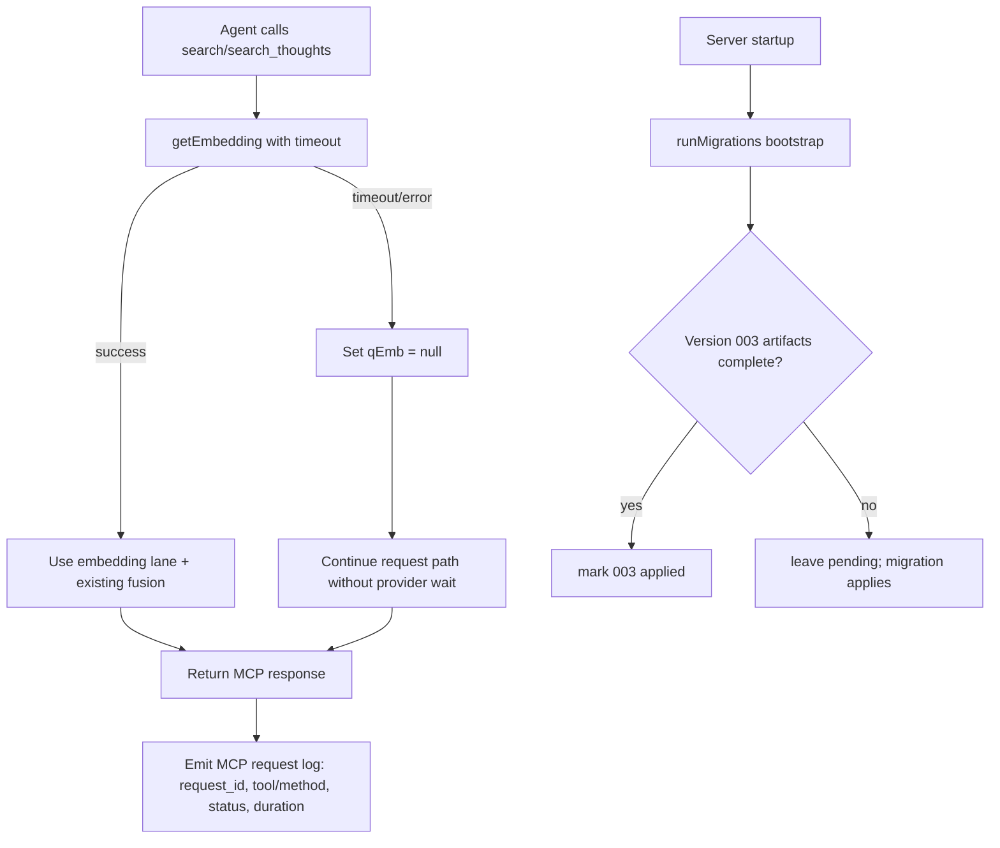

# fix: Prevent Search Stalls and Add MCP Request Observability

## Summary

Resolve agent-visible stalling on `search`/`search_thoughts` by bounding embedding calls with explicit timeouts and fail-open behavior, then add request-level MCP diagnostics so future stalls can be traced without client-side captures. Include a small migration-bootstrap correctness fix so recall-query logging is dependable and no longer emits false noise.

---

## Problem Frame

Current behavior confirms a partial availability failure:

- `/health` is healthy and core MCP surfaces (`tools/list`, `thought_stats`) respond quickly.
- Stall symptom is concentrated in `search` and `search_thoughts`.
- Both paths depend on `getEmbedding(...)`, which currently performs network `fetch(...)` with no timeout.
- When OpenRouter hangs or is slow, request latency can grow unbounded from the agent perspective.

Separately, logs repeatedly show `relation "recall_queries" does not exist`. This is likely caused by bootstrap logic that marks migration `003` as applied based on `search_text` presence only, even though `003` also creates `recall_queries`.

---

## Requirements

- R1. `search` and `search_thoughts` must have bounded response time when embedding providers are degraded or hanging.
- R2. Embedding timeout/failure must degrade gracefully (`qEmb = null`) rather than stalling the request path.
- R3. MCP requests must be diagnosable from server logs with correlation id, request method/tool, status, and duration.
- R4. Diagnostics must be safe by default (redacted/minimal payload logging unless explicitly enabled).
- R5. Bootstrap/migration logic must not mark migration `003` applied unless all required schema artifacts for that version are present.
- R6. Existing MCP protocol compatibility and search contract behavior remain intact.

---

## Scope Boundaries

- No changes to retrieval ranking policy (RRF/MMR/bands) beyond timeout-driven fail-open behavior.
- No client/agent SDK changes required for the initial fix.
- No full observability platform rollout (tracing backend, dashboards, alerts) in this iteration.

### Deferred to Follow-Up Work

- Build a dedicated “debug capture” admin tool for redacted request/response snapshots (tracked TODO: `add-agent-request-debug-tool`).
- Optional retry/circuit-breaker policy for embedding providers if timeout-only mitigation proves insufficient.

---

## Context & Research

### Relevant Code and Patterns

- `server/src/embeddings.ts` is the single embedding gateway used by query-time and background paths.
- `server/index.ts` `search` currently awaits embedding directly; `search_thoughts` already has local `.catch(() => null)` behavior.
- `server/index.ts` `/mcp` route currently has no structured per-request logging/correlation.
- `server/src/migrate.ts` bootstrap detection for migration `003` keys off `search_text` only.
- `server/db/migrations/003_search_text_and_recall_queries.sql` creates both search fields and `recall_queries`.

### Existing Test Surfaces to Extend

- `server/tests/search-tool-contract.test.ts`
- `server/tests/mcp-protocol-compat.test.ts`
- `server/tests/migrations.test.ts`

---

## Key Technical Decisions

- KTD-1. Introduce a shared embedding timeout in `embeddings.ts` using `AbortController`; timeout must be configurable via env with a safe default.
- KTD-2. Query tools (`search`, `search_thoughts`) treat embedding timeout/failure as non-fatal and continue with available lexical/vector-independent behavior.
- KTD-3. Add lightweight MCP request logging at the `/mcp` boundary with correlation id + duration + terminal status; payload body logging remains opt-in and redacted.
- KTD-4. Tighten migration `003` bootstrap detection to require all three distinct artifacts added by that migration — `search_text` column, `normalizer_version` column, and `recall_queries` table — before seeding version 3.

---

## High-Level Technical Design

---

## Implementation Units

### U1. Add bounded embedding calls and timeout controls

**Goal:** Ensure provider latency cannot stall request handling indefinitely.

**Requirements:** R1, R2.

**Dependencies:** None.

**Files:**
- Modify: `server/src/embeddings.ts`
- Modify (if needed for validation): `server/src/startupValidation.ts`

**Approach:**
- Wrap embedding `fetch` with `AbortController` + timeout.
- Add env-driven timeout config (for example `EMBEDDING_TIMEOUT_MS`) with a conservative default.
- Preserve current error propagation semantics from `getEmbedding`, but ensure timeout returns promptly with explicit timeout error context.

**Patterns to follow:** existing fail-fast env handling and explicit error messages in `embeddings.ts` / `startupValidation.ts`.

**Test scenarios:**
- Happy path: valid embedding response completes before timeout and returns vector.
- Error path: simulated hung/slow fetch aborts at configured timeout and throws timeout-shaped error.
- Edge case: invalid/empty timeout config falls back to default without crashing startup.

**Verification:** embedding timeout behavior is deterministic and bounded under forced slow provider conditions.

---

### U2. Apply fail-open query behavior for embedding-dependent tools

**Goal:** Keep `search` and `search_thoughts` responsive even when embedding provider is degraded.

**Requirements:** R1, R2, R6.

**Dependencies:** U1.

**Files:**
- Modify: `server/index.ts`
- Modify: `server/tests/search-tool-contract.test.ts`
- Modify or add: `server/tests/search-golden-set.test.ts` (only if needed to capture timeout-path expectations)

**Approach:**
- Align `search` behavior with resilient flow: on embedding timeout/error, continue using lexical fallback path rather than returning a stalled or hard-error response.
- Keep response shape and compatibility guarantees unchanged.
- Ensure `search_thoughts` timeout path remains bounded and does not regress quality-band output shape.

**Execution note:** test-first for timeout-path behavior. `OPENROUTER_BASE` is currently a hardcoded constant — to write integration tests that force a controlled embedding hang, extract it to an env var (e.g., `OPENROUTER_BASE_URL`, falling back to the hardcoded default). This follows the existing `MCP_BASE_URL` / `DB_*` env-var patterns and enables pointing `mcp-test` at a stub server. Alternatively, scope timeout-path coverage to isolated unit tests that stub `globalThis.fetch` — follow the `succeedEmbed`/`failEmbed` injection pattern from `server/tests/embedding-backfill.test.ts`.

**Patterns to follow:** existing `search_thoughts` `qEmb` nullable flow in `server/index.ts`; `succeedEmbed`/`failEmbed` injection in `embedding-backfill.test.ts` for unit-level stubs.

**Test scenarios:**
- Happy path: normal query with healthy embeddings returns existing shape and non-empty results where expected.
- Error path: embedding timeout returns via unit stub (stubbed `globalThis.fetch`) or controlled env-var stub server; `search` returns valid payload quickly.
- Error path: embedding timeout in `search_thoughts` returns valid JSON payload (with `results` array and quality fields) via same stub path.
- Integration: MCP protocol compatibility remains intact for `tools/call` + SSE envelopes.

**Verification:** timeout-induced provider degradation no longer manifests as agent-visible stall for these tool calls.

---

### U3. Add structured MCP boundary diagnostics

**Goal:** Make future stalls diagnosable from server-side evidence.

**Requirements:** R3, R4, R6.

**Dependencies:** None (independent sequencing; however, both U2 and U3 modify `server/index.ts` — schedule and execute sequentially, not in parallel, to avoid merge conflicts).

**Files:**
- Modify: `server/index.ts`
- Add (optional helper): `server/src/mcpDiagnostics.ts`
- Add or modify tests: `server/tests/mcp-protocol-compat.test.ts`

**Approach:**
- Add request correlation id: honor inbound `X-Correlation-ID` header if present (validate against `^[A-Za-z0-9\-_.]{1,128}$` and reject/replace with a server-generated UUID v4 if missing or non-matching), otherwise generate UUID v4. Write only the sanitized/generated value to logs.
- Log one structured line per `/mcp` request: timestamp, request_id, method/tool (when parseable from body — use Hono's `c.req.json()` or `c.req.raw.clone().json()` for body inspection; **do not** call `c.req.raw.json()` directly as it exhausts the `ReadableStream` before the MCP SDK reads it), status code, duration, and error class. Include an `embedding_lane` field (values: `"full"` when both BM25 and vector lanes ran, `"bm25_only"` when embedding timed out and the fail-open path activated, `"n/a"` for non-search tools) so operators can distinguish degraded from healthy responses at a glance. Log a safe sentinel string (e.g., `"<parse-error>"`) when the request body cannot be parsed — do not log raw fragments.
- Keep body/payload logging disabled by default; when enabled (via env flag), redact auth/token-sensitive HTTP headers **and** omit tool `params` fields that carry user content (e.g., `params.content`, `params.query`). Only structural fields (`name`, `method`, `id`) are safe to capture.

**Patterns to follow:** existing startup and worker logging style; avoid verbose per-chunk SSE logging.

**Test scenarios:**
- Happy path: successful MCP call emits expected structured log fields.
- Error path: unauthorized or invalid request still logs request id + status + duration.
- Edge case: malformed JSON-RPC body logs safely without crashing handler.

**Verification:** operators can correlate a stalled report to a concrete request lifecycle in logs.

---

### U4. Fix migration 003 bootstrap artifact detection

**Goal:** Prevent false “migration applied” state that suppresses `recall_queries` creation.

**Requirements:** R5.

**Dependencies:** None.

**Files:**
- Modify: `server/src/migrate.ts`
- Modify: `server/tests/migrations.test.ts`

**Approach:**
- Update bootstrap detection for version `003` to require all three distinct artifacts: `search_text` column, `normalizer_version` column, and `recall_queries` table (confirmed by auditing `003_search_text_and_recall_queries.sql` — this is the complete set of probe-friendly additions; the `search_vector` column and indexes existed or were modified by this migration but are not reliable bootstrap indicators).
- Only seed `schema_migrations` version 3 when the full artifact set is confirmed present.
- **Add a runtime repair probe** (run after bootstrap detection, unconditionally on startup): check whether version 3 is recorded in `schema_migrations` but `recall_queries` is absent. If so, re-apply migration 003 idempotently (the migration uses `IF NOT EXISTS` / `IF EXISTS` guards throughout). This self-heals any database that was bootstrapped before the bug fix without disrupting clean or already-correct databases.
- Keep idempotent bootstrap semantics for fresh and already-correct databases.

**Patterns to follow:** existing bootstrap probes and `ON CONFLICT DO NOTHING` writes in `migrate.ts`.

**Test scenarios:**
- Happy path: DB with all three artifacts (`search_text`, `normalizer_version`, `recall_queries`) marks v3 as applied during bootstrap.
- Edge case: DB with `search_text` and `normalizer_version` but missing `recall_queries` does not mark v3 applied during bootstrap.
- Edge case: DB where v3 is recorded in `schema_migrations` but `recall_queries` is absent triggers the runtime repair probe, re-applies 003 idempotently, and the noise log disappears.
- Integration: pending migration then creates missing table and records v3 correctly.

**Verification:** recurring `recall_queries does not exist` log noise disappears after migration correctness fix.

---

## Risks & Dependencies

- External provider behavior remains a dependency; timeout bounds impact but does not eliminate provider failure risk.
- Too-short timeout can reduce vector contribution quality; too-long timeout weakens stall mitigation. Calibrate with existing search tests and observed latency.
- Request-level logging must avoid leaking sensitive payloads; keep secure defaults.

---

## Open Questions

### Resolved During Planning

- Stalls are concentrated in embedding-backed query paths, not transport startup.
- Existing logging is insufficient for request-level diagnosis.

### Deferred to Implementation

- Exact default timeout value and whether separate timeouts are needed for query-time vs background embedding flows.
- Whether to expose request id in MCP response headers for cross-system correlation.

### Open Questions

- **pgvector statement timeout (scope TBD):** The root cause analysis names the embedding hang as the primary stall vector, but `db.query(...)` in `search`/`search_thoughts` also has no timeout. A slow pgvector similarity search on a growing dataset is a second independent stall path. Evaluate whether a configurable `statement_timeout` per connection (via `SET statement_timeout = <N>ms` or `QUERY_TIMEOUT_MS` env var in the pool setup) should be included in this plan or tracked as a follow-up. *(Source: adversarial reviewer)*

---

## Verification Strategy

- Preserve protocol compatibility (`server/tests/mcp-protocol-compat.test.ts`).
- Add timeout-path regression coverage for `search`/`search_thoughts`.
- Extend migration tests to cover partial-artifact bootstrap case for migration 003.
- Confirm log shape and correlation-id presence for success and failure request paths.
