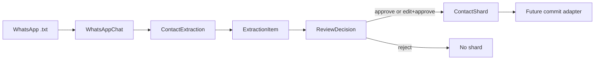

# feat: Spec Contact Memory Parser Types

## Summary

Define the shared Contact Memory parser type contract before implementation: WhatsApp parser output, AI extraction output, per-item review decisions, and the reviewed item-to-shard seam. The central invariant is that a full `ContactExtraction` is review-only, while each approved extraction item independently becomes one `ContactShard` for later adapter-driven commit.

---

## Problem Frame

Contact Memory needs a supplier-agnostic WhatsApp extraction pipeline shared by a Supabase Edge Function and local CLI. Without a precise type seam, implementation can accidentally commit whole extraction batches, leak platform-specific MCP details into domain types, or persist invalid tag/provenance metadata.

---

## Requirements

- R1. Define parser-output types for WhatsApp exports without AI/runtime dependencies.
- R2. Define `ContactExtraction` as an intermediate review-only AI output that cannot be treated as a platform shard.
- R3. Define `ExtractionItem` as a discriminated union covering commitments, events/logistics, interests/preferences, sentiment snapshots, important dates, shared links, and metadata/theme items.
- R4. Define `ReviewDecision` so approval, edit, and rejection are per item, not per extraction batch.
- R5. Define `ContactShard` as one approved item mapped to Contact-domain shard semantics: content, validated tags, source, agent context, and session ID.
- R6. Keep `ContactShard` independent from commit mechanisms such as current `capture_thought` and future `memory_teach`; translation belongs in a separate commit adapter.
- R7. Extract tag grammar into a shared utility that both `server/src/parseContext.ts` and `contact-memory/parser/types.ts` import; do not mirror tag regex/constants in Contact code.
- R8. Encode ContactShard tags as validated/branded values anchored to the shared tag grammar, not loose `string[]`.
- R9. Preserve human-review safety by requiring stable item identity, review audit provenance, bounded evidence/provenance, and sensitive-inference safeguards.
- R10. Add focused contract tests for type/schema validation, review decision mapping, tag validation, and shard-boundary invariants.

---

## Scope Boundaries

- This plan scopes only the shared type contract and its contract tests.
- No WhatsApp parsing implementation is included.
- No AI extraction prompt, provider runtime, Edge Function, CLI, Contact MCP, or commit adapter implementation is included.
- No platform database schema change is included.
- No Android review UI is included.
- No tag-based search/list filtering is included.

### Deferred to Follow-Up Work

- `contact-memory/parser/whatsapp.ts`: implement parsing behavior and parser edge-case tests after the type contract is in place.
- `contact-memory/parser/extractor.ts`: implement prompt/schema validation and provider-facing extraction contract after item schemas stabilize.
- `contact-memory/runtime/agent.ts`: implement supplier-agnostic runtime and provider adapters separately.
- Contact commit adapter: translate `ContactShard` into the current platform primitive without coupling domain types to `capture_thought` or `memory_teach`.
- Edge Function and CLI shells: wire parser, extractor, runtime, review, and commit adapter after the shared module contract exists.

---

## Context & Research

### Relevant Code and Patterns

- `docs/investigations/BOOTSTRAP_contact_memory_parser_session.md`: source bootstrap for locked Contact Memory parser architecture and immediate agenda.
- `docs/architecture/ai_memory_architecture_decisions.md`: Contact Memory product architecture superseding older platform assumptions.
- `docs/design/adr/ADR-012-tags-replace-binary-profile.md`: tags replace `profile`; products may introduce namespaced tags.
- `server/src/parseContext.ts`: current canonical tag grammar and limits; this plan extracts those internals into a shared utility instead of duplicating them.
- `server/index.ts`: current platform write primitive stores tags through `context` and must not leak into `ContactShard` as a domain dependency.
- `server/tests/parseContext.test.ts` and `server/tests/context-validation.test.ts`: existing validation-test style for tag/context edge cases.

### Institutional Learnings

- `docs/solutions/runtime-errors/parsecontext-null-safety-in-operator-crash-2026-06-23.md`: validation-producing modules should colocate type guards/helpers with the union they produce so callers do not hand-roll unsafe narrowing.
- `docs/solutions/workflow-issues/explicit-test-requirements-in-plans-2026-06-19.md`: plans need named contract tests, not broad “add tests” language.

### External References

- None used. Local architecture decisions and current platform contracts are sufficient for this scoped type plan.

---

## Key Technical Decisions

- One approved item commits as one shard: `ContactExtraction` never commits as a single platform record; approved items become independent `ContactShard` candidates for granular retrieval and independent supersession.
- `ContactExtraction` is review-only: it carries AI extraction batch context and items, but no platform-mapped content/tags/source shape that would encourage direct persistence.
- `ContactShard` is a Contact Memory domain type: it describes what happened in Contact terms and stays independent from platform commit primitives.
- `ContactShard.source` uses Contact vocabulary: `whatsapp_export`, `manual`, and `ai_session` are Contact-domain provenance values. Any mapping to the current platform `source` enum belongs in the future commit adapter.
- `agent_context` and `session_id` are Contact provenance on `ContactShard`: the type exposes them as domain fields, while platform storage placement is an adapter concern.
- Tags use one shared grammar utility: extract the current regex, count limits, length limits, duplicate handling, and validation result shape into a shared module imported by both `server/src/parseContext.ts` and `contact-memory/parser/types.ts`.
- Tags are a validated/branded type: `ContactShard` must not expose tags as raw `string[]`; helpers or schemas should construct branded values only through the shared grammar utility.
- Contact Memory tests need their own Deno execution surface: because existing `mcp-test` mounts `server/`, this plan should create Contact-local Deno configuration or otherwise document an executable test path before adding `contact-memory/tests`.
- Stable item identity is required: every extraction item needs a unique item identifier so review decisions survive reordering, filtering, and edits.
- Item ID ownership belongs to deterministic post-processing, not raw AI output: the extraction envelope and review decisions should identify both the extraction batch and item target so retries, filtering, and edits cannot attach decisions to the wrong item.
- Edits revalidate the item: an edit decision should carry a replacement item that still satisfies the discriminated-union branch and preserves evidence/provenance rather than bypassing validation with freeform text.
- Group chats are representable but not silently targetable: parser-level types may describe group chats, while shard creation requires explicit contact targeting before a `contact:*` tag can be produced.
- Evidence is bounded: `ContactShard` must carry minimal evidence references and optional bounded/redacted quotes, not raw full WhatsApp chats, full transcripts, or unbounded message arrays.
- Sentiment is sensitive inferred data: sentiment items require explicit sensitivity/inference metadata, confidence, evidence, and review-visible rationale before they can become shard candidates.

---

## Open Questions

### Resolved During Planning

- Should `ContactShard.source` use Contact-domain provenance or current platform enum values? It uses Contact-domain provenance; adapter translation owns platform coupling.
- Should `ContactExtraction` map to `public.thoughts`? No. It is an intermediate review-only type; only `ContactShard` maps to a commit candidate.
- Should commit mechanism naming appear in `ContactShard`? No. The future adapter owns `capture_thought` versus `memory_teach` translation.
- Should Contact code mirror the platform tag grammar? No. The grammar must be extracted to one shared utility and imported by both existing context parsing and the Contact type contract.

### Deferred to Implementation

- Exact slugging behavior for names with non-ASCII characters, emoji, or punctuation: the implementation should choose a deterministic rule and test it against the tag grammar.
- Exact content rendering per extraction item kind: `types.ts` should define the contract, but prose generation for final shard content can be refined in the commit adapter or extractor layer.
- Exact runtime validation library shape: the implementation may use Zod schemas, type guards, or both, provided tests prove runtime validation and branded tag construction through the shared tag grammar utility.

---

## Output Structure

    contact-memory/
      deno.json
      parser/
        types.ts
      tests/
        parser/
          types.test.ts
    shared/
      tagGrammar.ts
    server/
      src/
        parseContext.ts
      tests/
        parseContext.test.ts
        context-validation.test.ts

---

## High-Level Technical Design

> *This illustrates the intended approach and is directional guidance for review, not implementation specification. The implementing agent should treat it as context, not code to reproduce.*

The type seam has four distinct layers: parser output without AI, AI extraction output for review, review decisions per item, and one approved item mapped into one Contact-domain shard candidate. The commit adapter is intentionally outside this plan.

---

## Implementation Units

### U1. Extract Shared Tag Grammar

**Goal:** Resolve tag grammar ownership before Contact types are implemented by extracting the current platform grammar into a shared utility consumed by both existing context parsing and the new Contact type contract.

**Requirements:** R7, R8

**Dependencies:** None

**Files:**
- Create: `shared/tagGrammar.ts`
- Modify: `server/src/parseContext.ts`
- Modify: `server/tests/parseContext.test.ts`
- Modify: `server/tests/context-validation.test.ts`

**Approach:**
- Move the existing tag regex, maximum tag count, maximum tag length, duplicate handling, and validation result shape out of `server/src/parseContext.ts` into a shared utility.
- Update `server/src/parseContext.ts` to import the shared validator instead of owning private tag constants.
- Preserve current `parseContext` behavior and error semantics as much as possible; this is an extraction/refactor before Contact code consumes the utility.
- Export a validated/branded tag type or construction function suitable for later Contact imports.
- Do not create a second regex or tag limit constant in Contact code.

**Execution note:** Treat this as a characterization-first refactor: existing context/tag tests should pass before Contact types consume the shared module.

**Patterns to follow:**
- `server/src/parseContext.ts` for the current behavior to preserve.
- `server/tests/parseContext.test.ts` for focused validation edge-case tests.

**Test scenarios:**
- Happy path: existing valid context tags still parse through `parseContext` after extraction.
- Happy path: shared tag constructor validates `contact`, `contact:sarah`, `commitment`, and `sentiment`.
- Happy path: duplicate tags are de-duplicated through the shared utility, not independently by each consumer.
- Error path: uppercase tags, empty segments, whitespace-padded tags, multiple namespace separators, too-long tags, and over-16-tag arrays are rejected consistently by `parseContext` and the shared utility.
- Error path: repository search or contract test confirms no duplicated tag regex/count/length constants are introduced in `contact-memory/parser/types.ts`.

**Verification:**
- Existing context parsing behavior is preserved while the grammar becomes importable.
- Contact type implementation has a single source of truth for tag validation.

---

### U2. Establish Review-To-Shard Seam Skeleton

**Goal:** Lock the central `ContactExtraction` -> reviewed item -> `ContactShard` seam before filling out all item variants.

**Requirements:** R2, R4, R5, R6, R9, R10

**Dependencies:** U1

**Files:**
- Create: `contact-memory/deno.json`
- Create: `contact-memory/parser/types.ts`
- Create: `contact-memory/tests/parser/types.test.ts`

**Approach:**
- Define the envelope skeleton: `ContactExtraction` has an extraction/session identifier and item list, but no platform shard fields.
- Define the common extraction item base before variants: `item_id`, `extraction_id`, `kind`, confidence, target model, and bounded evidence references. Use `kind` as the discriminator key.
- Define `ReviewDecision` as an audited decision referencing extraction ID plus item ID, with outcome literals `approve`, `edit`, and `reject`.
- Require review audit provenance such as decision ID, reviewed timestamp, reviewer context, and edit rationale when an item is changed.
- Define a pure non-commit seam, such as an approved-item-to-shard-candidate factory/validator, that returns branded `ContactShard` candidates only after validating decisions and items.
- Make `ContactShard` a domain commit candidate for one approved item, carrying content, validated shared-grammar tags, Contact source, agent context, session ID, review provenance, and bounded evidence provenance.
- Keep this seam independent of platform commit behavior; it produces candidates for a future adapter, not database writes or MCP calls.
- Add Contact-local Deno configuration or equivalent documented setup so `contact-memory/tests/parser/types.test.ts` is executable outside the existing `mcp-test` container mount.

**Execution note:** Add the seam tests before filling out every item branch so implementers cannot accidentally model batch commits.

**Patterns to follow:**
- `docs/investigations/BOOTSTRAP_contact_memory_parser_session.md` for the review-gate requirement.
- `docs/architecture/ai_memory_architecture_decisions.md` for product-layer human review ownership.

**Test scenarios:**
- Happy path: approve decision for one commitment item yields exactly one valid `ContactShard` candidate.
- Happy path: edit decision validates the replacement item before shard candidate creation.
- Happy path: reject decision yields zero shard candidates.
- Edge case: extraction with multiple approved items yields one shard candidate per approved item, not one batch shard.
- Edge case: reordered items still match decisions by item ID.
- Edge case: review decisions reference extraction ID and item ID, not array position alone.
- Edge case: edited items preserve the original review target item ID.
- Edge case: `ContactShard` carries the review decision provenance that authorized it.
- Edge case: Contact Memory type tests execute from the documented Contact Deno configuration without relying on the `mcp-test` bind mount.
- Error path: decision referencing an unknown item ID is invalid.
- Error path: duplicate decisions for the same item are invalid unless the contract explicitly defines last-decision-wins before implementation.
- Error path: edit decision that changes item kind without an explicit allowed rule is invalid.
- Error path: edited item that drops evidence/provenance is invalid.
- Error path: full `ContactExtraction` fails the `ContactShard` validation path.
- Error path: direct raw-object construction cannot satisfy branded `ContactShard` candidate validation without passing through the seam helper/validator.

**Verification:**
- The review contract makes batch-level commits impossible by shape and tests.
- `ContactShard` exists only as the result of an approved item path.

---

### U3. Establish Parser And Extraction Domain Types

**Goal:** Create the shared parser/extraction type taxonomy without platform commit coupling.

**Requirements:** R1, R2, R3, R9, R10

**Dependencies:** U1, U2

**Files:**
- Modify: `contact-memory/parser/types.ts`
- Modify: `contact-memory/tests/parser/types.test.ts`

**Approach:**
- Define `WhatsAppMessage` and `WhatsAppChat` as parser outputs that can represent 1:1, group, and unknown chat formats.
- Fill out `ExtractionItem` variants for commitments, events/logistics, interests/preferences, sentiment snapshots, important dates, shared links, and conversation metadata/themes using the seam established in U2.
- Specify exact item-kind literals before implementation starts, covering at least `commitment`, `event`, `preference`, `sentiment`, `important_date`, `shared_link`, and `conversation_theme`.
- Define common item fields: deterministic item ID, confidence, evidence references, temporal fields, and target model.
- Include date/time precision concepts where exact dates, ranges, recurring month-day dates, and ambiguous timestamps need different semantics.
- Add a target union that distinguishes person-specific, group-derived, and chat-level items so validators know when `contact:*` is required, supplied during review, or not yet committable.
- Add sentiment-specific fields for sensitive inferred data: inference/sensitivity marker, confidence, evidence, and review-visible rationale.

**Execution note:** Start with contract tests for valid and invalid item shapes before filling out the exported type/schema surface.

**Patterns to follow:**
- `shared/tagGrammar.ts` for tag validation and branded tag construction.
- `docs/investigations/BOOTSTRAP_contact_memory_parser_session.md` for extraction target categories.

**Test scenarios:**
- Happy path: a 1:1 `WhatsAppChat` with two messages validates as parser output and carries a deterministic session/date range representation.
- Happy path: a `ContactExtraction` with zero items is valid and remains review-only.
- Happy path: each supported item kind validates with required fields and bounded evidence.
- Happy path: sentiment item validates only when it includes inference/sensitivity metadata, confidence, evidence, and rationale.
- Edge case: group chat metadata is representable without implying a single target contact.
- Edge case: group-derived item cannot become a person-targeted shard until review supplies an explicit person target.
- Edge case: chat-level metadata is either review-only or follows a separately specified non-person shard target rule.
- Edge case: important date without a year uses recurring/month-day precision rather than a fabricated year.
- Edge case: event/logistics date range rejects an end before its start.
- Error path: unknown item kind is rejected.
- Error path: duplicate item IDs in one extraction are rejected after deterministic post-processing.
- Error path: an item without required evidence is rejected or marked invalid according to the chosen schema rule.
- Error path: sentiment item without confidence/evidence/sensitivity metadata is rejected.
- Error path: stale `profile` fields are not accepted anywhere in the extraction contract.

**Verification:**
- The exported taxonomy represents all bootstrap extraction targets without platform commit fields.
- Tests prove `ContactExtraction` cannot be treated as a platform shard candidate.

---

### U4. Finalize ContactShard Tags, Provenance, And Privacy Guards

**Goal:** Make ContactShard tags, provenance, and evidence payloads explicit, validated, privacy-bounded, and independent from current platform implementation details.

**Requirements:** R5, R6, R8, R9, R10

**Dependencies:** U1, U2, U3

**Files:**
- Modify: `contact-memory/parser/types.ts`
- Modify: `contact-memory/tests/parser/types.test.ts`

**Approach:**
- Require `ContactShard` to include the `contact` tag and at least one valid `contact:*` identity tag when it targets a person.
- Support additional Contact-domain tags such as `colleague`, `commitment`, `event`, `sentiment`, and `link` only through shared-grammar validation.
- Keep Contact provenance vocabulary on `ContactShard`: `whatsapp_export`, `manual`, and `ai_session`.
- Keep `agent_context` and `session_id` as Contact-domain provenance fields; do not constrain them to current platform columns.
- Represent evidence minimally: message IDs, timestamp range, sender/contact references, and optional bounded/redacted quote. Do not allow full raw transcripts, full `WhatsAppChat`, or unbounded message bodies in `ContactShard`.
- Make any platform-specific source/metadata mapping a deferred adapter responsibility.

**Execution note:** Treat privacy and tag validation tests as contract tests; future commit adapters should not need to rediscover these boundaries.

**Patterns to follow:**
- `shared/tagGrammar.ts` for tag validation.
- `docs/design/adr/ADR-012-tags-replace-binary-profile.md` for reserved and namespaced tag conventions.

**Test scenarios:**
- Happy path: `contact`, `contact:sarah`, `commitment`, and `sentiment` validate as branded tags through the shared utility.
- Happy path: duplicate tags are de-duplicated according to the shared deterministic rule.
- Edge case: `contact:*` tag generation from display names with spaces or punctuation produces a valid tag or a clear validation failure.
- Edge case: very long contact identifiers respect the 64-character tag limit.
- Error path: `ContactShard` without `contact` or without a target `contact:*` tag is invalid when representing a person-specific item.
- Error path: raw `string[]` cannot satisfy the ContactShard tag field without validation/branding.
- Error path: `ContactShard` rejects full `WhatsAppChat`, full raw transcript strings, unbounded message arrays, or oversized evidence quotes.
- Integration: Contact provenance values remain Contact-domain values and are not replaced with current platform source enum values in `types.ts`.

**Verification:**
- ContactShard tag/provenance/evidence fields are valid by construction or explicit validation.
- No `profile` compatibility alias exists.

---

### U5. Add Contract Drift Guards For Platform Independence

**Goal:** Prevent future implementation from coupling the domain type contract to current platform primitive names or database quirks.

**Requirements:** R2, R5, R6, R10

**Dependencies:** U1, U2, U3, U4

**Files:**
- Modify: `contact-memory/parser/types.ts`
- Modify: `contact-memory/tests/parser/types.test.ts`

**Approach:**
- Add type guards or validation helpers next to the exported union/schema definitions so downstream code does not hand-roll unsafe narrowing.
- Add negative tests proving the domain contract does not expose commit mechanism fields, raw MCP arguments, or platform-only source enum assumptions.
- If helper contracts describe adapter inputs, name them as adapter-facing candidates rather than platform inserts.
- Keep metadata/evidence sufficient for a future adapter to map `source`, `agent_context`, and `session_id` without making `ContactShard` match current `public.thoughts` columns one-for-one.

**Execution note:** Use tests as regression guards for architectural boundaries, not just shape validation.

**Patterns to follow:**
- `docs/solutions/runtime-errors/parsecontext-null-safety-in-operator-crash-2026-06-23.md` for colocated type guards around nullable/discriminated unions.
- `server/tests/mcp-protocol-compat.test.ts` for tests that protect public contract wording and boundaries.

**Test scenarios:**
- Happy path: exported guards narrow valid extraction items, review decisions, and shard candidates safely.
- Edge case: omitted optional parser metadata does not crash validation or guards.
- Error path: objects containing `capture_thought`, `memory_teach`, raw MCP context strings, or platform source enum-only assumptions are not required by `ContactShard`.
- Error path: platform-specific `profile` or batch-level shard fields are rejected.
- Integration: a future adapter can consume `ContactShard` as a domain input without requiring changes to extraction or review types.

**Verification:**
- The type module clearly separates domain contracts from future adapter implementation.
- Tests fail if someone reintroduces platform-coupled fields into `ContactShard`.

---

## System-Wide Impact

- **Interaction graph:** This creates the shared contract consumed later by parser, extractor, review UI, CLI, Edge Function, and commit adapter work.
- **Error propagation:** Validation failures should be represented before commit-time so invalid tags, unsupported item shapes, or unsafe review decisions do not reach the platform adapter.
- **State lifecycle risks:** Stable item IDs and per-item review decisions prevent reordering or partial review from committing the wrong item.
- **API surface parity:** CLI and Edge Function should share this contract rather than defining separate request/response shapes.
- **Integration coverage:** Unit contract tests are sufficient for this plan; parser/runtime/adapter integration tests are deferred to their implementation plans.
- **Unchanged invariants:** The platform MCP API, `public.thoughts` schema, existing `capture_thought` behavior, and tag filtering behavior remain unchanged.

---

## Risks & Dependencies

| Risk | Mitigation |
|------|------------|
| Domain source values conflict with the current platform source enum | Keep `ContactShard.source` as Contact-domain provenance and require future adapter translation. |
| Tags drift from ADR-012 grammar | Extract one shared grammar utility and require both `server/src/parseContext.ts` and `contact-memory/parser/types.ts` to import it. |
| Full extraction batch accidentally becomes one shard | Make `ContactExtraction` review-only and test that only approved items become `ContactShard` candidates. |
| Edits bypass schema/evidence requirements | Model edits as validated replacement items and test missing evidence/provenance failures. |
| Group chats assign facts to the wrong contact | Represent group chats but require explicit target contact before shard candidate creation. |

---

## Documentation / Operational Notes

- This plan records the locked `types.ts` decision that one approved item maps to one shard candidate.
- If implementation reveals reusable Contact tag slugging rules, consider documenting them in a future Contact Memory architecture note.
- Keep verification scoped to the new Contact Memory type tests; do not use unrelated full server suites as the primary gate.

---

## Sources & References

- **Origin document:** `docs/investigations/BOOTSTRAP_contact_memory_parser_session.md`
- Contact architecture: `docs/architecture/ai_memory_architecture_decisions.md`
- Tag ADR: `docs/design/adr/ADR-012-tags-replace-binary-profile.md`
- Tag grammar source before extraction: `server/src/parseContext.ts`
- Shared tag grammar utility: `shared/tagGrammar.ts`
- Current platform write primitive: `server/index.ts`
- Validation learning: `docs/solutions/runtime-errors/parsecontext-null-safety-in-operator-crash-2026-06-23.md`
- Planning learning: `docs/solutions/workflow-issues/explicit-test-requirements-in-plans-2026-06-19.md`
