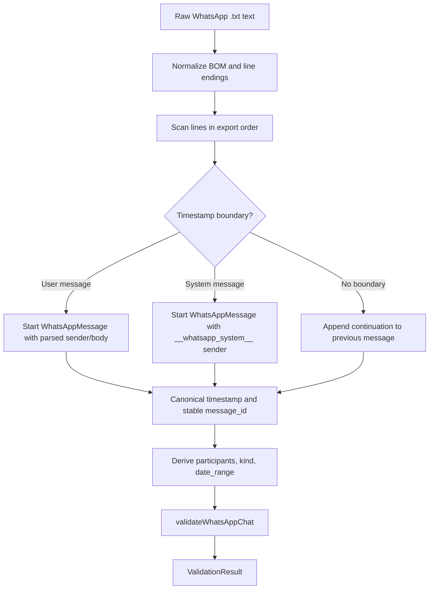

# feat: Implement Contact Memory WhatsApp Parser

## Summary

Implement `contact-memory/parser/whatsapp.ts` as a pure Deno/TypeScript parser for WhatsApp `.txt` exports. The parser produces the existing `WhatsAppChat` and `WhatsAppMessage` contract from `contact-memory/parser/types.ts`, with no AI, MCP, database, Supabase, review, extraction, or shard-commit dependency.

This is the Contact Memory parser's highest test-investment unit. The contract tests must be grounded in the real anonymised export at `docs/investigations/whatsapp/chat.txt`, but routine automated tests should use a sanitized committed fixture under `contact-memory/tests/fixtures/whatsapp/` so parser verification does not depend on reading sensitive investigation data outside the Contact test tree.

---

## Problem Frame

Contact Memory depends on a stable transcript parser before any AI extraction or human-review workflow can be trustworthy. If the parser misidentifies message boundaries, guesses ambiguous dates, drops media/deleted/system messages, corrupts Unicode, or produces unstable message IDs, downstream evidence references and review decisions become unreliable.

The observed export format is not the bracketed WhatsApp convention often seen in examples. The real sample uses non-bracketed timestamp lines such as `29/07/2015, 23:37 - Person_1: body`, has multi-line continuations, empty message bodies, `<Media omitted>` placeholders, edited/deleted markers, emoji/non-ASCII body text, link/location messages, timestamped system lines without a sender, and at least one out-of-order timestamp region.

---

## Requirements

- R1. Add `contact-memory/parser/whatsapp.ts` as a pure parser module with no AI/provider/runtime/MCP/database dependencies.
- R2. Produce `WhatsAppChat` and `WhatsAppMessage` values that validate through `validateWhatsAppChat` in `contact-memory/parser/types.ts`.
- R3. Parse the observed sample's primary message format: `DD/MM/YYYY, HH:mm - Sender: body`.
- R4. Preserve multi-line message continuations, including blank lines, URLs, addresses, dashes, colons, and emoji.
- R5. Preserve empty message bodies as messages with `body: ""`; do not silently drop them.
- R6. Preserve media placeholders, deleted-message markers, edited-message markers, URLs, location links, emoji, and non-ASCII content as body text.
- R7. Represent timestamped system messages without a sender using the deterministic sentinel sender `__whatsapp_system__` so the current `WhatsAppMessage.sender` contract remains valid.
- R8. Infer `participants`, `kind`, and `date_range` from parsed messages without counting system messages as participants.
- R9. Generate deterministic, unique, stable `message_id` values even for repeated same-timestamp/same-sender/same-body messages.
- R10. Preserve export file order in `messages`; do not sort by timestamp. Compute `date_range` from chronological min/max timestamps.
- R11. Handle locale/device timestamp variants defensively: support the observed format first, add explicit handling or explicit unsupported-format failures for bracketed timestamps, seconds, single-digit components, and AM/PM variants.
- R12. Validate calendar dates without JavaScript date rollover silently accepting invalid dates.
- R13. Normalize parser control concerns such as UTF-8 BOM and CRLF/LF line endings while preserving message body text with `\n` continuations.
- R14. Add comprehensive contract tests under `contact-memory/tests/parser/whatsapp.test.ts`, including a fixture-backed test against a sanitized committed export fixture.
- R15. Do not expose raw transcript, sender, body, URL, location, or deleted-message content in parser errors, logs, thrown exceptions, or test assertion messages. Diagnostics should use line numbers, counts, and error categories.
- R16. Treat non-empty malformed input that cannot be parsed into timestamped messages as a structured parser error; do not silently return an empty chat or ignore leading content unless a future explicit caller option is designed and tested.

---

## Scope Boundaries

- This plan only covers `contact-memory/parser/whatsapp.ts` and its parser contract tests.
- The parser returns transcript structure only; it does not extract commitments, events, sentiment, links, or contact facts.
- No AI runtime, provider adapter, extractor prompt/schema, Supabase Edge Function, CLI, Contact MCP, Android review UI, platform schema change, or commit adapter is included.
- No changes to `WhatsAppChat` / `WhatsAppMessage` shape are included unless implementation proves the existing contract cannot represent a required observed case.
- No broad server or .NET test-suite verification is required for this unit; verification should stay scoped to Contact parser tests.

### Deferred to Follow-Up Work

- Rich system-message metadata, such as `kind: "system"`, system-event type, affected participant, or raw export line number, if a later type-contract story expands `WhatsAppMessage`.
- Parser CLI or Supabase Edge Function file-upload wiring.
- Extraction/runtime tests that consume parser output.
- Additional real fixtures from other WhatsApp locales/devices once available and sanitized.

---

## Observed Sample Characteristics

- Timestamp format: `DD/MM/YYYY, HH:mm` with 24-hour time and no seconds.
- Message boundary: anchored timestamp prefix followed by ` - `.
- User message structure: `timestamp - sender: body`.
- System message structure: `timestamp - body` with no `sender:`, observed for WhatsApp notices such as encryption messaging.
- Multi-line continuations: lines without a timestamp prefix attach to the previous message, preserving newline boundaries.
- Empty bodies: lines like `29/01/2026, 11:46 - Person_2:` occur and should produce `body: ""`.
- Media placeholders: `<Media omitted>` appears many times and should be preserved.
- Edited/deleted markers: bodies include `This message was deleted` and inline `<This message was edited>` markers.
- Content variability: emoji-only bodies, non-ASCII text, Afrikaans/Dutch phrases, URLs, map links, addresses, coordinates, quoted text, and bodies containing colons/dashes.
- Ordering: at least one region has timestamps that are not monotonic in file order; parser output should preserve file order.
- Participants: the anonymized sample appears to be a 1:1 chat with two non-system senders, `Person_1` and `Person_2`.

### Explicit Format Gaps Not Covered by the Sample

- Bracketed exports such as `[15/01/2025, 14:23:45] Sender: body`.
- US-style `MM/DD/YYYY` and 12-hour `AM/PM` exports.
- Single-digit day/month components.
- Export lines with seconds.
- Real sender names with emoji, non-ASCII characters, punctuation, or colon-like characters.
- Group exports with three or more senders and group-management system messages.
- Media placeholders like `‎image omitted`, `image omitted`, or `video omitted`, including invisible directional marks.
- Contact added/removed, safety-number-changed, missed-call, and group-subject-changed system lines.
- Files containing leading unparseable lines before the first timestamp.

### Fixture Privacy Rules

- Real WhatsApp exports must not be committed or used in routine tests unless they have been explicitly sanitized for residual names, phone numbers, locations, URLs, addresses, media filenames, unique identifiers, and sensitive phrases.
- Automated parser tests should read committed sanitized fixtures from `contact-memory/tests/fixtures/whatsapp/`, which is already covered by the Contact-local `deno task test` read permission.
- The investigation fixture at `docs/investigations/whatsapp/chat.txt` may remain a manual reference for plan grounding, but tests should not require `--allow-read` outside the Contact test tree unless a later story deliberately changes test permissions.
- Tests must avoid full-transcript snapshots and avoid assertion messages that dump raw parsed chats or raw fixture content.

---

## Key Technical Decisions

- Parser API stays pure and explicit. Export `parseWhatsAppChat(rawText: string, options: ParseWhatsAppChatOptions): ValidationResult<WhatsAppChat>` from `contact-memory/parser/whatsapp.ts`. `ParseWhatsAppChatOptions` must require `session_id: string` for every successful parse and may include only parser-local options needed by this story.
- The default date locale for this story is the observed `DD/MM/YYYY` export. Ambiguous dates must not be guessed as US-style without an explicit parser option or format match.
- System messages use the reserved sentinel sender `__whatsapp_system__` because `WhatsAppMessage.sender` is currently required and there is no system-message field. That sentinel must not be counted in `participants`. If a real sender exactly equals the sentinel, the parser must fail with a structured collision error rather than misclassifying user messages.
- `kind` inference is evidence-based: exactly two non-system senders yields `one_to_one`, more than two yields `group`, and fewer than two yields `unknown`.
- `message_id` generation must include export order or message ordinal so repeated media placeholders at the same timestamp/sender/body remain distinct and stable.
- `messages` remain in export order. `date_range` uses chronological min/max parsed timestamps because sample file order is not guaranteed to be chronological.
- Message body preservation wins over normalization. Normalize line endings and BOM for parsing control only; preserve body content and continuation newlines as `\n`.
- Unsupported timestamp families should fail explicitly or be covered by parser options, not silently misparsed. For this story, support observed non-bracketed day-first timestamps with optional single-digit day/month components. Reject bracketed timestamps, non-bracketed seconds, and AM/PM timestamp families with `unsupported_timestamp_format` unless this plan is deliberately amended before implementation.
- Empty input is valid only when `session_id` is provided and the raw input is empty or whitespace-only; return a valid empty chat with `kind: "unknown"`, no participants, no messages, and an empty or omitted date range as allowed by the existing contract. Non-empty input with no parseable timestamp boundary must fail closed.
- Parser errors must be structured and privacy-safe. They should include category, line number when applicable, and counts; they must not include raw message text, sender names, URLs, locations, or body excerpts.

---

## Existing Patterns And References

- `contact-memory/parser/types.ts`: target output interfaces and `validateWhatsAppChat` contract.
- `contact-memory/tests/parser/types.test.ts`: current Contact Memory Deno test style using `Deno.test` and explicit thrown errors.
- `contact-memory/deno.json`: Contact-local test task and strict TypeScript configuration.
- `docs/plans/2026-06-29-001-feat-contact-parser-types-plan.md`: predecessor plan that deferred `whatsapp.ts` and locked AI/review/shard boundaries.
- `docs/investigations/BOOTSTRAP_contact_memory_parser_session.md`: source architecture note requiring pure parser behavior and high parser test investment.
- `docs/architecture/ai_memory_architecture_decisions.md`: Contact Memory product-layer boundaries superseding generic platform assumptions.
- `docs/solutions/workflow-issues/explicit-test-requirements-in-plans-2026-06-19.md`: tests must name exact regression risks, not merely assert that a parser test exists.
- `docs/solutions/runtime-errors/parsecontext-null-safety-in-operator-crash-2026-06-23.md`: parser/validator helpers should avoid unsafe union narrowing and test ordinary default paths, not only exotic cases.

---

## Output Structure

```text
contact-memory/
  parser/
    whatsapp.ts
  tests/
    fixtures/
      whatsapp/
        sanitized-chat.txt
    parser/
      whatsapp.test.ts
```

---

## High-Level Technical Design

This illustrates the intended approach and is directional guidance for review, not implementation specification. The implementing agent should treat it as context, not code to reproduce.



---

## Implementation Units

### U1. Pin Parser Contract Tests

**Goal:** Create the parser test surface before implementation so the highest-risk behaviors are explicit and reviewable.

**Requirements:** R1-R16

**Dependencies:** None

**Files:**
- Create: `contact-memory/tests/parser/whatsapp.test.ts`
- Create: `contact-memory/tests/fixtures/whatsapp/sanitized-chat.txt`
- Reference: `docs/investigations/whatsapp/chat.txt` as a manual source for observed characteristics only
- Reference: `contact-memory/parser/types.ts`

**Approach:**
- Add tests that import the future parser from `contact-memory/parser/whatsapp.ts` and validate returned chats through `validateWhatsAppChat`.
- Keep fixture snippets small and semantic, with one fixture-backed test that reads `contact-memory/tests/fixtures/whatsapp/sanitized-chat.txt` via the existing `--allow-read` Contact test permission.
- Tests should assert output behavior, not private helper names.
- The test file should use the existing Contact Memory style from `contact-memory/tests/parser/types.test.ts` unless implementation has a concrete reason to introduce a test assertion dependency.
- Tests must pass a caller-provided `session_id` into `parseWhatsAppChat` and assert the same value appears on successful output.
- Test helpers must avoid assertion messages that print raw parsed chats, raw fixture text, sender names beyond synthetic placeholders, URLs, locations, or message bodies from investigation data.

**Execution note:** Implement test-first. These tests should fail before `whatsapp.ts` exists or before parser behavior is implemented.

**Patterns to follow:**
- `contact-memory/tests/parser/types.test.ts`
- `docs/solutions/workflow-issues/explicit-test-requirements-in-plans-2026-06-19.md`

**Test scenarios:**
- Happy path: parse a single observed-format message and assert one valid `WhatsAppMessage` with canonical timestamp, sender, body, and stable ID.
- Happy path: parse multiple observed-format messages and assert `validateWhatsAppChat` accepts the full output.
- Contract: tests import `parseWhatsAppChat` and call it with `{ session_id: "test-session" }`; successful output uses that exact `session_id` and does not infer it from filename, content, current time, or date range.
- Contract: parser failures are returned through the validation-style result and do not throw for ordinary bad input.
- Contract: parser output must not contain extraction, review, shard, MCP, platform, or AI fields.
- Contract: empty input with caller-provided `session_id` returns a valid empty `WhatsAppChat` with `kind: "unknown"`, no participants, no messages, and an empty or omitted date range as allowed by the existing contract.
- Fixture-backed: parse `contact-memory/tests/fixtures/whatsapp/sanitized-chat.txt` and assert the result is valid, has 1:1 kind, has synthetic participants such as `Person_1` and `Person_2`, has non-empty messages, includes media/deleted/edited/empty-body cases, and spans the sanitized fixture's representative date range.
- Regression: the fixture-backed test should assert at least one known multi-line message remains one message rather than splitting continuations.
- Regression: the fixture-backed test should assert repeated same-minute media placeholders remain separate messages with distinct IDs.

**Verification:**
- Parser contract tests fail for the missing implementation and encode the main sample-grounded risks before behavior is added.

---

### U2. Implement Observed-Format Parsing

**Goal:** Parse the observed export's primary line format into valid `WhatsAppChat` output while preserving export order.

**Requirements:** R1, R2, R3, R4, R5, R8, R9, R10, R12, R13, R15, R16

**Dependencies:** U1

**Files:**
- Create: `contact-memory/parser/whatsapp.ts`
- Modify: `contact-memory/tests/parser/whatsapp.test.ts`
- Create: `contact-memory/tests/fixtures/whatsapp/sanitized-chat.txt`

**Approach:**
- Parse anchored boundaries matching the observed `DD/MM/YYYY, HH:mm - ...` format.
- Split user messages on the first sender/body separator after the timestamp prefix. Body text may contain additional colons, dashes, URLs, coordinates, or quotes.
- Treat non-boundary lines as continuations of the preceding message and preserve newline joins.
- Preserve empty body strings for timestamped sender lines with nothing after the colon.
- Canonicalize timestamps to a deterministic ISO-like string compatible with `validateWhatsAppChat` date-range comparisons.
- Add explicit message timestamp assertions in tests; do not rely on `validateWhatsAppChat` to prove every message timestamp is parseable, because the current validator only requires non-empty message timestamp strings.
- Validate day/month/year/hour/minute components manually enough to reject impossible dates instead of accepting JavaScript rollover.
- Derive `participants`, `kind`, and `date_range` after scanning.
- Generate message IDs from deterministic session context and message ordinal/export order, not only content.
- Return privacy-safe structured errors for invalid input; do not include raw line content, sender names, URLs, or body excerpts in error data.

**Execution note:** Keep behavior test-driven against the U1 tests. Add focused tests as gaps appear rather than relying only on the full fixture.

**Patterns to follow:**
- `contact-memory/parser/types.ts` validation-result and `WhatsAppChat` contract.
- `contact-memory/tests/parser/types.test.ts` direct Deno test style.

**Test scenarios:**
- Happy path: `29/07/2015, 23:37 - Person_1: hey` becomes one message with sender `Person_1` and body `hey`.
- Happy path: body text containing `14:00`, `location: https://maps.google.com/?q=-34.3450307,19.0103021`, and dashes is preserved as body, not misparsed.
- Edge case: sender names with spaces are parsed correctly.
- Edge case: continuation lines with dashes, colons, URLs, addresses, and blank lines attach to the previous message.
- Edge case: a timestamped line with an empty body emits `body: ""`.
- Edge case: output preserves file order even when timestamps move backward.
- Edge case: `date_range` uses min/max timestamps, not first/last file positions.
- Edge case: duplicate timestamp/sender/body lines produce distinct stable IDs.
- Error path: invalid calendar dates such as `31/02/2025, 10:00 - Person: nope` return a structured parser error or are excluded with an explicit invalid-input result; they must not roll over silently.
- Error path: leading continuation lines before any message produce an explicit parser error with line number/category only; they must not be ignored, attached to an arbitrary synthetic user, or echoed in error text.
- Error path: non-empty input with no parseable timestamp boundaries returns a structured failure, not an empty chat.

**Verification:**
- Observed-format snippets and the sanitized fixture pass through `validateWhatsAppChat` and preserve message order, IDs, timestamps, participants, kind, and date range as specified.

---

### U3. Preserve Content Markers And Unicode

**Goal:** Ensure low-information but evidence-relevant WhatsApp bodies are retained exactly enough for downstream review and extraction.

**Requirements:** R4, R5, R6, R9, R13, R14, R15

**Dependencies:** U2

**Files:**
- Modify: `contact-memory/parser/whatsapp.ts`
- Modify: `contact-memory/tests/parser/whatsapp.test.ts`

**Approach:**
- Preserve `<Media omitted>` as ordinary body text.
- Preserve deleted and edited markers as ordinary body text because the current type contract has no metadata field for them.
- Preserve emoji and non-ASCII sender/body text without lossy normalization.
- Strip a UTF-8 BOM only when it appears at the start of the raw export.
- Normalize CRLF/CR line endings into parser-internal `\n` joins while preserving message continuation newlines.
- Normalize parser-control comparisons for invisible directional marks only where needed to recognize media placeholder variants; do not strip those characters from arbitrary user text unless the implementation documents why.
- Keep privacy-sensitive content in successful message bodies only. Do not log, throw, snapshot, or include raw bodies, senders, URLs, locations, or deleted-message text in diagnostics.

**Patterns to follow:**
- `docs/investigations/whatsapp/chat.txt` examples for `<Media omitted>`, `This message was deleted`, `<This message was edited>`, emoji, links, and empty bodies.
- `docs/investigations/BOOTSTRAP_contact_memory_parser_session.md` WhatsApp format notes.

**Test scenarios:**
- Happy path: `<Media omitted>` remains the full message body.
- Happy path: repeated media messages at identical timestamp/sender remain separate messages with distinct IDs.
- Happy path: emoji-only bodies such as `👑` and multi-emoji bodies are preserved.
- Happy path: non-ASCII body text and non-ASCII sender names validate and preserve exact sender/body strings.
- Happy path: URL-only, Instagram, YouTube, and Google Maps location bodies preserve exact URLs and query strings.
- Edge case: `This message was deleted` remains a normal message body.
- Edge case: inline `<This message was edited>` remains part of the body.
- Edge case: media placeholder variants such as `‎image omitted`, `image omitted`, and `video omitted` are preserved and do not crash parsing.
- Edge case: CRLF input yields the same message bodies as LF input, with continuation newlines normalized to `\n`.
- Edge case: UTF-8 BOM before the first timestamp does not prevent parsing the first message.
- Regression: parser errors for malformed lines report category and line number without including the raw malformed line or surrounding message body.
- Regression: body colons after the sender separator do not truncate the message.

**Verification:**
- Content marker tests prove the parser does not drop or reinterpret WhatsApp evidence that the current type contract can only represent as body text.

---

### U4. Handle System Messages And Chat Classification

**Goal:** Parse system-message lines and infer chat kind/participants without corrupting user messages.

**Requirements:** R2, R7, R8, R10, R14, R15, R16

**Dependencies:** U2

**Files:**
- Modify: `contact-memory/parser/whatsapp.ts`
- Modify: `contact-memory/tests/parser/whatsapp.test.ts`

**Approach:**
- Treat timestamped lines with ` - ` but no sender/body separator as system messages.
- Emit a valid `WhatsAppMessage` with sender exactly `__whatsapp_system__` and body equal to the system text.
- Exclude the system sender from `participants` and `kind` inference.
- If a user-message sender is exactly `__whatsapp_system__`, return a structured collision error rather than excluding that real participant.
- Infer `one_to_one`, `group`, or `unknown` based on distinct non-system senders.
- Avoid using system message text to infer participant membership unless a later type-contract story adds structured system events.

**Technical design:**

This illustrates classification logic only; it is not an implementation recipe.

```text
if timestamped line has sender/body separator -> user message
else if timestamped line has message text -> system message with __whatsapp_system__ sender
else if no timestamp and previous message exists -> continuation
else -> privacy-safe structured parser error
```

**Patterns to follow:**
- `contact-memory/parser/types.ts` `ChatKind` values.
- `docs/investigations/BOOTSTRAP_contact_memory_parser_session.md` system-message examples.

**Test scenarios:**
- Happy path: encryption notice parses as a system message with sender `__whatsapp_system__` and full notice body.
- Happy path: contact added/removed system lines parse without crashing.
- Happy path: group subject changed or safety-number-changed notices parse without crashing.
- Happy path: two non-system senders plus system messages yields `kind: "one_to_one"` and two participants.
- Happy path: three non-system senders yields `kind: "group"` with three participants.
- Edge case: only system messages yields `kind: "unknown"` and no participants.
- Edge case: empty file yields the planned empty/unknown behavior from U1.
- Regression: system messages are not appended as continuations to the prior user message.
- Regression: system sentinel is not included in `participants`.
- Regression: a legitimate user sender named `__whatsapp_system__` fails with a collision error rather than being misclassified as a system message.

**Verification:**
- System-message tests prove sanitized examples of the real sample's WhatsApp notices produce valid `WhatsAppChat` output without requiring a type-contract expansion.

---

### U5. Add Defensive Locale And Unsupported-Format Behavior

**Goal:** Make timestamp variation explicit so the parser does not silently misparse exports from other locales/devices.

**Requirements:** R3, R11, R12, R14, R15, R16

**Dependencies:** U2, U4

**Files:**
- Modify: `contact-memory/parser/whatsapp.ts`
- Modify: `contact-memory/tests/parser/whatsapp.test.ts`

**Approach:**
- Support single-digit day/month variants when unambiguous under the configured or default day-first format.
- Support matrix for this story is fixed: support observed non-bracketed `D/M/YYYY, HH:mm` and `DD/MM/YYYY, HH:mm`; reject bracketed timestamps, non-bracketed seconds, bracketed seconds, and AM/PM variants with `unsupported_timestamp_format`.
- If parser options are introduced for locale or timestamp family, keep them small and parser-local; do not introduce product/runtime configuration in this story.
- Reject ambiguous or unsupported timestamp forms with a structured error path that callers can surface in CLI/Edge Function work later. Include detected format family and line number, but not raw line content.

**Patterns to follow:**
- `docs/investigations/BOOTSTRAP_contact_memory_parser_session.md` known timestamp variants.
- `docs/solutions/runtime-errors/parsecontext-null-safety-in-operator-crash-2026-06-23.md` guidance on safe validation paths.

**Test scenarios:**
- Happy path: single-digit day/month in day-first format parses deterministically.
- Defensive path: bracketed `DD/MM/YYYY, HH:mm:ss` line is rejected with an explicit `unsupported_timestamp_format` result.
- Defensive path: non-bracketed seconds such as `29/07/2015, 23:37:12 - Person_1: body` are rejected with an explicit `unsupported_timestamp_format` result.
- Defensive path: US `MM/DD/YYYY, h:mm AM/PM` line is rejected with an explicit `unsupported_timestamp_format` result.
- Error path: ambiguous date input is not silently interpreted as the wrong locale.
- Error path: invalid hour/minute values are rejected.
- Error path: malformed non-empty files with no parseable timestamp boundaries return a structured failure, not an exception and not an empty chat.
- Regression: defensive unsupported-format handling does not break the sanitized fixture's observed day-first format.

**Verification:**
- Locale-variant tests document what is supported now and what fails closed, preventing future agents from assuming untested WhatsApp conventions.

---

### U6. Finalize Fixture Coverage And Parser Contract Drift Checks

**Goal:** Lock a sanitized anonymised export as a regression fixture and ensure parser output stays aligned with the existing type contract.

**Requirements:** R2, R8, R9, R10, R14, R15

**Dependencies:** U2, U3, U4, U5

**Files:**
- Modify: `contact-memory/tests/parser/whatsapp.test.ts`
- Create: `contact-memory/tests/fixtures/whatsapp/sanitized-chat.txt`
- Reference: `docs/investigations/whatsapp/chat.txt` as a manual source for observed characteristics only
- Reference: `contact-memory/parser/types.ts`

**Approach:**
- Add final fixture assertions that cover the observed sample's parser-relevant characteristics through a sanitized committed fixture, without brittle assertions over all raw lines.
- Prefer semantic assertions: valid output, expected participants, date span, presence of known marker bodies, multi-line continuation preservation, empty-body preservation, and unique IDs.
- Avoid snapshotting the full parsed chat; that would be noisy and brittle and could leak sensitive content if a future fixture is not sanitized correctly.
- Ensure parser tests remain runnable through the Contact-local Deno task.
- Ensure fixture content is synthetic or sanitized enough for routine git/CI use. Do not include health phrases, real locations, real URLs with identifying query strings, phone numbers, real names, or relationship-specific message content from the investigation export.

**Patterns to follow:**
- `contact-memory/deno.json`
- `docs/solutions/workflow-issues/explicit-test-requirements-in-plans-2026-06-19.md`

**Test scenarios:**
- Fixture-backed: all parsed messages have non-empty IDs, non-empty senders, string bodies, and explicitly parseable canonical timestamps.
- Fixture-backed: `kind` is `one_to_one` for the sanitized fixture and participants are exactly the two non-system senders.
- Fixture-backed: `date_range.start` and `date_range.end` match the sanitized fixture's chronological min/max timestamps.
- Fixture-backed: the first message matches the sanitized fixture's first line body/sender/timestamp.
- Fixture-backed: a sanitized multi-line message includes all intended continuation lines in one body.
- Fixture-backed: sanitized empty messages produce messages with `body: ""` instead of being dropped.
- Fixture-backed: sanitized edited/deleted markers and `<Media omitted>` bodies exist in the parsed output.
- Fixture-backed: message IDs are unique across the full sanitized fixture.
- Contract drift: parser output remains accepted by `validateWhatsAppChat` after all fixture assertions.

**Verification:**
- The Contact parser test task passes and proves both snippet-level edge cases and sanitized fixture behavior without relying on unrelated platform tests.

---

## System-Wide Impact

- Contact Memory parser consumers get a deterministic transcript contract suitable for AI extraction and human review in later stories.
- Existing platform MCP/server behavior is unaffected.
- Current parser types remain the source of truth; this plan does not add platform coupling or alter the review-to-shard seam.
- Test coverage becomes the main executable documentation for WhatsApp format assumptions and unsupported variants.

---

## Risk Analysis & Mitigation

- Risk: Locale ambiguity can silently produce wrong timelines. Mitigation: default to observed day-first format and fail closed or require explicit options for unsupported locale families.
- Risk: System messages do not fit the current `WhatsAppMessage` shape. Mitigation: use the reserved `__whatsapp_system__` sentinel sender now, fail on sender collision, and defer richer metadata to a type-contract story.
- Risk: Full fixture tests become brittle or leak private data. Mitigation: use a sanitized committed fixture and assert semantic characteristics rather than snapshotting all parsed output.
- Risk: Parser IDs drift if based only on timestamp/sender/body. Mitigation: include ordinal/export order in deterministic IDs and test repeated media messages.
- Risk: Continuation parsing splits or merges messages incorrectly. Mitigation: anchor timestamp detection strictly and test continuations with URLs, dashes, colons, addresses, and blank lines.

---

## Deferred Implementation Notes

- Parser-internal helper names remain implementation details, but the public API is `parseWhatsAppChat(rawText: string, options: ParseWhatsAppChatOptions): ValidationResult<WhatsAppChat>` and requires a caller-provided `session_id`.
- Exact parser error internals can reuse `ValidationResult` details or a parser-local privacy-safe error code, but ordinary bad input must return through the validation-style result rather than throwing.
- If implementation discovers a real sample line that cannot be represented without changing `WhatsAppMessage`, stop and decide whether to adjust the type contract in a separate story rather than smuggling metadata through body text.

---

## Verification Strategy

- Primary verification: run the Contact-local Deno parser tests from `contact-memory`.
- The implemented parser is complete when `whatsapp.test.ts` covers observed sample behavior, documented defensive variants, invalid input behavior, and `validateWhatsAppChat` accepts successful outputs.
- Do not run unrelated server or .NET suites as the default safety net for this scoped parser unit.
