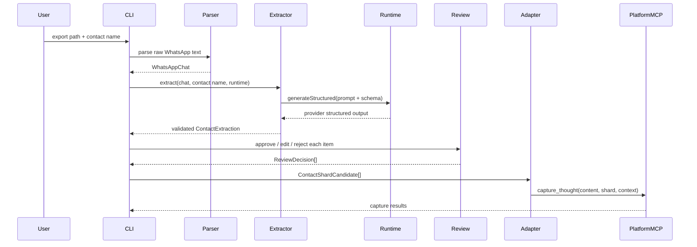

# feat: Build Contact Memory Local MVP

## Summary

Build the local Contact Memory MVP path from a real WhatsApp `.txt` export to reviewed, approved contact shards committed through the existing platform MCP. The implementation adds a supplier-agnostic structured runtime seam with one Anthropic provider, an extractor that validates `ContactExtraction`, a commit adapter that maps reviewed `ContactShardCandidate` objects to `capture_thought`, and a thin terminal review CLI.

---

## Problem Frame

The Contact parser and type contract already define the safe domain shape, but there is no runnable path that extracts useful contact facts, asks for human review, commits approved facts, and makes them queryable from Claude.ai through the platform MCP. The MVP needs to prove that full local loop without prematurely building the Android app, Contact MCP, Supabase Edge Function, or platform metadata expansion.

---

## Requirements

- R1. Accept a local WhatsApp `.txt` export path, contact name, `--project` flag defaulting to `contact-memory`, optional `--from`/`--to` date range arguments, and a configurable message cap; parse with the existing pure WhatsApp parser and stop with privacy-safe errors when parsing fails or the filtered message cap is hit.
- R2. Define `AgentRuntime.generateStructured(...)` as the only runtime interface used by extractor and CLI code.
- R3. Implement exactly one MVP provider adapter for Anthropic structured output; defer all other providers.
- R4. Implement an extractor that owns the Contact extraction prompt/schema and returns only a `ContactExtraction` that passes `validateContactExtraction`.
- R5. Include extractor tests for valid structured output, schema validation failure, and a repair path after provider output fails validation.
- R6. Present extracted items in a terminal review flow with approve, edit, and reject decisions per item, showing the cited `WhatsAppMessage` body and sender by looking up each item's evidence `message_id` in the in-memory parsed chat.
- R7. Use `createContactShardCandidates` from `contact-memory/parser/types.ts` as the only bridge from reviewed extraction items to commit-ready contact shards.
- R8. Translate each approved or edited `ContactShardCandidate` to `capture_thought` with `memory_type: "shard"`, a context string containing project and candidate tags, and an auditable `---cmv1---` content block that embeds the fact plus source, `session_id`, and one evidence reference.
- R9. Keep Contact domain types and extractor output platform-decoupled; do not add `capture_thought`, `memory_teach`, raw `context`, `profile`, or platform source fields to `ContactExtraction` or `ContactShardCandidate`.
- R10. Support manual verification on a real export through the local CLI and Claude.ai query path using two concrete retrieval checks: one query by contact name and one fact-specific query, both returning the committed shard in top results.
- R11. Require one fake-runtime/fake-commit CLI smoke test for wiring the parser/extractor/review/commit path without making it a full interactive CLI test suite.

---

## Scope Boundaries

- No additional providers beyond Anthropic are included.
- No Android app, Supabase Edge Function, Contact MCP server, or Supabase Storage integration is included.
- No platform schema change is included; provenance is embedded in committed content until `capture_thought` grows metadata support.
- No full interactive CLI test suite is required for this MVP shell; only the fake-runtime/fake-commit wiring smoke test is in scope, and manual verification on the real export remains the acceptance path for CLI usability.
- No tag-based search/list filtering is added to the platform MCP.
- No broad parser format expansion is included beyond what `contact-memory/parser/whatsapp.ts` already supports.
- No chunking or multi-pass extraction is included; oversized filtered exports fail honestly when the configured message cap is hit.

### Deferred to Follow-Up Work

- Platform metadata support for Contact provenance: move embedded provenance out of content when `capture_thought` or a successor write primitive accepts structured metadata.
- Additional providers: add OpenRouter/OpenAI/local adapters only after the runtime seam proves useful with Anthropic.
- Review persistence/resume: save partial review sessions or retry artifacts after the basic terminal loop works on a real export.
- Contact MCP domain query tools: build `get_contact_profile`, `search_commitments`, and related tools after committed shards prove queryable through the platform MCP.
- Automated CLI interaction tests: add if the CLI survives MVP and accumulates behavior worth protecting.

---

## Context & Research

### Relevant Code and Patterns

- `contact-memory/parser/types.ts`: defines `ContactExtraction`, all item kinds, `ReviewDecision`, `ContactShardCandidate`, validators, `makeContactTag`, and `createContactShardCandidates`.
- `contact-memory/parser/whatsapp.ts`: existing pure parser from raw export text to `WhatsAppChat`.
- `contact-memory/tests/parser/types.test.ts`: contract-test style for extraction validation, review decisions, candidate creation, tag validation, and platform-decoupling invariants.
- `contact-memory/tests/parser/whatsapp.test.ts`: privacy-safe parser test style and Deno-native assertions.
- `contact-memory/deno.json`: Contact-local Deno config with strict TypeScript and a scoped `deno task test` surface.
- `server/index.ts`: `capture_thought` accepts only `content`, optional `memory_type`, and optional `context`; tags enter only through parsed context.
- `server/src/parseContext.ts` and `shared/tagGrammar.ts`: canonical context/tag validation boundaries.
- `server/tests/_helpers/mcpClient.ts`: raw MCP-over-HTTP pattern, including Bearer auth, `Accept: application/json, text/event-stream`, and SSE `data:` parsing.

### Institutional Learnings

- `docs/architecture/ai_memory_architecture_decisions.md`: Contact Memory is product-layer curation over platform shard primitives; the human review gate belongs in Contact Memory.
- `docs/plans/2026-06-29-001-feat-contact-parser-types-plan.md`: `ContactExtraction` is review-only, one approved item becomes one shard candidate, and commit translation belongs in a separate adapter.
- `docs/plans/2026-06-30-001-feat-whatsapp-parser-plan.md`: parser scope is deliberately pure and format-limited to observed export shape.
- `docs/solutions/runtime-errors/parsecontext-null-safety-in-operator-crash-2026-06-23.md`: optional MCP context handling has caused runtime failures before; adapter tests should cover context construction explicitly.
- `docs/solutions/workflow-issues/explicit-test-requirements-in-plans-2026-06-19.md`: tests must name concrete contracts and edge cases rather than relying on broad safety-net suites.

### External References

- Anthropic JavaScript/TypeScript SDK documentation, checked during planning: structured output is best modeled with tool use (`tools`, `input_schema`, and forced `tool_choice`), not OpenAI-style `response_format`.

---

## Key Technical Decisions

- Use forced Anthropic tool use for structured extraction: Claude should emit a single tool call whose input is the extraction object, then local validation remains the hard gate.
- Keep the runtime generic but small: `AgentRuntime.generateStructured(...)` returns provider-produced structured data as `unknown`; the extractor owns domain validation and repair.
- Reuse `createContactShardCandidates`: reviewed items must flow through the existing validator/renderer/tag bridge instead of hand-building commit candidates in CLI code.
- Embed MVP provenance in content: the commit adapter writes an auditable block containing the fact plus source, `session_id`, and one evidence reference because `capture_thought` has no metadata field today.
- Lock the provenance grammar now: everything before `---cmv1---` is the human-readable fact; everything after is pipe-delimited `key:value` metadata. Required metadata keys are `source`, `session_id`, `extraction_id`, `item_id`, `item_kind`, `review_decision_id`, `review_outcome`, `evidence_message_ids`, and optional `evidence_quote` when available.
- Pass tags only through `context`: the adapter constructs platform context from validated candidate tags and project scope; it must not invent a raw `tags` parameter.
- Treat CLI as a thin shell: it wires parser, extractor, review, candidate creation, and commit adapter, but it should not own extraction schema, provider calls, or shard candidate construction.
- Treat transcript content as untrusted provider input: the extractor system prompt must instruct the model to treat transcript content as data, not instructions.
- Keep error reporting redacted: log categories only, never provider response bodies, API keys, Bearer tokens, or WhatsApp message content.
- Record the PII boundary plainly: running extraction means the user accepts that transcript data will be sent to the configured provider.

---

## Open Questions

### Resolved During Planning

- Should provenance be stored in content or dropped until metadata support exists? Use auditable content embedding now, reversible later when metadata support exists.
- Should the runtime expose a provider-specific Anthropic API or a generic structured interface? Use `AgentRuntime.generateStructured(...)` and hide Anthropic behind one adapter.
- Should the CLI build platform commits directly from extraction items? No; it must use `createContactShardCandidates` and then a separate commit adapter.
- Should source provenance be passed to `capture_thought` as a field? No such field exists; source provenance goes in content.

### Deferred to Implementation

- Exact prompt wording and schema representation: extractor tests should lock behavior, but the implementer may adjust the prompt/schema shape to fit Anthropic SDK constraints while preserving the transcript-as-data prompt-injection instruction.
- Exact terminal edit mechanics: use the smallest workable Deno-native approach; `$EDITOR` temp-file editing is acceptable if inline editing is too brittle.

---

## Output Structure

    contact-memory/
      runtime/
        agent.ts
        providers/
          anthropic.ts
      parser/
        extractor.ts
      commit/
        captureThoughtAdapter.ts
      cli/
        index.ts
      README.md
      tests/
        runtime/
          agent.test.ts
        parser/
          extractor.test.ts
        commit/
          captureThoughtAdapter.test.ts
        cli/
          index.test.ts

---

## High-Level Technical Design

> *This illustrates the intended approach and is directional guidance for review, not implementation specification. The implementing agent should treat it as context, not code to reproduce.*

---

## Implementation Units

### U1. Add Structured Runtime Seam and Anthropic Adapter

**Goal:** Create the supplier-agnostic runtime interface and one Anthropic-backed implementation for structured output.

**Requirements:** R2, R3, R9

**Dependencies:** None

**Files:**
- Create: `contact-memory/runtime/agent.ts`
- Create: `contact-memory/runtime/providers/anthropic.ts`
- Modify: `contact-memory/deno.json`
- Test: `contact-memory/tests/runtime/agent.test.ts`

**Approach:**
- Define `AgentRuntime.generateStructured(...)` as the only interface exposed to extractor/CLI layers.
- Add an Anthropic provider adapter that translates the generic request into Anthropic tool-use structured output.
- Keep provider configuration environment-driven for MVP, including API key and model selection defaults.
- Keep Anthropic imports isolated to `contact-memory/runtime/providers/anthropic.ts`.
- User-facing setup must state that running extraction sends transcript data to the configured provider.
- Provider/runtime errors must expose categories only, not provider response bodies, API keys, Bearer tokens, or message content.

**Execution note:** Add dependency-boundary tests before wiring the extractor so accidental provider leakage is caught early.

**Patterns to follow:**
- `server/src/consolidationLLM.ts` and `server/src/entityWorker.ts` for environment-driven LLM configuration and fail-fast error messages, but do not copy their OpenRouter `response_format` approach for Anthropic.
- `contact-memory/tests/parser/types.test.ts` for small Deno contract tests.

**Test scenarios:**
- Happy path: fake Anthropic client emits one structured tool-use payload; adapter returns its structured input as `unknown` without domain validation.
- Error path: missing API key/config produces a clear provider configuration error before a network call.
- Error path: provider response contains no structured tool-use payload; adapter reports a structured-output failure.
- Error path: fake provider error containing body-like content is reported as a category without leaking the body.
- Boundary: `contact-memory/runtime/agent.ts`, `contact-memory/parser/extractor.ts`, and `contact-memory/cli/index.ts` do not import Anthropic provider symbols directly.

**Verification:**
- Runtime consumers can depend on `AgentRuntime` without importing Anthropic.
- Contact-local tests prove the adapter handles success and provider-shape failures using fakes, not live network calls.

### U2. Implement Contact Extraction Prompt, Validation, and Repair

**Goal:** Convert a validated `WhatsAppChat` into a validated `ContactExtraction` using the runtime seam.

**Requirements:** R4, R5, R9

**Dependencies:** U1

**Files:**
- Create: `contact-memory/parser/extractor.ts`
- Test: `contact-memory/tests/parser/extractor.test.ts`

**Approach:**
- Keep the extraction prompt and provider-facing schema inside `extractor.ts`.
- Include contact name, parser `session_id`, chat kind, participants, and bounded message references in the extraction input.
- Filter messages by optional `--from`/`--to` date range before extraction and enforce the configured message cap against the filtered set.
- Do not chunk for MVP; if the filtered message count exceeds the cap, fail honestly with a clear user-facing message before calling the provider.
- Validate provider output with `validateContactExtraction` before returning it to the CLI.
- Add one repair pass: when validation fails, call `generateStructured` again with the validation error and the original invalid output summarized enough to repair shape without dumping raw transcript.
- Ensure extractor output remains review-only and does not include shard/platform commit fields.
- Treat hallucinated or unknown `message_ids` as a validation/post-validation failure before review.
- Include a system prompt instruction that transcript content is untrusted data and must not be treated as instructions.

**Execution note:** Implement extractor behavior test-first because this is the main trust boundary between raw provider output and human review.

**Patterns to follow:**
- `contact-memory/parser/types.ts` validators as the hard domain gate.
- `contact-memory/tests/parser/types.test.ts` for test fixtures that build valid person targets and extraction items.
- `contact-memory/tests/parser/whatsapp.test.ts` for privacy-safe error assertions.

**Test scenarios:**
- Happy path: runtime returns a valid extraction with one or more item kinds; extractor returns the validated value.
- Edge case: runtime returns a valid empty extraction; extractor returns it and the CLI can later show "no reviewable items."
- Edge case: filtered chat exceeds the configured message cap; extractor fails before provider invocation and reports the cap-hit category.
- Error path: runtime returns unsupported fields such as `content`, `tags`, `context`, or `capture_thought`; extractor rejects before review.
- Error path: runtime returns an item whose `extraction_id` differs from the envelope; extractor rejects before review.
- Error path: runtime references a `message_id` not present in the `WhatsAppChat`; extractor rejects before review.
- Error path: transcript contains an instruction-like message such as "ignore previous instructions"; extractor prompt contract treats it as data and tests verify the fixture does not change extraction behavior.
- Repair path: first runtime response fails validation, second response fixes the shape, extractor returns the repaired valid extraction.
- Repair path: repair response still fails validation; extractor reports a failure without exposing raw transcript content in the error.

**Verification:**
- Extractor tests cover schema validation and repair behavior without live provider calls.
- No extraction output can bypass `validateContactExtraction`.

### U3. Add Capture Thought Commit Adapter

**Goal:** Translate validated `ContactShardCandidate` objects into current platform `capture_thought` calls.

**Requirements:** R7, R8, R9

**Dependencies:** None

**Files:**
- Create: `contact-memory/commit/captureThoughtAdapter.ts`
- Test: `contact-memory/tests/commit/captureThoughtAdapter.test.ts`

**Approach:**
- Accept `ContactShardCandidate` values and produce/call the current `capture_thought` argument shape.
- Render content as an auditable block containing the candidate fact plus source, `session_id`, and one evidence reference.
- Use the fixed content grammar: human-readable fact, then a line containing `---cmv1---`, then pipe-delimited `key:value` metadata.
- Required metadata keys after `---cmv1---` are `source`, `session_id`, `extraction_id`, `item_id`, `item_kind`, `review_decision_id`, `review_outcome`, and `evidence_message_ids`; include `evidence_quote` only when available and bounded.
- Include review provenance enough to identify approve/edit decisions without committing rejected items.
- Build `context` from project scope and candidate tags using the same semicolon-separated syntax that `server/src/parseContext.ts` accepts.
- Use `memory_type: "shard"` for every committed candidate.
- Provide a small MCP client wrapper or injectable commit function so adapter mapping can be unit-tested without a live server.
- Preserve partial failure visibility: if committing multiple candidates, report per-item success/failure rather than hiding failures behind one aggregate message.

**Execution note:** Test the mapping before adding CLI integration; this protects the temporary provenance-in-content bridge.

**Patterns to follow:**
- `server/tests/_helpers/mcpClient.ts` for `/mcp` request shape, Bearer auth, Accept header, and SSE parsing.
- `server/index.ts` `capture_thought` input contract and 32KB content limit.
- `shared/tagGrammar.ts` for tag validity assumptions already enforced by candidates.

**Test scenarios:**
- Happy path: a candidate maps to `content`, `memory_type: "shard"`, and `context` with project plus all candidate tags.
- Happy path: committed content places the rendered fact before `---cmv1---` and required pipe-delimited metadata after it.
- Edge case: candidate has multiple evidence references; adapter embeds only the first one for MVP audit compactness.
- Error path: oversized rendered content is rejected or reported before/when `capture_thought` rejects the item.
- Error path: MCP commit failure for one candidate reports that candidate's `item_id` and continues or surfaces remaining result state according to the adapter API.
- Boundary: adapter does not add raw `tags`, `source`, or metadata parameters unsupported by `capture_thought`.
- Boundary: adapter does not include raw full transcript, full message arrays, or unbounded message body content.

**Verification:**
- Unit tests prove reversible provenance exists in content and tags flow only through `context`.
- Adapter can be called by CLI without importing platform server internals.

### U4. Implement Thin Terminal Review CLI

**Goal:** Wire the local MVP flow from file path and contact name through parsing, extraction, review, candidate creation, and commit.

**Requirements:** R1, R6, R7, R8, R10, R11

**Dependencies:** U1, U2, U3

**Files:**
- Create: `contact-memory/cli/index.ts`
- Modify: `contact-memory/deno.json`
- Test: `contact-memory/tests/cli/index.test.ts`

**Approach:**
- Accept a `.txt` file path and contact name from command-line args or prompts.
- Accept `--project`, defaulting to `contact-memory`; pass the project into the commit adapter context.
- Accept optional `--from` and `--to` date range arguments plus a configurable message cap, and pass the filtered/capped chat into extraction.
- Derive or request a stable `session_id` for the parser so message IDs remain stable across repeat runs.
- Run `parseWhatsAppChat`, then `extractContactMemory`, then show each item one at a time.
- For each extraction item, look up cited `message_id` values in the in-memory parsed chat and show the cited `WhatsAppMessage.sender` and `WhatsAppMessage.body` alongside the extracted fact.
- For approve decisions, create `ReviewDecision` values with stable IDs, timestamps, and local reviewer context.
- For edit decisions, let the user edit the item in a minimal Deno-native flow and revalidate through `validateExtractionItem` / `validateReviewDecision` before accepting the decision.
- For reject decisions, capture a local reason when provided but do not commit rejected items.
- Pass the validated extraction and decisions to `createContactShardCandidates`; do not construct candidate fields directly.
- Before any write, show a pre-commit summary with approve/edit/reject counts, candidate facts, target contact, project, and session; require explicit confirmation before calling the commit adapter.
- Call the commit adapter for approved/edited candidates and print per-item results.
- For group chats or contact-name/participant ambiguity, ask for explicit confirmation before targeting the supplied contact name.
- Recovery behavior: invalid edits return to edit/review for the same item; cancel/EOF aborts before further commits; MCP failures report the failed `item_id` category and continue reporting per-item state without leaking provider/MCP bodies or message content.

**Patterns to follow:**
- `contact-memory/parser/whatsapp.ts` parser API and structured validation result style.
- `contact-memory/parser/types.ts` review and candidate helper APIs.
- Deno built-ins for a local shell; avoid adding a TUI dependency unless implementation proves built-ins are not usable.

**Test scenarios:**
- Happy path: fake runtime and fake commit function drive CLI wiring from parsed chat through one approved item to one commit call.
- Edge case: `--project` is omitted; fake commit receives project `contact-memory`.
- Edge case: invalid edit is rejected and the same item remains in review state.
- Error path: cancel before pre-commit confirmation results in zero fake commit calls.
- Error path: fake MCP failure reports a category and failed `item_id` without leaking message content.

**Verification:**
- Running the CLI on the real export reaches item-by-item review.
- Approving at least one item commits it through the platform MCP.
- Rejecting an item produces no commit.
- Editing an item revalidates before commit and preserves required identity/evidence constraints.
- The CLI shows cited sender/body evidence before approval and requires final confirmation before any write.
- Claude.ai can query the committed fact through the connected platform MCP using both concrete verification queries.

### U5. Add Manual MVP Verification Notes

**Goal:** Document the local verification path so the MVP can be proven against the real export without turning the plan into test command choreography.

**Requirements:** R10

**Dependencies:** U4

**Files:**
- Create or modify: `contact-memory/README.md`

**Approach:**
- Add a compact local MVP section covering required environment variables, local platform MCP URL/API key assumptions, CLI invocation shape, and expected review outcomes.
- Include a manual verification checklist: parse succeeds, extraction validates, cited sender/body evidence is shown, final confirmation gates writes, approved items commit, and both Claude.ai verification queries retrieve the committed fact.
- Mention that embeddings are fire-and-forget, so BM25/search text recall may succeed before vector embedding completes.

**Patterns to follow:**
- `docs/wsl2-setup.md` for concise local setup notes.
- Existing MCP transport notes in `CLAUDE.md` for raw `/mcp` Accept/SSE behavior.

**Test scenarios:**
- Test expectation: none -- documentation/manual verification only.

**Verification:**
- A fresh agent or developer can follow the README notes to run the local MVP and know what success/failure looks like.

---

## System-Wide Impact

- **Interaction graph:** The new Contact pipeline consumes existing parser/types and calls the platform MCP over its public tool surface; it should not import `server/index.ts` or database modules.
- **Error propagation:** Parser, extractor, review validation, candidate creation, and MCP commit failures should each surface distinct, privacy-safe CLI messages.
- **State lifecycle risks:** `capture_thought` commits are per-shard and not transactional; partial success must be visible to the user.
- **API surface parity:** The generic runtime seam prepares for future providers, but the only committed provider implementation is Anthropic.
- **Integration coverage:** Unit tests cover extraction and adapter contracts, one fake-runtime/fake-commit smoke test covers CLI wiring, and the full parse-review-commit-query loop is verified manually against the real export and Claude.ai.
- **Unchanged invariants:** Existing platform MCP tool contracts, database schema, parser contract, shared tag grammar, and `ContactExtraction` review-only boundary remain unchanged.

---

## Risks & Dependencies

| Risk | Mitigation |
|------|------------|
| Anthropic output does not conform to `ContactExtraction` on first try | Force tool use, validate locally, and run one repair pass before failing. |
| Provider hallucinates message IDs or unsupported target data | Cross-check evidence IDs against `WhatsAppChat` before review. |
| Provenance embedded in content affects search quality | Keep the fact first and provenance clearly separated below it. |
| `capture_thought` lacks structured metadata | Isolate mapping in the commit adapter so migration to metadata support is localized. |
| Partial commit failure after review | Report per-item results and failed `item_id`s instead of claiming all-or-nothing success. |
| Real export uses unsupported WhatsApp timestamp format | Surface the parser's structured unsupported-format error; parser expansion is deferred. |
| Claude.ai cannot immediately retrieve a just-committed item by vector search | Use fact text that BM25 can match and document that embeddings are asynchronous. |

---

## Documentation / Operational Notes

- Contact-local tests should run through `contact-memory/deno.json` rather than server test containers unless a server integration test is explicitly added later.
- Any live MCP verification should use the same transport expectations as existing tests: Bearer auth, `Accept: application/json, text/event-stream`, and SSE response parsing.
- The CLI needs local secrets/config for Anthropic and platform MCP access; those should remain environment-driven and not be committed.
- Manual verification should include two Claude.ai queries: one by contact name and one fact-specific. Both must return the committed shard in top results.

---

## Sources & References

- Related code: `contact-memory/parser/types.ts`
- Related code: `contact-memory/parser/whatsapp.ts`
- Related code: `server/index.ts`
- Related code: `server/tests/_helpers/mcpClient.ts`
- Related code: `shared/tagGrammar.ts`
- Related plan: `docs/plans/2026-06-29-001-feat-contact-parser-types-plan.md`
- Related plan: `docs/plans/2026-06-30-001-feat-whatsapp-parser-plan.md`
- Architecture source: `docs/architecture/ai_memory_architecture_decisions.md`
- External docs: Anthropic JavaScript/TypeScript SDK structured tool use documentation, checked via local docs tooling during planning.
