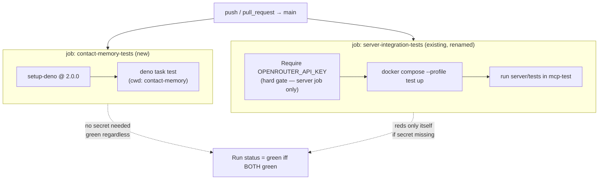

# feat: CI coverage for contact-memory + secret-gate resilience

## Summary

The CI pipeline ([.github/workflows/ci.yml](../../.github/workflows/ci.yml)) has a single job, `integration-tests`, that builds the Docker test stack and runs only `server/tests/`. The Contact Memory MVP under `contact-memory/` — 77 `Deno.test` blocks across 6 files — has **zero CI signal**. Separately, that single job's first step hard-exits `1` when the repository secret `OPENROUTER_API_KEY` is unset, which red-X'd every run (including `main`) during the PR #21 review even though nothing about the failure pointed at the missing secret.

This plan adds an **independent** `contact-memory-tests` job that runs the existing Deno suite natively — no Docker, no `OPENROUTER_API_KEY` — so the MVP gains real coverage and a green signal that survives a missing server-side secret. It also makes the secret dependence explicit and documented on the server job so a missing secret can no longer silently red-X the whole pipeline.

---

## Problem Frame

Surfaced 2026-07-03 during PR #21 review. Two distinct gaps behind one symptom (a red pipeline):

1. **No CI coverage for `contact-memory/`.** The pipeline only runs `server/tests/` inside the `mcp-test` container. The MVP's 77 tests never execute in CI, so regressions in the parser, extractor, CLI, runtime, or commit adapter would land undetected.
2. **A single missing secret hard-fails the whole pipeline.** The `Require OPENROUTER_API_KEY secret` step exits `1` in ~6s. Because there is only one job, that failure is the entire run's status — on branches *and* on `main`. The contact-memory suite stubs its `AgentRuntime`/provider seam and needs no OpenRouter key, yet today it could not provide a green signal independent of the server job's secret gate. (The secret has since been set by the PO; this plan prevents the class of failure, it is not a hotfix for the outage.)

**In scope:** CI workflow changes only. **Out of scope:** any change to `contact-memory/` or `server/` test code, and any change to the server integration job's test logic beyond scoping/documenting its secret dependence.

---

## Requirements

Traceability to the ST-069 board acceptance criteria:

- **R1** — CI runs the `contact-memory/` Deno suite as its own job (`deno test --allow-read --allow-env tests/`, i.e. `deno task test`), giving the MVP's 77 tests CI signal. *(→ U1)*
- **R2** — The contact-memory job does **not** require `OPENROUTER_API_KEY`; it stays green independent of the server job's secret gate because its tests stub the `AgentRuntime`/provider seam. *(→ U1)*
- **R3** — The `OPENROUTER_API_KEY` secret-gate failure mode is documented and scoped to the job that needs it, so a missing secret cannot silently red-X jobs that do not need it. *(→ U2)*
- **R4** — A run on `main` and a run on a contact-memory PR both go green. *(→ Verification)*

---

## Key Technical Decisions

- **KTD1 — Native Deno job, not Docker.** The contact-memory suite is pure Deno with no Postgres/pgvector/AGE dependency (its `deno.json` task is `deno test --allow-read --allow-env tests/`). Running it inside the Docker test stack would couple it to `mcp-test` startup and the secret gate for no benefit. Use `denoland/setup-deno` on `ubuntu-latest` instead — faster and structurally isolated from the server job.
- **KTD2 — Pin Deno to 2.0.0.** [server/Dockerfile](../../server/Dockerfile) pins `denoland/deno:2.0.0`. The CI job pins the same version so contact-memory runs on the same runtime the code targets, avoiding drift between local (WSL2-native / Docker) and CI.
- **KTD3 — Invoke the suite via `deno task test`.** `contact-memory/deno.json` already defines `test: deno test --allow-read --allow-env tests/`. Reusing the task keeps the permission set and entry path single-sourced in `deno.json` rather than duplicating flags in the workflow (R1 is defined against that exact command).
- **KTD4 — Keep the server job's secret gate a hard failure, but scope and document it (per PO 2026-07-03).** The server integration suite genuinely needs `OPENROUTER_API_KEY` (LLM/embedding-dependent tests). The gate stays `exit 1`, but it lives entirely inside the server job and is documented as intentional. Independence is achieved by the *new* job not carrying the gate — not by weakening the server job's real requirement. This is the confirmed alternative over a global warn-only gate, which would give a weaker guarantee that the server job has the key it needs.
- **KTD5 — Two independent jobs, no `needs:` edge.** The contact-memory job and the server integration job are siblings with no dependency between them, so one failing never blocks or masks the other's signal. The overall run is red iff either job is red; a missing secret reds only the server job while contact-memory still reports green.

---

## High-Level Technical Design

The current pipeline is `job2` alone with the gate as its first step. The change adds `job1` as an independent sibling and clarifies that the gate is a property of `job2`, not the pipeline.

---

## Implementation Units

### U1. Add independent `contact-memory-tests` CI job

- **Goal:** Give the 77-test contact-memory suite its own CI job that runs natively and stays green without `OPENROUTER_API_KEY`.
- **Requirements:** R1, R2
- **Dependencies:** —
- **Files:** [.github/workflows/ci.yml](../../.github/workflows/ci.yml)
- **Approach:** Add a second job (e.g. `contact-memory-tests`) alongside the existing integration job, running on `ubuntu-latest` with a short `timeout-minutes`. Steps: `actions/checkout@v4`; `denoland/setup-deno` pinned to Deno `2.0.0` (KTD2); run the suite via `deno task test` with the working directory set to `contact-memory/` (KTD3). The job carries **no** secret reference and **no** `Require OPENROUTER_API_KEY` step, so it is structurally independent of the server job's gate (KTD5). Do not run it inside the Docker test stack (KTD1).
- **Patterns to follow:** Mirror the existing job's `on:`/`runs-on:`/`checkout` conventions in the same file. Match the Deno version pinned in [server/Dockerfile](../../server/Dockerfile). Reuse the `test` task already declared in [contact-memory/deno.json](../../contact-memory/deno.json) rather than re-specifying `--allow-read --allow-env`.
- **Test scenarios:** `Test expectation: none -- CI workflow config. Validated by the workflow run itself (see Verification R4), not by an added test file.`
- **Verification:** On a branch that changes `ci.yml`, the `contact-memory-tests` job appears as a distinct check, runs the 77 tests, and passes. It passes even when `OPENROUTER_API_KEY` is unset (confirming R2), because its tests stub the provider seam.

### U2. Scope and document the server job's `OPENROUTER_API_KEY` gate

- **Goal:** Make the server integration job's secret dependence explicit and self-documenting so a missing secret can no longer silently red-X jobs that do not need it.
- **Requirements:** R3
- **Dependencies:** U1 (the independent job is what makes the gate "scoped to the job that needs it" true in practice)
- **Files:** [.github/workflows/ci.yml](../../.github/workflows/ci.yml)
- **Approach:** Give the existing job a name that states its scope (e.g. `server-integration-tests`) and keep the `Require OPENROUTER_API_KEY secret` step as the first step of *that job only* (KTD4). Add an explanatory comment at the gate (and/or a top-of-file comment) recording: (a) the server suite genuinely requires the key for LLM/embedding tests, so the gate is an intentional hard failure for this job; (b) the `contact-memory-tests` job deliberately omits the gate and is the independent green signal when the server-side secret is absent. Do not alter the server job's Docker startup or test-run steps. Optionally sharpen the gate's failure message so the log clearly names the remediation (set repo secret `OPENROUTER_API_KEY`).
- **Patterns to follow:** Keep YAML comment style consistent with the rest of `ci.yml`. Preserve existing step ordering and the `if: always()` / `if: failure()` steps untouched.
- **Test scenarios:** `Test expectation: none -- CI workflow config/documentation change. Validated by the workflow run itself (see Verification), not by an added test file.`
- **Verification:** The gate reads as a property of the server job, not the pipeline. With the secret present, the server job behaves exactly as before. The workflow file makes clear (via naming + comment) why the secret is required and which job it gates.

---

## Scope Boundaries

**In scope:** `.github/workflows/ci.yml` — one new job, one job rename + documentation of the existing secret gate.

**Out of scope (true non-goals):**
- No changes to any `contact-memory/` or `server/` source or test code.
- No change to what the server integration job actually tests or how it builds the Docker stack.
- No lint/format/`deno check` gate for contact-memory — R1 asks for the test suite only; adding static checks is a separate concern.

**Deferred to Follow-Up Work:**
- A shared/matrixed Deno-tests job if a third native Deno suite appears later. Two sibling jobs are clearest for now; matrixing on first repetition, not speculatively.
- Caching Deno dependencies in CI (`~/.cache/deno`) if the contact-memory job's cold-start install time becomes a concern. Not warranted at 77 fast unit tests.

---

## Risks & Dependencies

- **R-a — `denoland/setup-deno` version compatibility.** Pinning to `2.0.0` must match a version the action can install. Mitigation: `2.0.0` is a published Deno release and the exact tag used by [server/Dockerfile](../../server/Dockerfile); if the action's pin syntax needs `v2.0.0`/`2.x`, that is an execution-time adjustment, not a design change.
- **R-b — Hidden runtime dependency in the contact-memory suite.** The plan assumes the suite is self-contained (no network, no Postgres). Evidence: `deno.json`'s task uses only `--allow-read --allow-env`, and the review states the provider seam is stubbed. Mitigation: U1's verification is the first real proof; if a test reaches the network, that is a test-code bug tracked separately, not a CI-plan defect.
- **Dependency:** U2 depends on U1 landing (or landing together) so the "scoped to the job that needs it" claim is actually true when the docs are written.

---

## Verification

Whole-plan acceptance (R4), expressed as outcomes:

- On a PR branch that touches `contact-memory/` (or this `ci.yml` change), both the `contact-memory-tests` and `server-integration-tests` checks appear and both go green.
- On `main` after merge, both jobs run and both go green.
- Demonstrating R2/R3 without weakening the server job: the `contact-memory-tests` job passes on a run where `OPENROUTER_API_KEY` is absent, while the server job's gate (if the secret were absent) reds only itself — confirmed by inspecting the two checks' independence, not by unsetting the now-configured secret on `main`.
