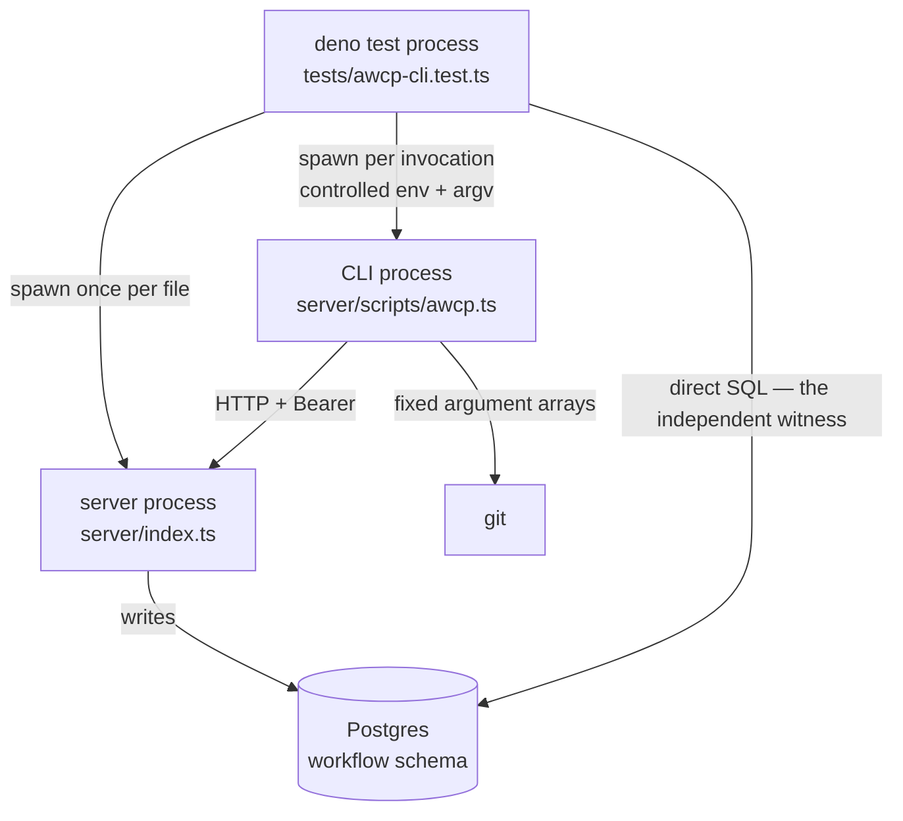

# Test the `awcp` CLI

## Goal Capsule

- **Objective:** Give `server/scripts/awcp.ts` automated coverage that exercises the shipped artifact across a real process boundary, and close the one ST-086 acceptance criterion that was claimed but never proven.
- **Authority:** The ST-087 entry in [.github/planning/story-board.md](../../.github/planning/story-board.md) is the product contract. [docs/solutions/conventions/verification-mechanisms-need-adversarial-review.md](../solutions/conventions/verification-mechanisms-need-adversarial-review.md) governs how the verification itself is judged. [CLAUDE.md](../../CLAUDE.md) governs commands, commit trailers, and merge strategy.
- **Execution profile:** Test-first is the wrong frame here — the tests *are* the deliverable. The direction that matters is the opposite one: every test must be shown to discriminate, because a test suite is exactly the kind of artifact that can be green and prove nothing. Test scenarios are enumerated per unit rather than deferred to a final "write tests" step, per [docs/solutions/workflow-issues/explicit-test-requirements-in-plans-2026-06-19.md](../solutions/workflow-issues/explicit-test-requirements-in-plans-2026-06-19.md).
- **Stop conditions:** Stop and surface if closing R7 turns out to require changing the API's response shape rather than the CLI's reading of it — that widens the blast radius from one script to every `/api/workflow` client. Stop if the parent test process turns out to need a wider `--allow-run` grant than `deno` (see A1), since that changes the CI command and the security story CLAUDE.md documents.
- **Tail ownership:** Standalone. `ce-work` owns review, commit, and PR.

---

## Product Contract

### Summary

Automated coverage for the `awcp` CLI, driven as a real subprocess against a real server, with the resulting rows asserted directly in Postgres. Also closes ST-086's criterion 5 for real, and makes a 400 from the API name the field that was wrong so an agent can correct itself.

### Problem Frame

`server/scripts/awcp.ts` is 371 lines of argument parsing, git wrapping and HTTP client with zero automated coverage. It shipped inside ST-086 alongside suites that cover the API, the store, the policy classifier and the dashboard — the CLI is the one surface nothing watches.

The consequence is already on record. The ST-086 code review found two real defects in this file by reading it: `--help` exited 2 instead of printing usage, and path ids were interpolated into URLs unencoded. Both were fixed. Neither was caught by a test, and nothing prevents the next one.

There is also a live overclaim. ST-086's board criterion 5 reads "one real local repository/session reported a commit-bearing checkpoint **through the CLI**", but the test backing it posts a hardcoded SHA ([server/tests/workflow-mvp-e2e.test.ts:232](../../server/tests/workflow-mvp-e2e.test.ts)). What is proven is that the API stores a `repo_commit` it was handed. What is claimed is that the CLI obtained one. Those are different facts, and only the second one makes a checkpoint self-describing.

Separately, the CLI's error surface is not usable by its primary caller. The API answers a validation failure with a per-field `issues[]` array, but `post()` reads only `message` and `unmetCriteria`, so a malformed `--policy-scope` yields a bare `400 request body failed validation`. An agent that cannot see which field it got wrong cannot fix itself; it can only retry blind.

### Requirements

**Subcommand coverage**

- R1. Each reporting subcommand — `packet`, `run`, `checkpoint`, `decision`, `end-run` — drives the real HTTP API end to end, and the row it creates is asserted directly in the database.
- R2. Argument parsing is covered at its edges: a missing required flag, a flag with no value, an unknown subcommand, and each help path, every case asserting its exit code (0 for help, 2 for usage errors).
- R3. The git-derived defaults are covered on both branches — the value the CLI obtains for itself, and the `null` path when git fails or is unavailable — with `--no-commit` as the explicit opt-out.
- R4. The request-timeout path produces its own distinct message, proven against a server that accepts the connection and never answers.

**Evidence quality**

- R5. ST-086's criterion 5 is proven: a checkpoint recorded through the CLI carries a `repo_commit` equal to this checkout's actual `HEAD`, obtained by the CLI rather than supplied to it.
- R6. At least one red control demonstrates the suite discriminates — a guard the suite claims to cover is removed, and the test is observed going red.
- R7. A 400 from the API names the offending field in the CLI's output, so an agent can correct its own call without reading server logs.

**Constraints**

- R8. The agent credential is exercised from the CLI: with `AWCP_AGENT_API_KEY` set, the reporting subcommands succeed.
- R9. The CLI is exercised as the shipped artifact — the same file, run as a subprocess under the permission set its shebang declares.

### Scope Boundaries

- The four supervision actions (resolve a decision, attach evidence, author a criterion, complete a packet) stay out. The CLI deliberately does not expose them, and `server/tests/workflow-agent-key-e2e.test.ts` already proves the server refuses an agent key on those routes.
- No restructuring of `server/scripts/awcp.ts` beyond the R7 change. Its single-file shape is a decision this story tests around, not one it revisits.
- Making the provider base URLs configurable stays ST-085's.

- In-process unit tests of the parsing helpers. Rejected rather than deferred: KTD1 declines to add an import seam, and without one there is nothing to unit-test against. If a seam ever arrives for an unrelated reason, these tests become cheap — but nothing here is waiting on them.

---

## Planning Contract

### Key Technical Decisions

- KTD1. **Process-boundary testing only; no import seam.** (session-settled: user-approved — chosen over extracting the parsing helpers into an importable module: `awcp.ts` runs `main()` at module top level and `die()` calls `Deno.exit(2)`, so an import seam would mean restructuring the shipped script, and in-process tests would still not cover the permission set or the exit codes that are half of what R2 asserts.) Governs R9.
- KTD2. **One server process shared by the whole test file.** (session-settled: user-approved — chosen over booting a server per test: roughly fifteen CLI invocations each paying a full server boot would dominate suite runtime.) The cost is that no test may assume an empty schema; each creates the packet or run it needs. One case is exempt and starts its own listener: the timeout test (R4) needs a server that accepts and never answers.
- KTD3. **`issues[]` is surfaced by changing what the CLI reads, not what the API sends.** (session-settled: user-approved — chosen over deferring the fix to a separate story: the board scopes it here, and the test that proves R7 has to assert against *something*.) The API's response shape is unchanged, so no other `/api/workflow` client is affected. Governs R7.
- KTD4. **The test derives the CLI's permission flags from the script's own shebang line rather than hardcoding them.** `deno run <flags> script.ts` ignores the shebang, so a hardcoded flag list in the test would silently diverge from the grant the script ships with — and the divergence would be invisible in exactly the direction that matters, a test passing under looser permissions than production gets. Governs R9.
- KTD5. **Assertions read Postgres directly, not the API's read model.** The CLI's write path already runs through the API; asserting through the same API would make one component both the thing under test and the witness. A direct `sql` query is an independent observer.
- KTD6. **The CLI's stdout is a second assertion channel, not the primary one.** `emit()` prints a label plus the record as JSON, so a test can parse the created id from stdout and then verify that same id in the database. That link — the id the CLI reported is the row that exists — is what makes "the CLI did this" a claim rather than "something did this".

### High-Level Technical Design

Three processes and two independent paths to the database. The write path runs through the CLI and the server; the assertion path goes straight to Postgres. Keeping them separate is what makes the assertions evidence rather than an echo.

The parent test process spawns the Deno binary twice over: once for the server, once per CLI invocation. Permissions do not inherit — the CLI child receives exactly the grants the parent passes it, which is what KTD4 exploits.

### Assumptions

- A1. The parent test process needs no grant beyond the existing `--allow-run=deno`. Deno permissions are per-process, so the parent execs the `deno` binary and the CLI child receives its own `--allow-run=git` from the argv the parent constructs. If this is wrong, the CI command in [.github/workflows/ci.yml](../../.github/workflows/ci.yml) and the documented commands in CLAUDE.md both change, and the narrowed-grant security story stated there needs revisiting. Confirm in U1 before building on it.
- A2. `tests/awcp-cli.test.ts` sorts before `tests/workflow-mvp-e2e.test.ts`, which drops the `workflow` schema at both ends of its run. `deno test` runs files sequentially unless `--parallel` is passed, and neither CI nor CLAUDE.md passes it. The new file therefore runs first against a schema its own spawned server bootstraps. Do not add `--parallel` without giving these files separate databases — the existing e2e file carries the same warning for the same reason.

### Sequencing

U1 is a hard prerequisite: it settles A1 and produces the invocation helper every other unit calls. U2 through U5 are independent of each other once U1 lands. U6 changes production code and should come last, so the red control it carries is run against the finished suite rather than a partial one.

---

## Implementation Units

### U1. Harness for driving the shipped CLI

- **Goal:** A helper that runs `server/scripts/awcp.ts` as a subprocess with a controlled environment and returns exit code, stdout and stderr — plus the shared server fixture the rest of the file uses.
- **Requirements:** R9; unblocks R1-R8.
- **Dependencies:** none.
- **Files:** `server/tests/_helpers/awcpCli.ts` (new), `server/tests/awcp-cli.test.ts` (new).
- **Approach:**
  1. Read the shebang line from `server/scripts/awcp.ts` and parse the `--allow-*` flags out of it, so the child runs under the grant the script ships with (KTD4). Fail loudly if the shebang cannot be parsed — a silent fallback to hardcoded flags is the failure this exists to prevent.
  2. Spawn `Deno.execPath()` with those flags plus the script path and the test's argv. Pass `clearEnv: true` and an explicit env map, mirroring `startServerProcess` — the container sets `MEMORY_API_KEY` and inheriting it would make credential tests prove nothing.
  3. Capture stdout and stderr separately; return them with the exit code. Provide a small parser for the `emit()` output shape so tests can lift the created id.
  4. Boot one server on a port of its own via `startServerProcess` (KTD2). Ports 3142 and 3143 are taken by the ST-086 e2e file; use 3144.
- **Execution note:** Settle A1 first. Run the file with the existing `--allow-run=deno` grant and confirm the CLI child can still reach `git`. If it cannot, stop and surface — that is a stop condition, not something to fix by widening the grant unilaterally.
- **Patterns to follow:** `server/tests/_helpers/serverProcess.ts` — particularly its stream-draining loop (a child whose pipes fill blocks on write) and its `clearEnv` docblock.
- **Test scenarios:**
  - `awcp help` under the shared fixture exits 0 and prints usage containing the subcommand list.
  - The helper's shebang parser returns the four grants currently declared (`--allow-net`, `--allow-env`, `--allow-sys=hostname`, `--allow-run=git`).
  - The helper's shebang parser throws when handed a file whose first line is not a shebang, rather than falling back to a default.
- **Verification:** The file runs green in isolation with the documented command, and the smoke test's output shows the CLI's own usage text.

### U2. Subcommand coverage with database assertions

- **Goal:** Each reporting subcommand drives the API end to end, and the row it created is verified by direct SQL.
- **Requirements:** R1, R8; KTD5, KTD6.
- **Dependencies:** U1.
- **Files:** `server/tests/awcp-cli.test.ts`.
- **Approach:** Drive the subcommands in dependency order within one test — packet, then a run on that packet, then a checkpoint on that run, a decision on the packet, and `end-run`. Lift each created id from the CLI's stdout, then assert the corresponding row in `workflow.*` by that id. Repeat the `packet` → `run` → `checkpoint` leg once more with `AWCP_AGENT_API_KEY` set instead of `MEMORY_API_KEY` for R8; the agent key is a distinct value from the operator key, so the server's collision guard stays satisfied.
- **Patterns to follow:** the `sql` template usage in `server/tests/workflow-mvp-e2e.test.ts`; `server/src/workflow/store.ts` for column names.
- **Test scenarios:**
  - `packet` with title, objective and `--policy-scope personal` exits 0, and a `workflow.packets` row with the reported id carries that policy scope.
  - `run --packet <id>` exits 0, and the `workflow.runs` row carries `agent_type` of `local-cli` (the CLI's default, not a value the test passed).
  - `checkpoint --run <id> --completed W --state S` exits 0, and the `workflow.checkpoints` row carries both fields.
  - `decision --packet <id> --question Q` exits 0 and the row is blocking; the same call with `--advisory` produces a non-blocking row.
  - `end-run --run <id>` exits 0 and the run's status is `ended`; `--status failed` yields `failed`; `--status bogus` exits 2 without reaching the API.
  - The same packet/run/checkpoint sequence succeeds with only `AWCP_AGENT_API_KEY` in the child's environment.
- **Verification:** Every assertion names a row by an id the CLI itself printed, so no test passes on a row some other test created.

### U3. Commit provenance — close ST-086's criterion 5

- **Goal:** Prove that a checkpoint's `repo_commit` was obtained by the CLI, not handed to it.
- **Requirements:** R5.
- **Dependencies:** U1, U2.
- **Files:** `server/tests/awcp-cli.test.ts`.
- **Approach:** Invoke `checkpoint` with no `--commit` flag, from a working directory inside this checkout. Independently read the expected value with `git rev-parse HEAD` from the test, and assert the stored `repo_commit` equals it. The absence of `--commit` in the argv is the load-bearing part: it is what makes the stored value the CLI's work rather than the test's.
- **Execution note:** This is the unit that retires a claim the board currently makes on weaker evidence. When it lands, ST-086's criterion 5 has a real proof for the first time — worth naming in the commit message.
- **Test scenarios:**
  - A checkpoint created with no `--commit` stores a `repo_commit` matching `git rev-parse HEAD`, and the argv used contains no commit value.
  - `--commit <explicit sha>` stores that value, showing the flag still overrides the default.
- **Verification:** Assert the stored value against a freshly-read `HEAD` rather than a constant, so the test cannot pass against a stale hardcoded SHA — the exact weakness it exists to replace.

### U4. Argument-parsing edges and exit codes

- **Goal:** The parser's failure modes are pinned, including the two defects the review found by reading.
- **Requirements:** R2.
- **Dependencies:** U1.
- **Files:** `server/tests/awcp-cli.test.ts`.
- **Approach:** Table-driven — argv in, expected exit code and a substring of stderr or stdout out. These are the cheapest tests in the file and the ones that would have caught the `--help` regression, so keep them exhaustive rather than representative.
- **Test scenarios:**
  - `--help`, `-h`, `help`, and no arguments each exit 0 and print usage. (`--help` as the first argument is parsed as the subcommand, not a boolean flag — the case that regressed.)
  - `packet` with no `--title` exits 2 and names `--title`.
  - `packet --title` with no following value exits 2 and says a value is required.
  - `packet --title T --objective O` with no `--policy-scope` exits 2 — the boundary value has no default by design.
  - An unknown subcommand exits 2 and suggests `awcp help`.
  - A bare positional argument after the subcommand exits 2 rather than being silently ignored.
  - A packet id containing a URL-significant character reaches the API as an encoded path segment and yields a 400 naming the id, not a request against a different route — the second defect the review found.
- **Verification:** Every usage error exits 2 and every help path exits 0; no case exits 1 or 0 by accident.

### U5. Git-default degradation, `--no-commit`, and the timeout path

- **Goal:** The two paths where the CLI degrades rather than failing are covered, plus the distinct timeout message.
- **Requirements:** R3, R4.
- **Dependencies:** U1.
- **Files:** `server/tests/awcp-cli.test.ts`.
- **Approach:**
  1. For the `null` git path, run the CLI with a working directory outside any git repository so `git rev-parse` exits non-zero. `git()` returns `null` on non-zero exit, which is the branch under test. Withholding the `--allow-run=git` grant is the alternative lever and also reaches the `null` branch — prefer whichever produces the clearer failure message when it breaks, and say which in the test's comment.
  2. For the timeout, start a listener that accepts the connection and never responds, point `AWCP_BASE_URL` at it, and set `AWCP_TIMEOUT_MS` low. Assert the message distinguishes a timeout from an unreachable server — those are different operator problems and the CLI already words them differently.
- **Test scenarios:**
  - `packet` run outside a git repository succeeds, and the stored row's `repository` and `branch` are null.
  - `checkpoint --no-commit` stores a null `repo_commit` while the surrounding fields are populated.
  - `checkpoint` against a never-answering server exits 2 with a message naming the timeout and the elapsed budget.
  - The same CLI against a closed port exits 2 with the unreachable-server message, not the timeout one — the discrimination control for the case above.
- **Verification:** The timeout and unreachable cases produce different messages; a test that accepted either would not be proving anything about the timeout path.

### U6. Surface field-level validation errors, and prove the suite discriminates

- **Goal:** A 400 tells an agent which field was wrong, and the suite is shown to go red when a covered guard is removed.
- **Requirements:** R6, R7; KTD3.
- **Dependencies:** U1-U5.
- **Files:** `server/scripts/awcp.ts`, `server/tests/awcp-cli.test.ts`.
- **Approach:** Widen the error branch in `post()` to read the `issues[]` array the API already sends (`{ path, message }` per entry) alongside the existing `message` and `unmetCriteria`. The id-parameter 400 uses a different shape — `message` plus `received`, no `issues` — so handle both rather than assuming every 400 carries issues. Keep the output one line per issue so it stays greppable.

  Then run the red control. Revert the `issues[]` read, confirm the R7 test fails, and restore it. Record what was removed and what went red in the commit message, per the convention.
- **Execution note:** The red control is not optional decoration. This suite's whole subject is a file that had 371 lines and no coverage, so a green suite here has to be shown to be capable of turning red.
- **Patterns to follow:** the existing `unmetCriteria` branch in `post()` — the same shape of optional detail, already handled.
- **Test scenarios:**
  - `packet --policy-scope everyone` (out of vocabulary) exits 2 and the output names `policyScope`, not just "request body failed validation".
  - A 400 carrying multiple issues names every offending field.
  - A completion-style refusal carrying `unmetCriteria` still renders as before — the existing branch is not regressed by the new one.
  - A 400 with no `issues` array (the malformed-id shape) still produces a readable message rather than an empty or `undefined` fragment.
- **Verification:** With the `issues[]` read reverted, the first scenario fails on the missing field name and the others still pass — that asymmetry is what shows the assertion is specific rather than incidental.

---

## Verification Contract

| Gate | Command | Applies to |
|---|---|---|
| This file alone | `docker compose --profile test exec mcp-test deno test --frozen --allow-net --allow-env --allow-read --allow-run=deno tests/awcp-cli.test.ts` | U1-U6 during development |
| Full server suite | `docker compose --profile test exec mcp-test deno test --frozen --allow-net --allow-env --allow-read --allow-run=deno tests/` | Before commit |
| Red control | Remove the guard named in the unit, re-run, observe red, restore | U6 (required), any unit whose assertion looks incidental |

The full-suite baseline is **334 passed / 9 failed**, measured on 2026-08-03 at `f36903e`. The two commits since (`22fa20c` and its contents) change only documentation and env examples, so the count carries — re-measure if that stops being true. The nine are the documented pre-existing provider-401 failures in `tests/e2e.test.ts` and `tests/entity-worker-observability.test.ts`; CI passes them because CI holds a provider credential. A run that ends with a *different* set of nine has broken something this plan did not intend to touch.

Before running from a checkout other than the one that started the stack, confirm the bind mount points where you think it does — `docker inspect --format '{{range .Mounts}}{{.Source}}{{"\n"}}{{end}}' $(docker compose ps -aq mcp-test)`. See [docs/solutions/workflow-issues/verify-worktree-change-against-docker-test-stack.md](../solutions/workflow-issues/verify-worktree-change-against-docker-test-stack.md).

---

## Definition of Done

**Global**

- All nine requirements are covered by a named test, or explicitly deferred in Scope Boundaries.
- Full suite green against the 334/9 baseline, with the nine failures unchanged in identity.
- The red control in U6 was run, went red, and both facts are recorded in the commit message.
- No abandoned experimental code — helper variants, commented-out spawn attempts, or debugging output — remains in the diff.
- A1 is resolved in the plan's favour or surfaced as a blocker; the CI command is not widened without a decision.

**Per unit**

| Unit | Done signal |
|---|---|
| U1 | The CLI's own usage text appears in test output, and the child's grants were parsed from the shebang rather than written in the test |
| U2 | Every asserted row is located by an id the CLI printed |
| U3 | `repo_commit` matches a freshly-read `HEAD`, with no commit value in the argv |
| U4 | Each help path exits 0 and each usage error exits 2 |
| U5 | Timeout and unreachable produce different, separately asserted messages |
| U6 | The R7 test is observed failing with the `issues[]` read removed, and passing with it restored |

On completion, ST-086's board criterion 5 can be re-stated on real evidence — a checkpoint whose commit the CLI obtained — rather than on a test that posts a constant.
