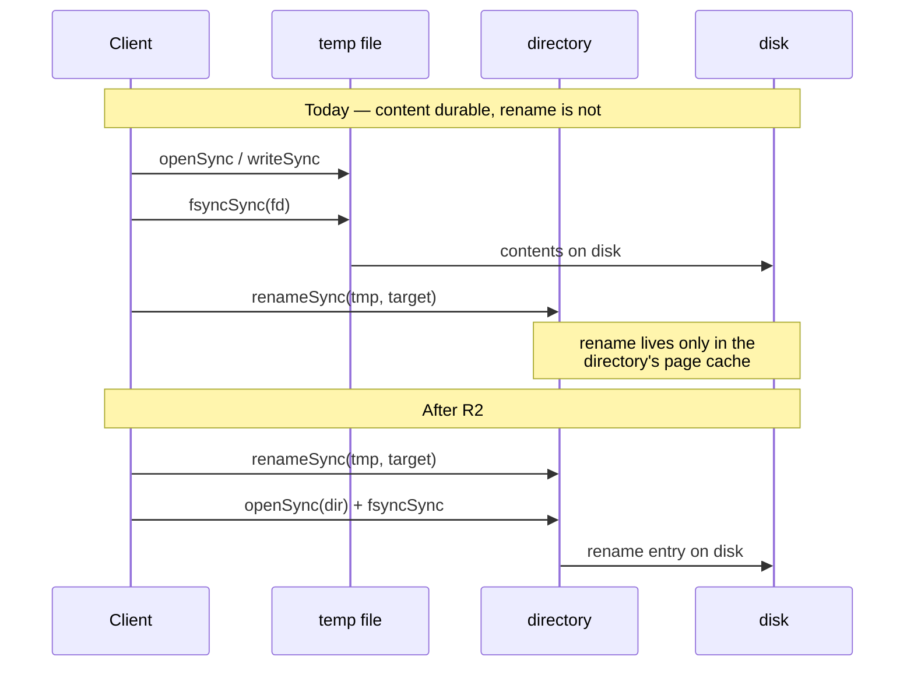
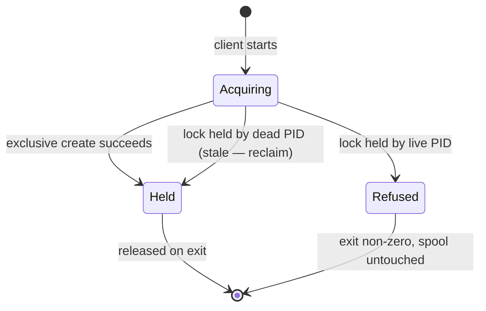

# ST-092 — Node-Client Hardening and Test-Suite Operational Safety - Plan

## Goal Capsule

**Objective:** Close the durability, concurrency, and failure-handling gaps that the ST-088 Phase 3 cross-AI review found in `server/scripts/awcp-node-client.mjs`, and remove two test-suite hazards that can destroy real operational state. After this story the node client's own guarantees match what its docblocks claim, and an ordinary local test run can no longer de-enrol a live execution node.

**Product authority:** [`.planning/phases/03-node-client-reliable-delivery-regression-safety/03-REVIEWS.md`](../../.planning/phases/03-node-client-reliable-delivery-regression-safety/03-REVIEWS.md) — the two-lane review (codex + antigravity), both source-grounded, findings 1–8 in its verified table.

**Relationship to ST-088:** Additive and forward-only. Phase 3 is merged, its evidence artifacts are historical record, and **nothing in this story rewrites them.** ST-088's `03-REGRESSION-FINAL.txt`, `03-VERIFICATION.md`, and findings §16 remain valid for the tree they were taken against.

**Open blockers:** None. Two review findings are deliberately **not** in scope and route elsewhere (see Scope Boundaries).

---

## Product Contract

### Problem Frame

Phase 3 shipped a node client whose functional behaviour is well tested — 32 tests, an empty-diff regression gate, and real-node evidence on `z2`. The review did not dispute any of that. What it found is a gap between what the client's own documentation asserts and what its code does, concentrated in the local persistence layer:

- `writeSpool`'s docblock states that rename-based replacement means "a crash mid-write leaves either the old complete spool or the new one." That is true of *content* but not of *durability*: the temp file is fsynced and the directory never is, so the rename itself is not guaranteed to survive power loss.
- `allocateSeq` is an unlocked read-increment-write. The client is designed for a single active process, but nothing enforces that, and the test that appears to prove repeated allocation loops sequentially inside one process — so it cannot fail for the reason it exists.
- `evictOldest` shrinks the spool before recording the drop, so a crash between the two loses events *without* incrementing the counter EVENT-04 requires to be visible.
- `flushOnce` parses response bodies that a malformed hub could make unparseable, rejecting `flush()` instead of returning one of its own typed outcomes.
- `runAgent`'s stop path can block for a full heartbeat interval and can report exit 0 with the final checkpoint still spooled.

Separately, two test-suite hazards were found that have nothing to do with the client's own quality but can destroy the state it depends on.

### Requirements

**R1 — Single-writer enforcement.** A second concurrent client process against the same `AWCP_HOME` must fail loudly and non-destructively rather than silently allocating a duplicate `client_seq`.

**R2 — Durable rename.** Every atomic-replacement write (spool and state alike) must fsync the containing directory after the rename, so the replacement survives power loss and the docblock's durability claim becomes true.

**R2b — Crash-atomic sequence counter.** The `client_seq` counter must never be observable as truncated or empty. It is written today with a truncate-in-place open, so a crash between truncate and write leaves a zero-length file that reads back as sequence 0 — reproducing the D-14 reset that `allocateSeq`'s own docblock exists to prevent, by a different route than the one it guards.

**R3 — Recoverable drop accounting.** A crash between spool eviction and drop recording must not lose events without incrementing the visible counter.

**R4 — Total response handling.** Every hub response — including invalid JSON and a 200 whose body is missing or misshapen — must map onto one of `flushOnce`'s declared outcomes with the spool preserved, never an exception escaping `flush()`.

**R5 — Honest shutdown.** `SIGINT`/`SIGTERM` must interrupt the heartbeat wait rather than wait it out, and a stop whose final flush did not deliver must not report success.

**R6 — Test isolation from real state.** A test that drops the `workflow` schema must refuse to run against a database that is not a designated test database.

**R7 — Port-collision immunity.** Spawned-server tests must not depend on hardcoded ports, and must retain the existing proof that the handle returned refers to the process the test started.

### Non-Goals

- Supporting genuinely concurrent local producers. R1 *enforces* the single-writer model; it does not lift it.
- Any change to hub-side code (`server/src/workflow/**`) beyond what R6 requires in tests.
- Re-running or amending ST-088 Phase 3's regression or real-node evidence.

---

## Key Technical Decisions

**KTD1 — Enforce single-writer with an exclusive lockfile; do not make allocation concurrent-safe.**
*(session-settled: user-directed — chosen over atomic cross-process allocation: the client was designed for one active process per node, and a lock that fails loudly turns an invisible corruption into an operator-visible error without adopting a concurrency model nothing needs.)* Governs R1.

The rejected alternative — serialising read-increment-write so concurrent producers genuinely work — is a larger change with its own crash-consistency story, and it would legitimise a usage pattern the hub's `(node_id, client_seq)` uniqueness was never designed around. A lock is falsifiable with two real spawned processes; an atomicity claim is much harder to prove.

**KTD2 — Move `startServerProcess` to ephemeral ports, parsing the real port back out of the child's own `Listening on` line.**
*(session-settled: user-directed — chosen over reassigning the duplicate and adding a uniqueness guard: it removes the collision class permanently rather than catching the next instance.)* Governs R7.

This deliberately rewrites a load-bearing safety mechanism, and the constraint that makes it safe is already documented in `server/tests/_helpers/serverProcess.ts:144-166`: the helper does not trust a `/health` 200, because on a fixed well-known port that only proves *something* is listening. It waits for `"Listening on"` on the child's own stdout, which nothing else can write to. **That proof gets stronger under `port: 0`, not weaker** — Deno prints the actual bound port, so the line becomes both the binding proof and the source of the port. The hazard it guards against (a stale process already holding the port) cannot occur at all when the kernel assigns a free one.

**KTD3 — Guard the destructive test by database identity, not by environment name.** Governs R6.

`workflow-mvp-e2e.test.ts` reads `DATABASE_URL` from the environment and drops the schema against whatever it points at. A guard keyed on a variable like `CI` or an env label would pass in exactly the situation that matters — CLAUDE.md's documented WSL2-native inner loop points `.env.dev` at the shared dev Postgres. The guard must assert a property of the *database it is connected to*, and fail closed when it cannot establish one.

**KTD4 — Order eviction as record-then-shrink, not shrink-then-record.** Governs R3.

Making the two steps genuinely atomic would require a journal and a recovery path. Reversing the order achieves the requirement more cheaply: a crash after `recordDrops` but before `writeSpool` over-counts drops for events still present in the spool, which is visible in the counter and harms nothing beyond an inflated total; the current order under-counts, which is silent and is precisely what EVENT-04 forbids. Over-reporting a drop is a strictly better failure than losing an event invisibly.

**KTD5 — Add a directory-fsync helper rather than inlining it at each call site.** Governs R2.

Exactly two call sites rename today — `writeSpool` (`awcp-node-client.mjs:333`) and `writeState` (`:376`). One helper keeps the durability property in one place and makes the next rename-based writer inherit it.

**KTD6 — Route the sequence counter through the same rewrite-and-rename primitive rather than special-casing it.** Governs R2b.

This finding is **not** from the review — it surfaced while verifying KTD5's call-site count, and it is the most severe durability gap in the client. `allocateSeq` (`:259`) and the `nodeIdPath` write (`:475`) both use `writeFileFsync`, which opens with `"w"` and therefore **truncates before it writes** (`:154-155`). The counter's crash window is not "stale value" — it is **empty file**, and `allocateSeq`'s own recovery path (`:253-256`) treats an unparseable counter as `current = 0`, so the next allocation returns 1.

That is the D-14 failure the docblock at `:242-249` says it exists to prevent: sequence reset, followed by the hub's `ON CONFLICT (node_id, client_seq) DO NOTHING` silently discarding real events. The docblock closes the derive-from-spool route and leaves this one open. Reusing the existing rename primitive is preferable to hardening `writeFileFsync` in place, because the atomicity requirement belongs to the *counter*, not to every small-file write.

---

## High-Level Technical Design

The write-durability change, showing what the current code guarantees versus what R2 requires:

The single-writer lock's state model (KTD1):

The `Refused` transition is the whole point of R1: it must leave the spool, counter, and state file exactly as it found them.

---

## Implementation Units

### U1. Directory-fsync helper and durable rename

**Goal:** Make the rename in every atomic-replacement write durable, so `writeSpool`'s stated crash guarantee becomes true.

**Requirements:** R2 (KTD5)

**Dependencies:** none

**Files:**
- `server/scripts/awcp-node-client.mjs` (modify — add `fsyncDir`, call it after each `renameSync`)
- `server/tests/awcp-node-client.test.ts` (modify — add durability assertions)

**Approach:**
1. Add a `fsyncDir(dirPath)` helper alongside `writeFileFsync`. Note that Node has no fsync-a-directory-handle API via `opendirSync` — obtain a descriptor with `openSync(dirPath, "r")` and `fsyncSync` that, closing in a `finally`.
2. Call it after `renameSync` in `writeSpool` (`:333`) and `writeState` (`:376`).
3. Correct `writeSpool`'s docblock, which currently asserts a durability property the code did not provide — the comment is part of the defect.

**Patterns to follow:** `writeFileFsync` / `appendLineFsync` (`awcp-node-client.mjs:154-177`) — same open/act/fsync/close-in-`finally` shape.

**Test scenarios:**
- `fsyncDir` is invoked once per `writeSpool` call, asserted via an injected spy on the config seam.
- `fsyncDir` is invoked once per `writeState` call.
- A directory that cannot be opened surfaces the error rather than being swallowed — a durability helper that silently no-ops is worse than none.
- Existing spool round-trip and crash-hook tests still pass unchanged (the `beforeRename` seam must keep working).

**Verification:** The spool and state writers each fsync their directory after rename; the docblock no longer claims more than the code does.

---

### U1b. Crash-atomic sequence counter

**Goal:** A crash while allocating a sequence number can never leave the counter readable as empty, and therefore can never reset the sequence to 1.

**Requirements:** R2b (KTD6)

**Dependencies:** U1

**Files:**
- `server/scripts/awcp-node-client.mjs` (modify — `allocateSeq`, and the shared write primitive it uses)
- `server/tests/awcp-node-client.test.ts` (modify)

**Approach:**
1. Write the counter through a rewrite-and-rename primitive with the U1 directory fsync, rather than `writeFileFsync`'s truncate-in-place open.
2. Decide explicitly what an unparseable counter should mean now that "empty" is no longer a reachable crash state. Treating it as 0 is what converts corruption into a silent reset; failing loudly is consistent with KTD1's stance that an operator-visible error beats invisible corruption. Record the choice in the docblock.
3. Extend `allocateSeq`'s docblock: it currently explains only the derive-from-spool route to a D-14 reset and should name this one too.

**Execution note:** Write the crash-window test first — it fails against the current truncate-in-place write, which is what proves it tests atomicity rather than allocation.

**Test scenarios:**
- Crash injected between truncate and write (via the same seam pattern as `beforeRename`): the counter still reads its previous value, and the next allocation continues from it rather than returning 1.
- Red/green control: the same test fails when the counter is written with the original truncate-in-place call.
- A counter file that is empty or unparseable on disk produces the behaviour chosen in step 2, asserted explicitly rather than left implicit.
- Normal sequential allocation is unchanged — the existing monotonicity and post-drain tests still pass.
- The counter file retains mode `0600` after the rename.

**Verification:** No crash window exists in which the counter reads back as empty; the D-14 invariant holds against both routes to a reset, not just the documented one.

---

### U2. Reverse eviction ordering so a drop is never invisible

**Goal:** A crash during overflow eviction can over-count drops but can never lose an event without incrementing the counter.

**Requirements:** R3 (KTD4)

**Dependencies:** none

**Files:**
- `server/scripts/awcp-node-client.mjs` (modify — `evictOldest`)
- `server/tests/awcp-node-client.test.ts` (modify)

**Approach:**
1. In `evictOldest`, compute the seqs to evict, call `recordDrops` first, then `writeSpool` with the remainder.
2. Document the asymmetry explicitly: an over-count is visible in the counter and costs only an inflated total; an under-count is silent and violates EVENT-04.

**Execution note:** Write the crash-between-steps test first — it fails against the current ordering, which is what proves it tests the ordering rather than the eviction.

**Test scenarios:**
- Normal overflow: oldest entry evicted, counter incremented by exactly one, newest entry retained.
- Crash injected between `recordDrops` and `writeSpool`: the counter shows the drop and the spool still holds the entry — over-counted, nothing lost.
- Red/green control: the same crash-injection test fails when the original shrink-then-record order is restored.
- Evicting multiple entries at once increments the counter once per entry and writes one stderr line per entry.
- `evictOldest(config, 0)` and an empty spool remain no-ops that write nothing.

**Verification:** No ordering exists in which an event leaves the spool without the counter having been incremented first.

---

### U3. Single-writer lock

**Goal:** A second concurrent client against the same `AWCP_HOME` exits non-zero and changes nothing.

**Requirements:** R1 (KTD1)

**Dependencies:** none

**Files:**
- `server/scripts/awcp-node-client.mjs` (modify — lock acquire/release, `resolveConfig` gains `lockPath`)
- `server/tests/awcp-node-client.test.ts` (modify)

**Approach:**
1. Add `lockPath` to `resolveConfig` as an injectable path, following the existing every-path-is-a-parameter convention.
2. Acquire with an exclusive-create open (`wx`) writing the owning PID; release on normal exit and on the terminal-auth path.
3. Treat a lock whose recorded PID is no longer alive as stale and reclaim it — a client killed by `SIGKILL` must not brick the node permanently.
4. Refuse on a live holder: exit non-zero with a message naming the holding PID, before touching the spool, counter, or state.
5. Apply at the mutating CLI verbs (`emit`, `flush`, `checkpoint`, `run`); leave `status` read-only and lock-free.

**Execution note:** The proof requires two **real** processes. An in-process test cannot distinguish this lock from no lock at all — that is the exact weakness this unit exists to fix in the Phase 3 test.

**Test scenarios:**
- Two spawned client processes against one `AWCP_HOME`: the second exits non-zero and its stderr names the contention.
- After a refused run, `client_seq`, `spool.jsonl`, and `state.json` are byte-identical to before it.
- A lockfile containing a dead PID is reclaimed and the run proceeds.
- A lockfile containing the live current PID is refused.
- The lock is released after a normal run, so a second sequential run succeeds.
- The lock is released on the terminal-auth (exit 77) path — a permanently-failing node must not stay locked.
- `status` runs while the lock is held.
- Red/green control: the two-process contention test fails when lock acquisition is stubbed out.

**Verification:** Two concurrent processes cannot both allocate; a crashed process does not permanently block the node.

---

### U4. Total response handling in `flushOnce`

**Goal:** No hub response, however malformed, escapes as an exception from `flush()`.

**Requirements:** R4

**Dependencies:** none

**Files:**
- `server/scripts/awcp-node-client.mjs` (modify — `flushOnce`)
- `server/tests/awcp-node-client.test.ts` (modify)

**Approach:**
1. Wrap both `await res.json()` sites (the 400 branch and the 200 branch) so a parse failure returns `{outcome: "malformed", detail}` rather than throwing.
2. Validate the 200 body shape before use: `acknowledged` must be an array of entries carrying numeric `client_seq`. A 200 that fails validation is `malformed`, not `acked` — treating it as acked would remove spool entries the hub never confirmed, violating EVENT-03.
3. Preserve the existing per-event-rejection detection (`issues` where every entry has a numeric `client_seq`) untouched — it is already correct and its docblock explains why.

**Patterns to follow:** the existing outcome union in `flushOnce` (`awcp-node-client.mjs:511-559`) and `flush`'s outcome-mapping docblock.

**Test scenarios:**
- A 400 with a body that is not valid JSON returns `malformed`, spool untouched.
- A 200 with a body that is not valid JSON returns `malformed`, spool untouched.
- A 200 whose body has no `acknowledged` key returns `malformed`, spool untouched.
- A 200 whose `acknowledged` is not an array returns `malformed`.
- A 200 whose `acknowledged` entries lack numeric `client_seq` returns `malformed` — explicitly asserting the spool is unchanged, since this is the case that could silently delete undelivered events.
- A 200 acknowledging seqs outside the batch sent does not remove entries the hub never confirmed.
- The existing valid-200 and valid-400-rejection paths behave exactly as before.

**Verification:** `flush()` returns a declared outcome for every response shape; no input causes it to reject.

---

### U5. Honest shutdown semantics

**Goal:** A signal interrupts the heartbeat wait immediately, and a stop that did not deliver does not report success.

**Requirements:** R5

**Dependencies:** U4

**Files:**
- `server/scripts/awcp-node-client.mjs` (modify — `runAgent`, and `main`'s exit-code mapping)
- `server/tests/awcp-node-client.test.ts` (modify)

**Approach:**
1. Make the heartbeat wait abortable — race `sleepImpl(interval)` against a promise that `stop()` resolves, so the loop wakes on signal instead of at the next interval boundary.
2. Propagate the final flush's outcome into the exit code: a `deferred` final flush must not exit 0. Reuse the existing exit-75 deferred convention rather than inventing a new code.
3. State in the docblock whether a stop checkpoint left in the spool counts as a clean shutdown — the current code answers this implicitly and the review flagged the ambiguity.

**Test scenarios:**
- `stop()` during the heartbeat wait resolves `done` promptly rather than after a full interval, asserted with an injected `sleepImpl`.
- A stop whose final flush returns `deferred` yields exit 75, not 0.
- A stop whose final flush succeeds yields exit 0.
- A terminal-auth outcome still yields exit 77 and still releases the U3 lock.
- The stop checkpoint is emitted exactly once even when `stop()` is called twice.

**Verification:** Shutdown latency is bounded by the signal, not the heartbeat; the exit code distinguishes delivered from deferred.

---

### U6. Guard the destructive workflow test against non-test databases

**Goal:** `workflow-mvp-e2e.test.ts` cannot drop the `workflow` schema on a database that is not a designated test database.

**Requirements:** R6 (KTD3)

**Dependencies:** none

**Files:**
- `server/tests/workflow-mvp-e2e.test.ts` (modify — add the guard at the top of the suite)
- `server/tests/_helpers/` (add or extend a shared guard helper if a second destructive suite needs it)
- `docs/solutions/workflow-issues/` (add a learning: a documented inner-loop command that destroys real state)

**Approach:**
1. Assert a property of the connected database before the first `DROP SCHEMA` — not a property of the environment. Fail closed: if the check cannot establish that this is a test database, refuse rather than proceed.
2. Fail with a message that names the hazard concretely: dropping `workflow` removes `execution_nodes`, which de-enrols any real node and locks it out behind a 401 until enrolment is manually reopened.
3. Extend the existing file-header note (`workflow-mvp-e2e.test.ts:1-32`), which already warns about concurrency but not about which *database* the file may run against.

**Execution note:** Prove the guard fires before relying on it — a guard that has never been observed to refuse is indistinguishable from one that always passes.

**Test scenarios:**
- Pointed at the designated test database, the suite runs exactly as it does today.
- Pointed at a non-test database, the suite refuses before any `DROP SCHEMA` executes — asserted by confirming the schema still exists after the refusal.
- With the identifying property absent or unreadable, the suite refuses (fails closed).
- The refusal message names `execution_nodes` and the de-enrolment consequence.

**Verification:** No code path reaches `DROP SCHEMA` without having positively established that the target is a test database.

---

### U7. Ephemeral ports in `startServerProcess`

**Goal:** Remove the hardcoded-port collision class entirely while strengthening the binding proof.

**Requirements:** R7 (KTD2)

**Dependencies:** none

**Files:**
- `server/tests/_helpers/serverProcess.ts` (modify — spawn with `PORT=0`, parse the bound port, derive `baseUrl`)
- `server/tests/awcp-cli.test.ts` (modify — drop `CLI_PORT`)
- `server/tests/provider-egress.test.ts` (modify — drop `PROCESS_PORT`)
- `server/tests/workflow-node-hub-e2e.test.ts` (modify — drop `PORT`)
- `server/tests/workflow-agent-key-e2e.test.ts` (modify — drop `PORT`)
- `server/tests/workflow-node-client-hub-e2e.test.ts` (modify — drop `PORT`, two call sites)
- `server/tests/workflow-mvp-e2e.test.ts` (modify — two call sites, including the restart path)

**Approach:**
1. Spawn with `PORT: "0"` and parse the actual port from the child's `Listening on http://<host>:<port>/` line — the same line the helper already waits for. The wait becomes the port source as well as the binding proof.
2. Derive `baseUrl` from the parsed port instead of the caller's argument, and expose the resolved port on `ServerProcess` for callers that need it.
3. Migrate all eight call sites. Callers already using `server.baseUrl` need no further change.
4. Update the `144-166` docblock: the stale-process hazard it describes is now structurally impossible, and the reason the stdout parse matters has shifted from *discrimination* to *discrimination plus port discovery*.
5. **Note for the implementer:** `workflow-mvp-e2e.test.ts` restarts a server. Under ephemeral ports the restarted process binds a *different* port, so any place that reuses a previously captured `baseUrl` across the restart must take it from the new handle. This is the highest-risk edit in the unit.

**Test scenarios:**
- Two servers started concurrently in one test receive different ports and both respond on their own `baseUrl`.
- The returned handle's `baseUrl` reaches the process this call spawned — assert against a value unique to that child's environment, not a bare `/health` 200.
- A child that fails to bind still fails the boot with the existing diagnostic rather than hanging.
- The `workflow-mvp-e2e` restart path addresses the restarted server on its new port and its state assertions still hold.
- Full suite passes with no hardcoded server port constants remaining in `server/tests/`.

**Verification:** No test file hardcodes a spawned-server port; two suites can no longer collide; the binding proof still discriminates the spawned child from any other listener.

---

### U8. Regression gate and evidence

**Goal:** Prove the client's existing guarantees are intact and record what changed for ADR-016's benefit.

**Requirements:** R1–R7, R2b

**Dependencies:** U1, U1b, U2, U3, U4, U5, U6, U7

**Files:**
- `docs/investigations/ST-084-awcp-host-spike-findings.md` (modify — a short subsection recording that the single-writer constraint is now enforced rather than assumed)
- `CLAUDE.md` (modify — extend the test-grant inventory if U3's two-process test needs a new grant)

**Approach:**

1. **Declare the expected identity delta *before* running the comparison.** Plan 03-05's empty-diff gate worked because ST-088 Phase 3 was purely additive — it added two test files and touched no existing one. **This story is not additive:** U7 modifies six existing test files, and U1b may intentionally change how an existing test observes an unparseable counter. An unqualified "empty diff" gate would therefore either fail for expected reasons or, worse, be quietly relaxed until it passes. Write down the expected changes first; the gate is then "the observed delta equals the declared delta", not "the delta is empty".
2. Run the full suite and compare test identities against ST-088's `03-REGRESSION-FINAL.txt` name-for-name, not by totals — the same identity method as 03-05, with the declared-delta allowance above.
3. Any identity change *not* in the declared set is a regression and blocks the story, whatever the totals say.
4. Record the ADR-016-relevant delta in one paragraph: Phase 3's evidence was gathered under an *assumed* single-writer model; that model is now *enforced*, which is what lets Phase 4 cite the evidence without the "concurrent local producers" caveat the review attached to it. Note that U1b closed a D-14 reset route that Phase 3's evidence did not cover and neither review lane found.
5. If U3's contention test spawns processes, extend CLAUDE.md's grant inventory — it is an inventory, and a stale one reads as a complete list.

**Test scenarios:** *Test expectation: none — this unit runs and records existing tests rather than adding behaviour.*

**Verification:** Every pre-existing test identity either matches the Phase 3 baseline or appears in the delta declared in step 1 with a stated reason; no unexplained identity changes; the findings subsection states only what this story proved.

---

## Verification Contract

1. Full suite passes, and every pre-existing test identity in `03-REGRESSION-FINAL.txt` either matches or appears in U8's pre-declared delta with a stated reason. Unlike Phase 3, this story modifies existing test files, so an unqualified empty diff is the wrong gate — see U8 step 1.
2. Every red/green control named in U2, U3, and U6 has been observed failing against the unfixed code — a control that has never gone red has not been shown to work.
3. No test file in `server/tests/` contains a hardcoded spawned-server port.
4. `workflow-mvp-e2e.test.ts` refuses to run against a non-test database, demonstrated rather than asserted.
5. Two concurrent client processes against one `AWCP_HOME` produce one success and one loud refusal, with no state mutation from the refused run.
6. A crash injected into the counter's write window leaves the previous sequence readable — the counter is never observable as empty.

## Definition of Done

- R1–R7 and R2b each have a passing test naming the input, action, and expected outcome.
- The corrected docblocks in `writeSpool`, `allocateSeq`, and `serverProcess.ts` describe what the code now does.
- U8's declared identity delta is written down before the comparison runs, and the observed delta matches it exactly.
- The findings-document subsection is committed.
- Story board ST-092 moved to its terminal state with the WIP limit respected.
- Commits carry `Story: ST-092`; the PR body ends with the trailer as its final block and no commit carries `Co-authored-by:` (CLAUDE.md merge-strategy Rules 1 and 2).

---

## Scope Boundaries

### Deferred to Follow-Up Work

- **`FEATURE_WORKFLOW` permanence** (review finding 7). Phase 4 already owns this decision; duplicating it here would fork it.
- **The ADR-016 scope qualifier itself.** U8 records the *fact* that single-writer is now enforced; deciding how ADR-016 words its host recommendation is Phase 4's call.
- **`last_seen_at` never advancing on ingestion** (review finding 8). A hub-side change in `server/src/workflow/store.ts`, outside this story's client-and-tests boundary. Worth its own story — it makes a healthily-reporting node read as stale.
- **Module-import side effects** (`process.emitWarning` replaced at evaluation time). Real but cosmetic; no test depends on it.
- **Retry-jitter asymmetry at the backoff cap.** The review rated it LOW and explicitly acceptable.

### Not in Scope

- Supporting concurrent local producers (see Non-Goals).
- Re-running ST-088's real-node experiments on `z2`.
- Editing `.planning/STATE.md` or `.planning/ROADMAP.md`, whose staleness the review also flagged — that is GSD state housekeeping, not story work.

---

## Risks & Dependencies

| Risk | Impact | Mitigation |
|---|---|---|
| U7's restart path in `workflow-mvp-e2e.test.ts` breaks subtly — the restarted server binds a new port and a stale `baseUrl` still resolves to nothing | A green-looking test that no longer proves restart survival | Called out explicitly in U7; its test scenario asserts the restarted server is addressed on its new port |
| U3's lock is acquired but never released on an unanticipated exit path, bricking the node | Operator cannot run the client at all | Stale-PID reclaim (U3 step 3) makes this self-healing; two test scenarios cover release on the normal and terminal-auth paths |
| U6's guard is written so it can never fire | The hazard remains, now with the appearance of protection | U6 carries an execution note and a scenario requiring the refusal to be observed, per `docs/solutions/conventions/verification-mechanisms-need-adversarial-review.md` |
| `fsyncDir` is unsupported or throws on some filesystem | Client fails on a platform Phase 3 supported | U1 scenario asserts the error surfaces rather than being swallowed; behaviour on the Ubuntu target is what the story is verified against |
| The full-suite run needed by U8 is destructive to `db-test` state | Confusing failures in unrelated suites | Same sequencing constraint Phase 3 used — U8 runs last |

---

## Open Questions

- **Which database property identifies a test database** (U6/KTD3)? Candidates include the database name, a marker table, or a settable server-side parameter. Resolved at implementation time against what `db-test` actually exposes — the requirement is that it be a property of the connection, not of the environment.
- **Does U3's contention test need a new Deno permission grant?** Depends on whether it spawns `node` or drives the lock through the injected config seam. U8 extends CLAUDE.md's inventory only if the answer is yes.

---

## Sources & Research

- [`03-REVIEWS.md`](../../.planning/phases/03-node-client-reliable-delivery-regression-safety/03-REVIEWS.md) — the two-lane cross-AI review; findings 1–8 verified table.
- `server/scripts/awcp-node-client.mjs` — `allocateSeq` (250), `writeSpool` (309), `writeState` (363), `recordDrops` (388), `evictOldest` (413), `flushOnce` (511), `flush` (601), `runAgent` (817).
- `server/tests/_helpers/serverProcess.ts:144-166` — the fixed-port binding-proof rationale that KTD2 supersedes; `startProviderSentinel` (43-71) already demonstrates the ephemeral-port pattern.
- `server/tests/workflow-mvp-e2e.test.ts:49` (`DATABASE_URL` unguarded), `:104` and `:601` (`DROP SCHEMA`), `:1-32` (the existing concurrency-only header warning).
- Port collision confirmed live: `awcp-cli.test.ts:48` and `workflow-agent-key-e2e.test.ts:34` both bind 3144.
- `docs/solutions/conventions/verification-mechanisms-need-adversarial-review.md` — red/green controls and the "green suite coexisting with real defects" failure mode this plan's controls exist to avoid.
- `docs/solutions/workflow-issues/cross-ai-review-lane-silent-prompt-loss.md` — why this plan's origin review is trusted: both lanes were confirmed source-grounded.
