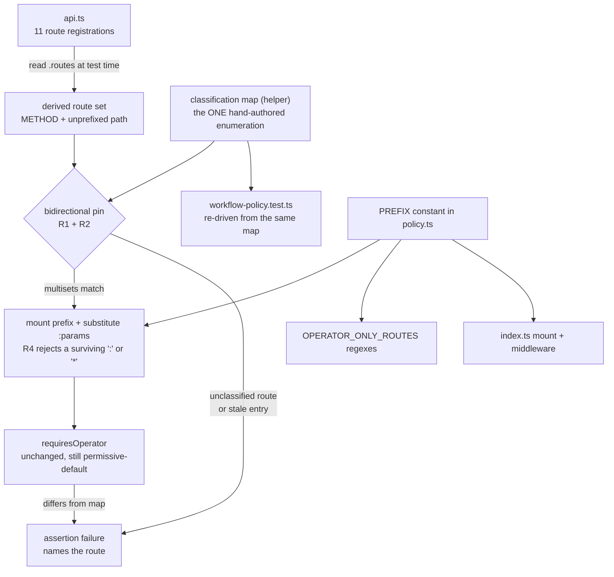

# ST-094 — Router-Derived Workflow Route Classification - Plan

## Goal Capsule

**Objective:** A route registered through `createWorkflowApi()` cannot reach production without an authorization classification. Adding one to the workflow API without a classification entry fails the test suite. The guarantee is bounded to that factory by design — routes reaching `/api/workflow` by other means are named in Risks & Dependencies and are not closed here.

**Means:** Derive the route set from the Hono router at test time and pin it against one hand-authored classification map, bidirectionally (KTD4). The classifier's permissive default stays (KTD1).

**Authority hierarchy:** The ST-094 entry in [.github/planning/story-board.md](../../.github/planning/story-board.md) is the origin. Where this plan and that entry disagree on a verified fact, this plan wins — two of the entry's acceptance criteria rest on claims that research disproved (see Problem Frame). [CLAUDE.md](../../CLAUDE.md) governs conventions and the merge/verification rules.

**Board state — deferred at PO instruction.** ST-094 stays in Backlog and the board's reciprocal `Plan:` field stays unset for now, so another story can take the In Progress slot in a separate session. The `story: ST-094` frontmatter above is live; the board-side half of the cross-link is owed, not forgotten. Whoever picks this up moves the entry Backlog → In Progress and fills `Plan:` with this file's path before starting U1.

**Stop conditions:** Stop and raise it if closing the enumeration gap turns out to require changing which routes `requiresOperator` classifies as operator-only. That is the declined option (KTD1), not an implementation detail.

---

## Product Contract

### Summary

Add a test that reads the workflow API's real route table and requires every entry to carry an explicit authorization classification entry. Collapse the several hand-kept enumerations of that route set into one map that the test pins against the router. Delete the classifier docblock's prose copy of the same list.

### Problem Frame

`requiresOperator` in [server/src/workflow/policy.ts](../../server/src/workflow/policy.ts) is `OPERATOR_ONLY_ROUTES.some(...)` over four patterns. Its default return is `false` — agent-reachable. [server/src/workflow/api.ts](../../server/src/workflow/api.ts) registers eleven routes. A twelfth route added there is agent-callable the moment it lands, and nothing reports it. The operator/agent split is the per-client permission boundary named as a first-class concern in [STRATEGY.md](../../STRATEGY.md)'s trust track, so a silent widening of it is not a cosmetic defect.

The same route set is written down in several places by hand, and no copy is derived from the router: the four operator patterns, a prose list of the seven reporting routes in the `requiresOperator` docblock, an eleven-entry `CASES` table in [server/tests/workflow-policy.test.ts](../../server/tests/workflow-policy.test.ts), and the `/api/workflow` mount prefix written separately in the classifier's regexes and at two mount sites in [server/index.ts](../../server/index.ts). Each copy drifts on its own. A further copy lives in the dashboard's emitted browser script ([server/src/workflow/dashboard.ts](../../server/src/workflow/dashboard.ts), `fetch("/api/workflow" + path)`), and more appear in comments. U1 deliberately leaves those in place: the client-side copy is a separate consumer with its own failure mode, and comment prose is not a call site.

Two claims in the board entry did not survive verification, and both change what to build:

- The entry says a test that forgets the mount prefix "passes vacuously". Under a bidirectional map it does not — the four operator routes would classify `false` against an expected `true` and fail on the assertion. The prefix error is only silent under a weaker assertion shape. R3 keeps the shape in which it stays loud.
- The entry treats the docblock's seven-route prose list as a maintenance hazard. It is that, but it is **accurate today**: the seven named routes are exactly the seven non-operator registrations, and 4 + 7 = 11. There is no correctness repair to budget for. R6 is drift-prevention only.

A third hazard is real and was not in the entry. `ID` is `[^/]+`, which matches the literal string `:packetId`. A test that prefixes the router's paths but does not substitute the parameters classifies the same four routes as operator-only and goes green while proving nothing about real request paths. R4 closes it.

[docs/solutions/conventions/a-credential-format-gate-is-not-an-authorization-gate.md](../solutions/conventions/a-credential-format-gate-is-not-an-authorization-gate.md) (severity: critical) records an authorization gap in this same module that survived three review passes, behind a docblock asserting the opposite of what the code did. Its central tell — a docblock stating a security property is a claim to verify, never evidence — is why R6 deletes the prose rather than correcting it.

### Key Decisions

- **Keep the permissive default; guard it with a router-derived test.** (session-settled: user-directed — chosen over flipping the default to deny: an allowlist is the stronger fix, but the PO chose detection over changing live authorization behaviour.) Governs R1, R2, R3.
- **Delete the classifier docblock's prose route enumeration rather than bringing it under the test's assertions.** (session-settled: user-directed — chosen over keeping the prose and asserting on it: prose next to unenforcing code is the exact failure mode that shipped a critical gap in this module.) Governs R6.
- **The derived coverage lives in a new test file, not the existing policy test.** (session-settled: user-directed — chosen over one combined file: the existing file imports a module that imports nothing and needs no infrastructure, and that property is itself evidence.)
- **Assert at classification level, not end-to-end.** (session-settled: user-directed — chosen over extending to a real agent-key refusal: [server/tests/workflow-agent-key-e2e.test.ts](../../server/tests/workflow-agent-key-e2e.test.ts) already proves the composition root refuses an agent key over real HTTP.) Governs R2.

### Requirements

**Detection**

- R1. Every entry in `createWorkflowApi().routes` must appear in the classification map, or the suite fails.
- R2. Every entry in the classification map must still exist in the router, or the suite fails.
- R3. For each entry carrying an operator boolean, `requiresOperator` applied to the mounted, concrete path must equal that value. An entry marked non-request-path is exempt from this assertion and asserted to be one instead (KTD3).
- R4. A path handed to `requiresOperator` by this test must carry neither an unsubstituted route parameter nor a wildcard segment — no surviving `:` and no surviving `*`.

**Single source of the enumeration**

- R5. One hand-authored map is the only test-side statement of intent about which workflow routes need the operator credential, and each of its entries records the basis for that classification; the test pins the map to the router. The classifier's own four patterns are unchanged and are pinned to the map by R3, not replaced by it (KTD1).
- R6. The `requiresOperator` docblock states no route list of its own.
- R7. The mount prefix is written once on the server side and consumed at every server-side site that needs it. The `dashboard.ts` client copy is a recorded remainder outside this requirement (KTD6), and the existing policy test's standalone cases keep their literal paths.

**Proof that the guard works**

- R8. The suite fails when the guard's own inputs go empty, when a route is left unclassified, and when the mount prefix is not applied — each proven by a check that runs on every CI pass, not by a one-time manual demonstration.

### Success Criteria

- Adding a route to `api.ts` and running the suite produces a failure naming that route and telling the implementer to classify it.
- The failure in the line above is an assertion failure, never an import, resolution, or compile error. A red for the wrong reason is not a control ([docs/solutions/conventions/a-control-that-fails-for-the-wrong-reason-is-not-a-control.md](../solutions/conventions/a-control-that-fails-for-the-wrong-reason-is-not-a-control.md)).
- The evidence run is the container command from the Verification Contract, not only a native run.

### Scope Boundaries

#### Not in Scope

- Changing which routes `requiresOperator` classifies as operator-only, or its permissive default. That is the declined option.
- The remote node hub at [server/index.ts](../../server/index.ts) (`app.route("/workflow/nodes", ...)`). It sits outside the `/api/workflow/*` middleware behind its own `validateNodeBearer`, and is a separate credential boundary.
- Any edit to `server/db/workflow/*.sql`. The migration runner checksums raw file bytes and the server exits before opening its port on drift.

#### Deferred to Follow-Up Work

- A sibling sweep for other hand-kept enumerations over a growing surface consumed by a permissive-default predicate, as [docs/solutions/conventions/fix-the-assumption-not-the-symptom.md](../solutions/conventions/fix-the-assumption-not-the-symptom.md) prescribes after a fix of this shape lands.
- Closing the residual coverage boundary in R1's derivation — the shapes are listed in Risks & Dependencies and the decision is the second Open Question.

### Sources

- [server/tests/workflow-boundary.test.ts](../../server/tests/workflow-boundary.test.ts) — the structural precedent. Its `readTsSources` enumerates from the directory with a throw-if-empty guard, its `ALLOWED_IMPORTS` is an allowlist with the inversion argued in a docblock, and it carries permanent red/green controls on the predicate, the extractor, and the enumeration.
- [server/tests/workflow-policy.test.ts](../../server/tests/workflow-policy.test.ts) — the existing hand-written cases and the `control:` case at its foot.
- [docs/solutions/conventions/verification-mechanisms-need-adversarial-review.md](../solutions/conventions/verification-mechanisms-need-adversarial-review.md) — §2 (non-vacuity and discrimination fail independently), §5 (a control that runs on one machine controls nothing).
- [CONCEPTS.md](../../CONCEPTS.md) § Verification Practice — the canonical terms this plan and the new test use: Red/Green Control, Non-Vacuity Guard, Discrimination, Wrong-Reason Red, Fails Open/Fails Closed, Point-in-Time Result.
- Hono 4.9.2 route table: `routes: RouterRoute[]` is declared on the shipped public type surface (`hono/types` exports `RouterRoute`; the root entry does not). `method` is upper-cased at registration. `route()` copies into the parent and leaves the sub-app's own table unmutated. Across 4.9.2 → 4.13.3, `path`, `method`, and `handler` are unchanged; `basePath`'s derivation moved.

---

## Planning Contract

### Key Technical Decisions

KTD1. **Keep `requiresOperator`'s permissive default and its four operator patterns exactly as they are.** (session-settled: user-directed — chosen over flipping the default to deny: an allowlist fails safe, but the PO chose a detector over changing live authorization behaviour.) Instantiates the first Key Decision; governs R1, R2, R3. The honest consequence, which the plan states rather than hides: this mitigates the class recorded in the credential-gate learning, it does not close it. The residual belongs in Risks & Dependencies, not in a green test's silence.

KTD2. **Read `.routes` off the unmounted `createWorkflowApi()` instance, and use only `method` and `path`.** Those two fields are unchanged across 69 Hono releases; `basePath` is the one field whose derivation moved, so the test does not read it. `server/deno.json` pins `npm:hono@4.9.2` with a frozen lockfile, so a version bump cannot arrive unreviewed.

KTD3. **Classify every entry in the route table; filter nothing.** Hono records `use()` and `all()` alike as `method: "ALL"`, so method cannot separate middleware from a handler. `hono/dev`'s `inspectRoutes` adds an `isMiddleware` flag, but it is the arity heuristic `handler.length > 1` — a route handler written `(c, next) => …` is marked middleware and would be skipped by a filtering test. That fails **open**, on exactly the surface this test exists to guard. Requiring every entry to be classified fails closed **on enumeration** — nothing new goes unnoticed — and sidesteps the `use()`/`all()` ambiguity entirely.

It does not, however, make an `ALL` entry safe, and the distinction is load-bearing. `requiresOperator` compares the method exactly, so an `ALL` entry returns `false` for every path, including an operator-only one: an `all()` registration on a supervision path would be agent-reachable for every method except POST while the suite stayed green. An `ALL` or wildcard entry therefore carries an explicit non-request-path marker in the map rather than an operator boolean, and R3 exempts it from the classifier-equality assertion while R1 and R2 still pin it. The rule that follows: a supervision route is never registered with `all()`. `api.ts` has no `use()` today; the map documents the policy for the first one that appears.

KTD4. **One map, pinned bidirectionally.** R1 and R2 together mean the map's records must match the router's entries one for one, compared as multisets rather than as unique keys. A new route with no entry fails; a stale entry for a deleted route fails. This is what makes the map the single statement of intent (R5) rather than a fourth thing that drifts. Without R2 the map only grows.

KTD5. **The new file's `DATABASE_URL` need is a control-validity constraint, not a nuisance.** Importing `api.ts` reaches `server/src/db.ts`, which throws at module load when `DATABASE_URL` is unset — a load-time error, which is the Wrong-Reason Red class verbatim. The suite's existing convention is to rely on the container env and never fabricate a value; eight test files do exactly that. Deriving routes by regex over `api.ts` source text would keep the file pure and is rejected: a scan over source text is the failure class in the adversarial-review learning, and `api.routes` is the real router. Verified empirically: with `DATABASE_URL` set, reading `.routes` passes under Deno's default sanitizers, because the postgres client is lazy. No `sanitizeResources`/`sanitizeOps` opt-out is needed.

KTD6. **Export the mount prefix from `policy.ts` and consume it at every site.** The prefix is currently written into the classifier's four regexes, twice in `index.ts`, and once more client-side in `dashboard.ts` — which U1 does not touch, so "once" below means once across the server-side call sites, not once in the repository. Re-typing it in the test would add a fourth copy — the defect this story exists to stop. `policy.ts` still imports nothing, so the workflow module's import allowlist is unaffected, and `index.ts` already imports `policy.ts`. This changes how the operator patterns are *built*, never which routes they match; KTD1's boundary holds.

KTD7. **Four proofs, not one.** Non-vacuity and discrimination fail independently, so an anti-vacuity guard alone does not discharge the adversarial-review learning: (a) the bidirectional pin, (b) a Non-Vacuity Guard that the derived route set is non-empty, mirroring `readTsSources`' throw-if-empty, (c) a standing prefix control that asserts a prefix-less concretizer produces a mismatch, and (d) a permanent Discrimination control driving the same classification logic over a synthetic router that carries an unclassified route. Each covers a failure the others do not, which is why R8 names three failure conditions rather than one. A one-time "add a route, watch it go red, remove it" is a Point-in-Time Result and is not a substitute for (d).

KTD8. **Delete the docblock's prose route list; point it at the derived test.** (session-settled: user-directed — chosen over bringing the prose under the test's assertions.) Governs R6. Do not replace it with a corrected list. Note for the implementer: this edit will look non-test-bearing and is not — the prose is the thing the story is removing, so it belongs in the same change and its removal is defended, not assumed.

### Assumptions

- The container test stack is running and its bind mount points at this checkout. A worktree in play makes `exec` reach a different checkout — see [docs/solutions/workflow-issues/verify-worktree-change-against-docker-test-stack.md](../solutions/workflow-issues/verify-worktree-change-against-docker-test-stack.md).

### Implementation Constraints

- No new Deno permission grant is required. The new test needs `--allow-env` and `--allow-read`, both already in the suite command and in [.github/workflows/ci.yml](../../.github/workflows/ci.yml). **CLAUDE.md's permission-inventory comment therefore needs no entry** — worth stating, because that comment's own header demands it be kept current and a reader would assume an addition is owed.
- No lockfile change. The test imports `hono` (already in `server/deno.json`'s import map) and `https://deno.land/std@0.224.0/assert/mod.ts` — the full URL every test file in the suite uses, since the import map carries no `std` entry and a bare specifier would not resolve.
- Test files import framework packages by bare specifier (`from "hono"`), not `npm:` — that is the `src/` convention.
- **`RouterRoute` is not exported from Hono's root entry**, only from its `hono/types` subpath, and `server/deno.json`'s import map maps the bare specifier `hono` with no trailing-slash entry — so `from "hono"` cannot name that type and `from "hono/types"` will not resolve. Do not reach for `npm:hono@4.9.2/types` to get around it: the entries are structurally typed, so read `method` and `path` off them and let inference do the work, or declare a local two-field shape. Naming Hono's type buys nothing here and would be the only `npm:` specifier in the test suite.
- There are no test-to-test imports anywhere in `server/tests/`, and `_helpers/*.ts` is not collected by `deno test tests/`. A shared helper is the established shape.

### High-Level Technical Design

The guard closes the loop between the router and the classifier, so the enumeration cannot be stated twice.

Three checks run alongside the pin and fail independently of it: a Non-Vacuity Guard on the derived set, a standing prefix control, and a Discrimination control over a synthetic router carrying an unclassified route.

---

## Implementation Units

### U1. Single-source the `/api/workflow` mount prefix

**Goal:** The mount prefix is written once, so the new test cannot introduce a fourth copy of it.

**Requirements:** R7 (KTD6)

**Dependencies:** none

**Files:**
- `server/src/workflow/policy.ts` (modify — export the prefix constant, build the four regexes from it)
- `server/index.ts` (modify — consume it at the `/api/workflow/*` middleware and the `app.route` mount)
- `server/tests/workflow-policy.test.ts` (re-run only — existing cases keep passing with no edit; U2 is the unit that rewrites it)

**Approach:**
1. Export a named prefix constant from `policy.ts`. Keep `policy.ts` importing nothing, so the workflow module's import allowlist is untouched.
2. Build each entry of `OPERATOR_ONLY_ROUTES` by interpolating that constant, leaving the matched paths byte-identical to today.
3. Consume it at both `index.ts` sites. `index.ts` already imports `policy.ts`, so no new module edge appears.

**Patterns to follow:** `ID` in `policy.ts` — an existing module-scope constant interpolated into the same regexes.

**Test scenarios:**
- Every existing case in `workflow-policy.test.ts` passes with no edit to its expectations — the refactor changes construction, not classification.
- The four operator-only paths still classify `true` and the seven reporting paths still classify `false`.
- A path outside the prefix still classifies `false`, proving the interpolated regexes remain anchored.

**Verification:** The classifier's behaviour is unchanged, and the prefix literal appears once across the classifier and the composition root, counting live code only — the `dashboard.ts` client copy and comment prose are out of scope.

---

### U2. Extract the classification map to a shared test helper

**Goal:** One hand-authored enumeration of workflow route classifications exists, and the existing policy test reads from it instead of holding its own copy.

**Requirements:** R5 (KTD4)

**Dependencies:** U1

**Files:**
- `server/tests/_helpers/workflowRouteClassification.ts` (create — the map plus a path-concretizing helper)
- `server/tests/workflow-policy.test.ts` (modify — drive `CASES` from the map)

**Approach:**
1. Key the map by method plus the **unprefixed** path exactly as registered (`POST /packets/:packetId/complete`), because that is the shape the router reports and the shape U3 pins against.
2. Give each entry either an expected operator-only boolean or a non-request-path marker (KTD3), plus a short label for test names and a one-line rationale recording why the route is supervision or reporting. The rationale is what U4 removes from the classifier docblock; without it the map records a value with no stated basis.
3. Add the helper that turns a key into a mounted concrete path: prepend the prefix from `policy.ts`, substitute each `:param` with a fixture id.
4. Re-drive `workflow-policy.test.ts`'s `CASES` from the map through that helper. Keep the file's existing standalone cases and its `control:` case as they are — they cover method-awareness, case-insensitivity, and varying id shapes, which the map does not.
5. The helper imports only `policy.ts`, so `workflow-policy.test.ts` keeps its no-infrastructure property.

**Execution note:** Confirm `workflow-policy.test.ts` still runs with no `DATABASE_URL` after this unit. That property is part of what the file proves, and losing it here would be silent.

**Patterns to follow:** `server/tests/_helpers/testDatabaseGuard.ts` — an existing helper module consumed by test files.

**Test scenarios:**
- All eleven re-driven cases produce the same expectations they asserted before the extraction.
- The `control:` case still fails an always-true classifier against the reporting-route subset.
- The file runs to green with `DATABASE_URL` unset, proving the helper added no infrastructure dependency.
- The concretizing helper leaves neither `:` nor `*` in its output for every key in the map that carries an operator boolean.

**Verification:** `workflow-policy.test.ts` holds no route list of its own, and still needs nothing but the classifier to run.

---

### U3. Router-derived classification test

**Goal:** A workflow route that nobody classified fails the suite, and the guard's own failure modes are proven on every run.

**Requirements:** R1, R2, R3, R4, R8 (KTD2, KTD3, KTD4, KTD7)

**Dependencies:** U2

**Files:**
- `server/tests/workflow-route-classification.test.ts` (create)

**Approach:**
1. Call `createWorkflowApi()` and read `.routes`, taking only `method` and `path` per KTD2. Do not mount it and do not read `basePath`.
2. Compare **occurrence counts**, not unique keys. Hono emits one route-table entry per handler, so a multi-handler registration produces two entries sharing a method and path; a set of unique keys would collapse them and leave one unchecked, breaking R1's every-entry promise. Hold the expectation as a list of route records and assert the multiset of derived entries equals the multiset of map entries, reporting each direction with its own message: an unclassified route names the route and says to classify it in the helper; a stale entry names the entry and says the route is gone.
3. For each key carrying an operator boolean, build the mounted concrete path through U2's helper, assert neither `:` nor `*` survives, then assert `requiresOperator` equals that value. Assert each non-request-path entry is one, and do not pass it to the classifier.
4. Add the Non-Vacuity Guard: the derived set is non-empty. Mirror `readTsSources`' throw-if-empty and say in the message that an empty derivation would look identical to a clean pass.
5. Add a second permanent control for the prefix: run the classification logic over the real map with a prefix-less concretizer and assert it reports at least one mismatch. This fails on its own if no operator-expected route remains, which is the condition that would otherwise retire the prefix check silently.
6. Add the permanent Discrimination control: build a synthetic `Hono` app carrying a route absent from the map, run the same pin logic over it, and assert it reports that route as unclassified. Build both in memory — do not write a probe file, because CI grants no `--allow-write` outside `/tmp` and an earlier control in `workflow-boundary.test.ts` failed there for exactly that reason while passing locally.
7. Write the header docblock in the house style: name the story, state what the file proves, and argue why this shape rather than the obvious alternative. It must record three things — that every entry is classified rather than filtered and why filtering on `isMiddleware` fails open (KTD3); that the derivation is `createWorkflowApi()` only, so the remote node hub is deliberately absent; and all three shapes named in Risks & Dependencies that reach the prefix without passing through the factory — a composition-root registration under the prefix, a second sub-app mounted there, and a composition-root wildcard that matches the prefix without naming it.

**Execution note:** Write the pin assertion first and watch it go red against a deliberately removed map entry, before the map is complete. The red must be an assertion failure, not an import error — an import error here means `DATABASE_URL` is unset, which is a Wrong-Reason Red and proves nothing.

**Patterns to follow:** `server/tests/workflow-boundary.test.ts` — its allowlist docblock argues the inversion; its `assert(checked > 0)` is the weak-form guard; its controls at the predicate, extractor, and enumeration are the model for steps 5 and 6. Import `Hono` by bare specifier as `workflow-remote-node-hub.test.ts` does.

**Test scenarios:**
- The eleven derived routes each match the map's expected classification through a concrete mounted path.
- A map entry removed in a scratch edit produces a failure naming that route as unclassified — an assertion failure, not a load error.
- A map entry for a route the router does not register produces a failure naming that entry.
- A route registered with two handlers produces two derived entries and requires two map records; a single record for it fails on the occurrence count rather than passing on a matching key.
- Deliberately dropping the mount prefix from the concretizing step turns the four operator routes red, confirming the prefix error is loud rather than vacuous.
- Deliberately skipping parameter substitution leaves a `:` in the path and trips R4's assertion before classification runs.
- A wildcard path trips the same assertion: a `use()`-registered entry concretizes to a path no request carries, so it must be marked non-request-path rather than classified.
- An `all()` registration on an operator-only path is reported as a non-request-path entry, not silently classified agent-reachable — the case that would otherwise leave a supervision route reachable on every method but POST.
- The Non-Vacuity Guard fails when the derived route set is empty.
- The prefix control reports a mismatch against the real map, and would still report one if only reporting routes remained classified — it does not depend on a particular route staying operator-only.
- The Discrimination control reports the synthetic router's unclassified route, and passes the synthetic router whose routes are all classified — a control that only ever goes red is uselessly strict.

**Verification:** Adding a route to `api.ts` fails this file with a message naming the route; removing it returns the suite to green.

---

### U4. Remove the prose route enumeration from the classifier docblock

**Goal:** The classifier states no route list that nothing enforces.

**Requirements:** R6 (KTD8)

**Dependencies:** U3

**Files:**
- `server/src/workflow/policy.ts` (modify — the `requiresOperator` docblock)

**Approach:**
1. Delete the sentence enumerating the seven reporting routes. Do not replace it with a corrected list.
2. Keep the parts of the docblock that carry meaning the code does not: that the default is agent-reachable, and that this function makes no authentication decision of its own.
3. Point the docblock at `server/tests/workflow-route-classification.test.ts` as the place the full classification is stated and enforced.

**Execution note:** Land this after U3 is green. Deleting the prose before the test exists removes the only written statement of the route split, however unenforced, and leaves a window with neither.

**Test scenarios:**
- `Test expectation: none` — the change is a comment deletion. Its correctness is that the suite from U3 is green and that no route list remains in `policy.ts`; both are checked in the Verification Contract rather than by a new case.

**Verification:** `policy.ts` contains no route enumeration outside `OPERATOR_ONLY_ROUTES` itself, and the docblock names where the enforced classification lives.

---

## Verification Contract

| Gate | Command | Applies to |
|---|---|---|
| Targeted classification suite | `docker compose --profile test exec mcp-test deno test --frozen --allow-net --allow-env --allow-read tests/workflow-route-classification.test.ts tests/workflow-policy.test.ts` | U1–U4 |
| Full server suite | `docker compose --profile test exec mcp-test deno test --frozen --allow-net --allow-env --allow-read --allow-write=/tmp --allow-run=deno,git tests/` | U1–U4 |
| Zero-infrastructure check | `docker compose --profile test exec -e DATABASE_URL= mcp-test deno test --frozen --allow-net --allow-env --allow-read tests/workflow-policy.test.ts` | U2 |

Clearing `DATABASE_URL` is not fabricating a value: `server/src/db.ts` throws on any falsy value, so the empty string reproduces the unset condition inside the container rather than inventing a connection string.

The container run is the gate, not a native run. A control that runs on one machine controls nothing: the merge-gating command is the one in `.github/workflows/ci.yml`, and this suite's grants are byte-identical there. Before running, confirm the `mcp-test` bind mount points at this checkout.

Record the evidence against a commit SHA plus the pathspec `server/src/workflow/policy.ts server/src/workflow/api.ts server/index.ts server/tests/_helpers/workflowRouteClassification.ts server/tests/workflow-policy.test.ts server/tests/workflow-route-classification.test.ts`, not a date. Any commit touching those paths expires the result — that is a property of the files, not an instruction to a person, so it still holds when someone else changes them.

CI does not run on PRs that target anything other than `main`. If this work stacks on another branch, the local container run is the only gate it will get.

---

## Definition of Done

- R1–R8 each hold. R1–R4 and R8 are proven by named cases in U3, R5 by U2, R7 by U1's verification, and R6 by U4's — the last two through the Verification Contract rather than a new case.
- The full server suite is green in the container, and that run is recorded with its commit SHA.
- `policy.ts` contains no route enumeration in prose, and `workflow-policy.test.ts` contains no route list of its own.
- The mount prefix is written once in `server/src/workflow/policy.ts` and consumed at both `server/index.ts` sites; the `dashboard.ts` client copy is a recorded remainder, not a failure of this criterion.
- `requiresOperator` classifies exactly the routes it classified before the change.
- No new Deno permission grant, no CLAUDE.md inventory edit, no `ci.yml` edit, no lockfile change.
- The board entry is moved Backlog → In Progress with `Plan:` pointing at this file, by whoever picks the story up.
- No scratch probe files, commented-out attempts, or abandoned derivation approaches remain in the diff.
- Commits carry the `Story: ST-094` trailer, and no commit carries a `Co-authored-by:` trailer. After the squash, `git log -1 --format='%(trailers:key=Story,valueonly)'` on the merge commit returns `ST-094` — empty means it must be fixed before anything builds on it.

---

## Risks & Dependencies

- **The residual this story does not close.** The permissive default remains, and the bidirectional pin does not audit the decision it forces. Under R1 an unclassified factory route cannot reach `main` at all — so the surviving risk is not the unclassified route but the *permissive entry*: an author adds a route, types agent-reachable, and a green suite proves a classification was written, not that it was scrutinised. `false` is the zero-friction value. The credential-gate learning's own remedy was to invert the default; the PO chose otherwise (KTD1). The per-entry rationale U2 requires is the partial mitigation — it forces a stated basis, not a review. Say this in the plan and in U3's docblock rather than letting a green suite retire the suspicion.
- **A coverage boundary the board entry does not name.** U3 derives from `createWorkflowApi()`. Three shapes are invisible to it: a route registered directly on the composition root under `/api/workflow/*`; a second sub-app mounted at that prefix; and a wildcard route or middleware registered on the composition root at a pattern that matches paths under the prefix without naming it — `server/index.ts` already carries `app.options("*", ...)` and `app.use("*", ...)`, so the third shape is present today rather than hypothetical. This is distinct from the remote node hub carve-out, which is a different mount and a different credential. Named in U3's docblock; closing it is deferred.
- **`.routes` is typed but undocumented.** It carries no JSDoc and no Hono docs page addresses it, though `RouterRoute` is genuinely exported from `hono/types` and the field is not `#private`. Mitigated by KTD2 reading only the two fields unchanged across 69 releases, and by the frozen lockfile.
- **Ranking, stated plainly.** The remedy ladder in the fix-the-assumption learning runs database constraint > closed type > single shared guard > sibling sweep plus a test at each site. This story lands at the third tier. It is not the strongest available fix and the plan does not imply otherwise.

---

## Open Questions

- **Is U1 mandatory, or gated on PO confirmation?** U1 touches `server/src/workflow/policy.ts` and `server/index.ts` — the only production files this plan changes beyond a comment, and neither is named in the origin story's own file list. It is a constant extraction that leaves the matched paths byte-identical, so KTD1's boundary holds. Dropping it is not free: U2's helper would then hardcode the prefix instead of importing it, U2's dependency on U1 disappears, and R7 plus its done-criterion go with it. U3 and U4 stand unchanged either way. Deferred, not blocking.
- **Should the guard derive from the composed application router rather than the factory?** That would close all three coverage shapes in Risks & Dependencies instead of documenting them, at the cost of a test that depends on the composition root's wiring rather than the workflow product's own surface. Deferred, not blocking — the Objective is scoped to the factory until this is answered.
- **Should the classification suite be a required CI check on branches that do not target `main`?** CI triggers only on `main` and PRs targeting it, so on stacked work the local container run is the only gate while runtime authorization stays permissive. Changing the trigger is outside this story's file scope. Deferred, not blocking.
